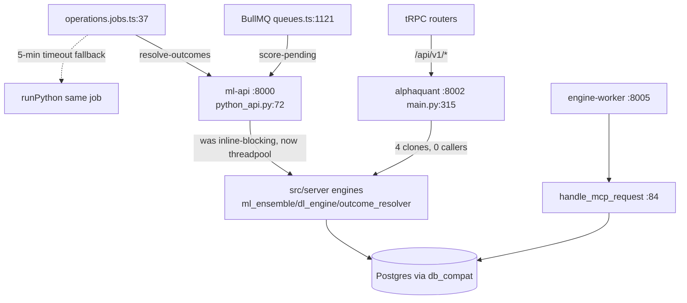

# Feature: alphaquant-api (:8002) + ml-api (:8000) + engine-worker (:8005) + MCP

Two independent tracer runs produced convergent findings (double-verified).

- **ml-api** (`python_api.py`): 4 endpoints — score-pending :21, train-dl :33, resolve-outcomes
  :45, infer-dl :57. **No /health.** All four `async def` handlers called blocking engines
  inline — event loop frozen for the whole multi-minute run (fixed 2026-09-02: threadpool
  offload mirroring main.py's `run_in_thread`). Live callers: score-pending (queues.ts:1121),
  resolve-outcomes (operations.jobs.ts:37); **train-dl/infer-dl have zero HTTP callers** (DL
  runs via subprocess, dl.jobs.ts:105,131).
- **alphaquant-api** (`backend-python/main.py`): `/health` :113 + 13 `/api/v1/*` routes + the
  four ml-api clones (:250-303) which delegate to the same canonical modules — and have
  **zero callers** (alphaQuantClient.ts exposes only `/api/v1/*`).
- **engine-worker** (:8005): `/health` :39, `/mcp/tools` :59, `/signals/risk-summary` :68,
  `/ingestion/dlq` :74. **No production consumer in-repo** (tests only; live-verified once
  2026-08-29, AF-20260829-03). No auth on any endpoint — sole control is the loopback bind.
- **MCP** (`market_intelligence_mcp.py`): 3 tools (:17,:36,:57) via `handle_mcp_request` :84;
  `analyze_stock_risk` does an unordered `SELECT * FROM stock_scores WHERE symbol=?` (:40-42) —
  arbitrary row among per-timeframe rows.

Key findings: [RISK-fixed] ml-api event-loop blocking + the resulting double-resolver window
(python_api.py handlers; client timeout pythonApi.ts:4 → operations.jobs.ts:40 fallback);
[DUP-ACCIDENTAL] dead HTTP surface (4 alphaquant clones + 2 ml-api endpoints, zero callers);
[DEBT] engine-worker serves no production caller; no auth on Python services (loopback bind
only) vs Node's loopback+secret gate (internalAuth.ts:19-36); stale comments
(operations.jobs.ts:30-33 "port 8002"/"SQLite"; ecosystem.config.cjs:24-27 "default to SQLite").
