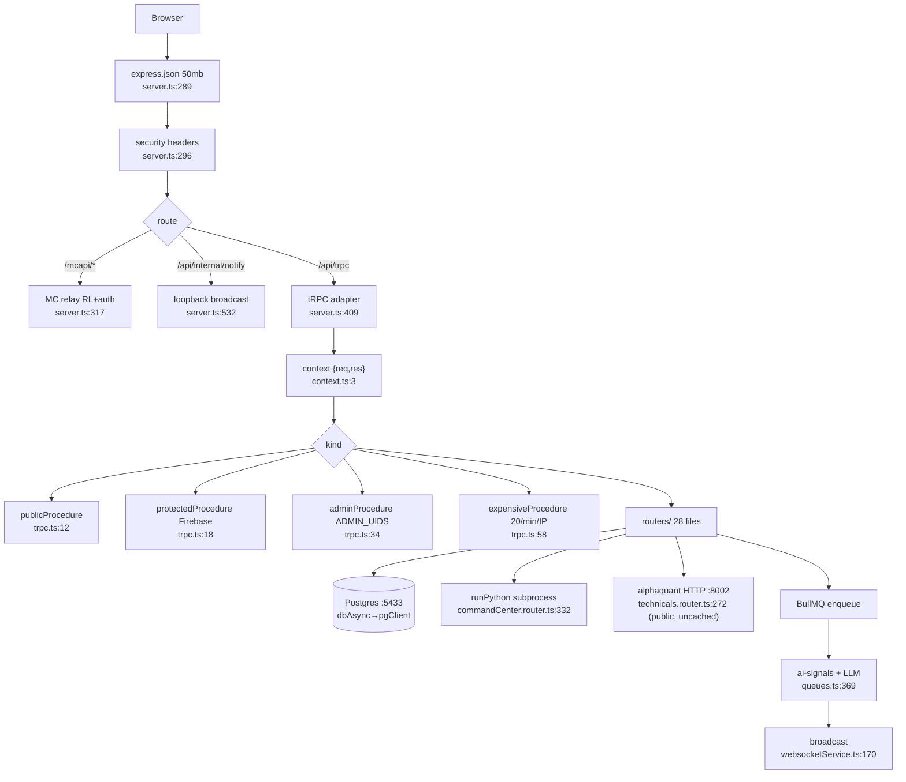

# Feature: api-gateway (:3000)

Entry `server.ts` → Express middleware (`50mb` JSON :289, security headers :296) → raw routes
(`/mcapi/*` :317 gated, `/api/internal/notify` :532 loopback-only, `/api/health` :519) → tRPC
`/api/trpc` (:409, context = `{req,res}`, context.ts:3) → 28 domain routers merged in
`router.ts` (pure merge point, 64 lines). WSS attached :575 with **no `path` option**
(websocketService.ts:104 — accepts upgrades on any path, unauthenticated, read-only alerts).

Procedure census (verified): **278 publicProcedure / 55 admin / 34 protected / 9 expensive**
(20/min/IP in-memory limiter, trpc.ts:56-66). AI: gemini/bedrock via `aiService.ts:13-43`.
WebSocket sources: AI path queues.ts:369, canonical picks after ranker queues.ts:2909-2911,
technical scans technicalSignalsService.ts:1628, 2% movers websocketService.ts:264-278.

Key findings: [RISK] `saveBacktestStrategy` public unauth INSERT (ml.router.ts:501-517);
[RISK] `enqueueSignals` ≤200 LLM jobs/req, spend before write-gate (signals.router.ts:59-64,
queues.ts:340-384); [RISK] `getTvTa`/`getTvScreener` uncached unthrottled public proxy
(technicals.router.ts:272-289); [DEBT] WSS all-path upgrades; 50mb global body limit;
[DUP] monitor.router queue registry duplicated in-file (:631-667 vs :826-862).
