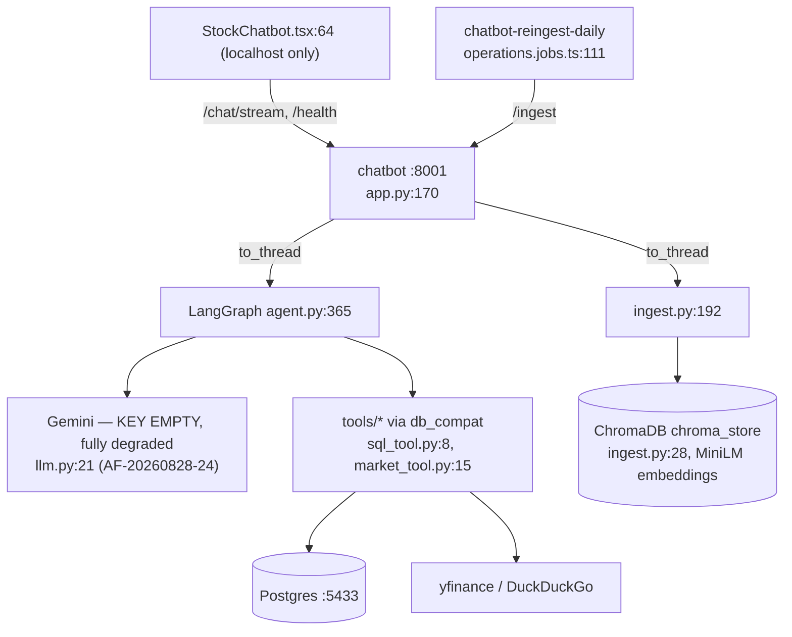

# Feature: chatbot (:8001, LangGraph RAG)

Endpoints (`app.py`): `/health` :84, `/chat` :95, `/chat/stream` :120 (SSE), `/ingest` :158.
Graph: classify_intent → execute_tools → synthesize_answer (agent.py). Blocking handled
correctly: `asyncio.to_thread` for /chat :101 and /ingest :163; LangGraph nodes are sync.
Consumers: browser StockChatbot.tsx:64 (hardcoded `http://localhost:8001`, no auth headers) +
nightly `chatbot-reingest-daily` 20:00 UTC (operations.jobs.ts:111).

Key findings: [RISK] **binds `0.0.0.0` with zero auth** (app.py:170) — the only Python service
not on loopback; all consumers are localhost, so the bind buys LAN exposure of `/ingest` and
LLM-spending `/chat` for nothing; [RISK known-open] no working LLM backend (empty Gemini key,
AF-20260828-24 — `/chat` 500s at the first node, `/health` honestly reports unavailable);
[DEBT] dead `DB_PATH` SQLite defaults (app.py:27, agent.py:26, ingest.py:20, sql_tool.py:12);
unbounded `MemorySaver` sessions keyed on client-supplied session_id (agent.py:381);
swallow-and-empty tool degradation (sql_tool.py:148-150 etc.); non-streaming `/chat` has no
in-repo caller. NOT bugs: the SQLite-ism at ingest.py:126 is translated (sql_translate.py:201);
per-collection ingest failures re-raised only after all collections run, deliberately
(ingest.py:192-206).
