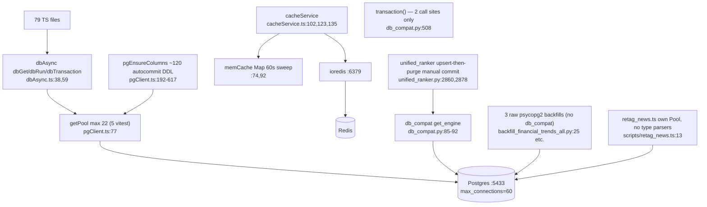

# Feature: data-layer (Postgres :5433 only + cache)

One TS facade (`dbAsync.ts:38,47,59` → `pgClient.ts`, pool `max = PG_POOL_MAX ?? (VITEST ? 5 : 22)`,
pgClient.ts:77; budget math 22+5+5+3+10=45/60 at :65-76) with 79 importer files. One Python
facade (`db_compat.py:85-92`, SQLAlchemy engine, **no pool_size → default 5+10=15 per process**
× 4 services vs the "Python 10" budget line). 226 tables; 6 hypertables / 5 compressed
(schema.postgres.sql:4362-4377); 53 node-pg-migrate files. Redis optional (cacheService.ts:12)
with in-memory L1.

Key findings: [RISK] Python pool ceiling unbounded per service (db_compat.py:90) — 4×15
theoretical vs budget; [RISK] cache L1/Redis incoherence — `cacheSet` writes Redis only,
`cacheGet` promotes into L1 for 30s → stale-read window; **`cacheDel` has zero production call
sites** (cacheService.ts:135); [DEBT] `trendlyneScreener.ts:776,288` DELETE-then-refill not in
a transaction; no `statement_timeout` in any production pool; stale docstring `max_connections=50`
(pgClient.ts:102); 62 hand-rolled `_Fake*` conn classes across 35+ test files.
