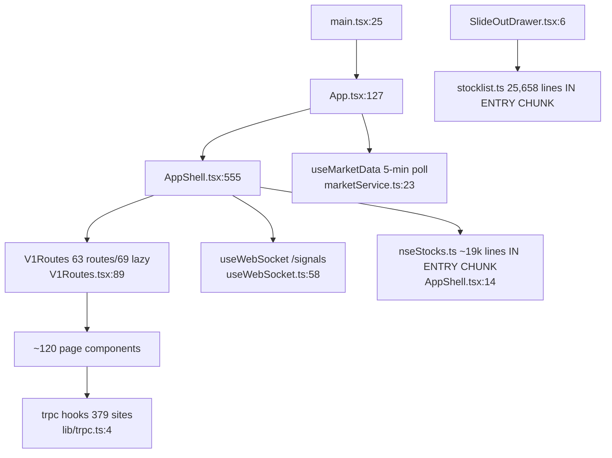

# Feature: frontend (v1-only since 2026-09-01)

`main.tsx` (QueryClient default staleTime 5min, main.tsx:56) → `App.tsx` (auth, watchlist
dual-store, 13-prop drill to V1Routes :327-340) → `AppShell` (nav, single WS, CommandPalette)
→ `V1Routes.tsx` — **63 routes, 69 lazy imports**. tRPC hooks: **379 call sites / ~120 files**.
`useMarketData` called once (App.tsx:165). ~90 `refetchInterval` sites across ~63 files; same
endpoint multi-pollers: `getAllIndices` ×4, `getFiiDiiFlow` ×3, cockpits ×2 @60s.

Key findings: [RISK] **~45k lines of literal stock data in the entry chunk** (static imports
via SlideOutDrawer.tsx:6 + AppShell.tsx:14) — parsed on the main thread at startup; [RISK]
`FALLBACK_INDICES` renders hardcoded fabricated prices in the shell header (App.tsx:121-125);
[RISK] `?? 0` renders failure as genuine zeros (SignalIntelligence.tsx:323-326;
V1StockDetails.tsx:674 `stockPrice ?? 0` feeds option chain); [DEBT] marketService error state
unreachable (marketService.ts:26,48-53); 4 orphan components (AlphaCockpit, BuyRecommendationsPage,
ModelRocPanel, TrendlyneSectorDashboard); aiService has zero client importers (server-only).
