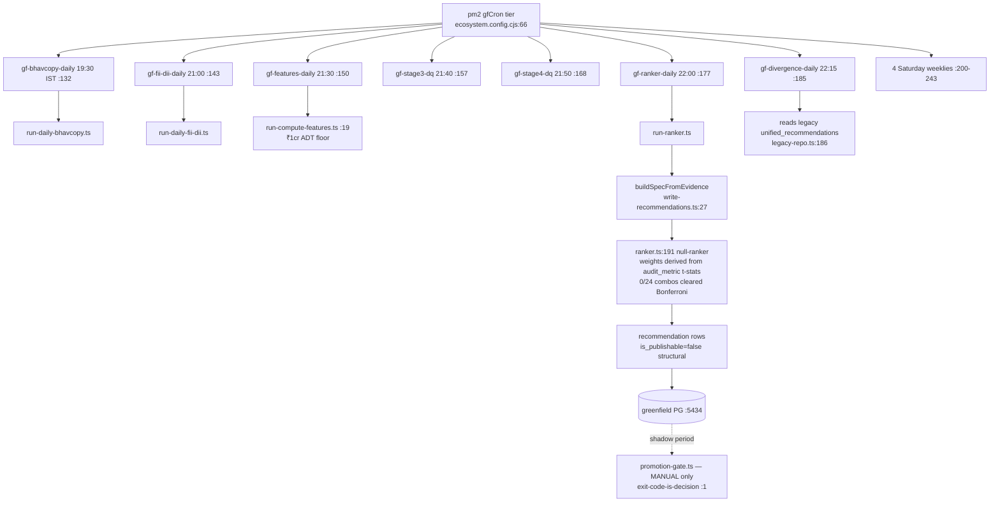

# Feature: greenfield shadow track (deliberate clean-room rebuild)

pnpm monorepo: 7 packages (`contracts`, `db` (13 migrations, 7 repos), `ingestion` (stages
nse/3/4/5), `market-calendar`, `observability`, `provider-sdk`, `testing`) + 3 one-file app
stubs (`apps/{api,web,worker}` — scaffolding only). Own Dockerized Postgres **:5434** (+ Redis
:6380, MinIO :9000) — deliberately offset from legacy :5433/:6379. Zero legacy→greenfield
imports (one regex keyword hit only); greenfield→legacy is one-way via `legacy-repo.ts`.
Verified live: all 11 `gf-*` pm2 apps registered with the IST-rewritten crons.

Key findings: [DUP-LEGIT] the shadow duplication is by design and bounded — it stops at the
EOD rank; no ML/RL/intraday/UI duplication. The ranker honestly emits a `null` unvalidated
ranker (weights derive from recorded t-stats, not hand-setting) — independently reaching
measurement.md's verdict on a clean rebuild. [DEBT] **two trading-day truth sources**: greenfield's
`trading_session` table (session-calendar.ts:22-71) vs legacy `as_of.py`'s OHLCV-grid
derivation — same name, different ground truth, diverge during ingestion gaps; cheap mitigation
is a periodic equivalence check, not a merge. [DEBT] gf-kayal-weekly re-spends the Trendlyne
request budget the legacy `trendlyne-weekly` also consumes — no shared quota coordination
(ecosystem.config.cjs:201). [DEBT] promotion-gate + measurement-baseline runners have no
scheduled entry — the grading half of the shadow loop is manual. [DEBT] `gfCron` falls back to
legacy `DATABASE_URL` if `GREENFIELD_DATABASE_URL` is unset (:76) — fails loudly at first
insert, acceptable.
