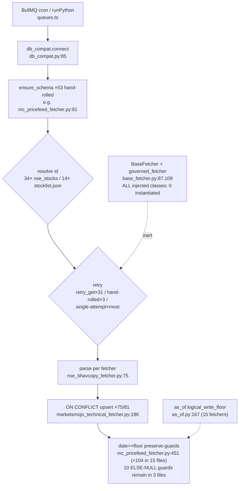

# Feature: python-ingestion (81 fetchers)

Shared: `db_compat.connect` (sole DB API), `as_of.py` (logical_trading_date :81,
logical_write_floor :167, trading_days_back :204 — 28 fetchers import it), `fetch_utils.retry_get`
(:46, 31 fetchers), `FetchTracker` (:82, only 4 fetchers), `tl_fetch` WAF adapter.
Re-implemented per fetcher: `ensure_schema` in **53** files; MC header dict in **24** files;
id loaders (34 fetchers read `nse_stocks` from DB, 14 read `scripts/stocklist.json`, ≥4
near-identical loader functions); retry (canonical retry_get + 3 hand-rolled loops +
single-attempt print-and-None as the majority pattern + 2 more framework layers).

Key findings: [DEBT] 2026-08-28 bulk-pass scaffolding 100% inert — 79+5 injected
`*FetcherBaseFetcher` classes with **zero instantiations**, `@governed_fetcher` imported by 75 /
applied 0 times, `to_polars_df` copy-pasted into ~203 files / 0 call sites, DLQ path
(`data_ingestion_dlq`, base_fetcher.py:72) unreachable; [DEBT] 34 `except: pass` in 24 fetchers;
degraded prints to stdout (et_stats_client.py:128,134); [DUP-ACCIDENTAL] loaders, headers,
ensure_schema, guard SQL all per-file copies (see 02-duplication-report.md).
