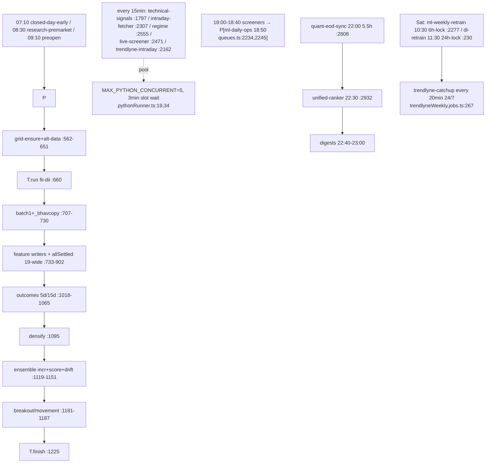

# Feature: scheduler (BullMQ + runPython)

`queues.ts` (3,327 ln) registers ~50 repeatable jobs (all UTC via addJobWithCatchup
`tz:'Etc/UTC'`, registerJob.ts:44-46) across morning / market-hours (every 15 min) / evening
/ night+Saturday lanes. `ml-daily-ops` (18:50 IST, 3.5h budget, 4h lock) = ~95 Python
invocations, 18 via StepTracker `T.run`, ~60 bare `.catch(console.warn)`, fan-outs 3/19/5
(queues.ts:707,821,1018). Catch-up guard matches active same-name runs (registerJob.ts:109-162).

Key findings: [RISK] 19-wide runPython fan-out vs 5 slots + 3-min waiter → "slot likely leaked"
failures (queues.ts:821-902, pythonRunner.ts:19,34); [RISK] ml-weekly-retrain step budgets sum
>8h under a 6h lock (queues.ts:1320-1425 vs :2284); [RISK] trendlyne-catchup unguarded through
market hours while sibling midweek has the guard (trendlyneWeekly.jobs.ts:267 vs :80-83);
[DEBT] stock-refresh holiday-skip stamps success (:238-241/:1694-1697); dead duplicate
CATCHUP_STAGGER_MS (:1622-1623); stale header comment (:2210 vs :2234).
