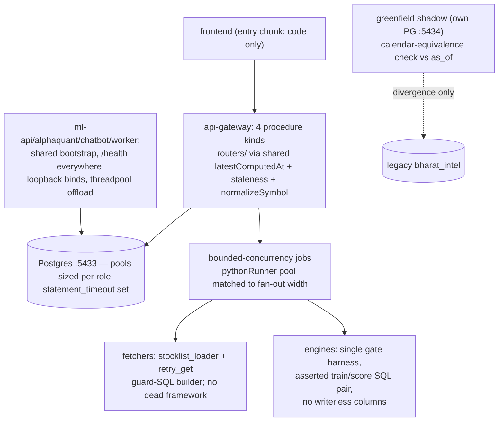

# 03 — Unified Proposal & Refactoring Strategies (2026-09-02)

## Ground rules (repo-specific)

- **Deletion over abstraction.** The highest-value refactors here remove dead code, not add layers.
- **Pre-adjudicated non-goals** (do not re-propose): merging the four signal tables; merging
  `signal_outcomes` into `unified_signal_outcomes`; deleting `stock_scores`/`quant_scores`;
  renaming `technical_signals`; deleting greenfield; re-adding deploy/port-drift checks.
- **Never a bulk unverified edit.** The 2026-08-28 pass that injected the dead scaffolding below
  broke 17 files (shebangs, `__future__` placement, docstring injection). Any multi-file pass
  must `py_compile` every touched file, `head -1` for shebangs, and run the full gates.
- **Scoring-surface files** (`unified_ranker.py`, `scoring_engine.py`, weight tables) require
  backtest evidence per `verify-gate.mjs` — several items below are therefore documented as
  *decisions to request*, not autonomous fixes.

## U1. Delete the dead scaffolding (pure win, biggest single cleanup)

- **Component:** none new — deletion. Remove from ~205 `src/server/*.py`: the injected
  `class XFetcherBaseFetcher(BaseFetcher[...])` (~84 definitions, 0 instantiations), the
  `from base_fetcher import ... governed_fetcher` unused imports (~80 files), `to_polars_df`
  (203 copies, 0 call sites), and the `WorkflowDAG`/`TaskNode` imports in 36 files that never
  build one (real constructions exist only inside `workflow_orchestrator.py:112,124`).
- **Open decision for the owner:** `base_fetcher.py`'s DLQ/circuit-breaker design is currently
  unreachable. Either delete the module too, or actually wire `@governed_fetcher` onto the
  highest-risk fetchers (Trendlyne WAF family) — do not keep it as decorative scaffolding
  (the exact "onboarded N files ≠ capability" anti-pattern, recurring-bugs.md).
- **Call-site changes:** none (zero call sites is the premise). **Capability loss:** none.
- **Verification:** `py_compile` all touched files; full pytest; `grep -rn "\.to_polars_df\("`
  still 0 before and after.

## U2. One shared provider-id loader for Python

- **Component:** `src/server/stocklist_loader.py` — `load_provider_map(field)` returning
  `dict[symbol, id]` from `scripts/stocklist.json`, mirroring `stockMapping.ts:3-13` semantics.
- **Call sites:** the 9 hand-rolled loaders in 02-duplication-report.md A1 become one-line
  imports. The two inverted/derived variants (`trading80_call_alerts_fetcher.py:73`,
  `mover_screener_fetcher.py:370`) get explicit `invert=True` params.
- **Capability loss:** none (loaders are pure/cached). **Risk:** low; each fetcher's
  `live_datasource` test is the per-site check.

## U3. Consolidated staleness math, three consumers kept

- **Component:** one `staleness.ts` exposing `tradingDaysStaleAt(now, lastTs, calendar)` —
  the *math* only. `dataQualityChecks.ts`, `jobHeartbeat.ts`, and `monitor.router.ts:121-213`
  keep their own delivery channels but call the shared function; monitor.router's ~20
  hand-rolled MAX() probes move behind it.
- **Capability loss:** none. **Risk:** medium — live monitoring; needs its own DQ-sweep
  verification pass (run `npm run dq:check` before/after and diff the 163 verdicts).

## U4. Performance fixes (measured, ranked by cost)

1. **Bound the `latest_price` window CTE** — signals.router.ts:245-252, scoring.router.ts:165-173
   (executed twice per call :174,:210), ml.router.ts:325-332. Live EXPLAIN: WindowAgg over
   **42,136,925 rows**, cost 2,545,528, decompressing every historical chunk. Fix shape: bound
   the inner SELECT with `WHERE date >= (SELECT MAX(date) FROM stock_ohlcv) - INTERVAL '90 days'`
   (preserves exact output for anything that traded in 90d; long-dead symbols lose a price they
   can't act on — an explicit, disclosed semantics choice) **or** a per-candidate-symbol LATERAL
   (bit-exact, more code). Verify by diffing old-vs-new query output on the live read replica
   before/after.
2. **`getSignalReportCard` (ml.router.ts:259-364):** `Promise.all` the 5 independent reads
   (in-file precedent :234) + `fetchWithCache('ml:signal-report-card', …, 60)` (batch-cadence
   tables; precedent misc.router.ts:418-424).
3. **`getStrategyPicks` (scoring.router.ts:144-242):** `fetchWithCache('scoring:strategy-picks', …, 300)`
   — polled every 300s by InvestmentStrategy.tsx:57; a hit is never staler than one poll cycle.
4. **DQ sweep concurrency (dataQualityChecks.ts:2478-2494):** bounded `Promise.all` chunks of 8
   for the per-check `dbGet`s (checks are already exception-isolated :2483-2488); batch the
   history inserts once per sweep. ~500 serial round trips → ~21 chunks.
5. **Monitor stats (monitor.router.ts:281-291):** raise `monitor:system-status` cache 30s→300s
   and/or serve row counts from `pg_class.reltuples` (display-only magnitudes).
6. **FinBERT backlog writes (newsSentimentService.ts:1086-1088):** one bulk UPDATE via scalar
   `unnest($1::text[], …)` (mind the recurring-bugs multidimensional-unnest caveat).

## U5. Boundary hardening (decisions to request — each changes observable behavior)

- `saveBacktestStrategy` (ml.router.ts:501-517) → `protectedProcedure` (needs a logged-out-caller
  check first, per the expensiveProcedure precedent comment trpc.ts:41-55).
- `enqueueSignals` (signals.router.ts:59-64): cap jobs/req (≤200 today) and move the LLM spend
  behind the write-gate (queues.ts:340-384).
- `getTvTa`/`getTvScreener` (technicals.router.ts:272-289): `expensiveProcedure` + cache — same
  treatment as the `/mcapi` relay (server.ts:313-327).
- chatbot `0.0.0.0` → `127.0.0.1` (chatbot/app.py:170) unless an off-box consumer exists (none
  found in-repo; browser client is localhost, StockChatbot.tsx:64).
- WebSocket: add `path: '/signals'` to the WSS (websocketService.ts:104) — today any path upgrades.
- Pool ceilings: set explicit `pool_size`/`max_overflow` in `db_compat.py:90` to make the
  "Python 10" budget line true (4 services × 15 today); add a pool-level `statement_timeout`
  after measuring the slowest legitimate query (DQ sweep's slowest check sets the floor).

## U6. Engine-layer hygiene (scoring-adjacent — evidence required before touching)

- `cs_score` is writerless (scheduler removed 2026-08-31, queues.ts:1153) but still averaged and
  persisted by unified_ranker.py:1763-1780,:2779 → the column and its dispersion telemetry
  silently decay. Fix = stop reading it in the blend + drop the reporting column, WITH a
  before/after `factor_edge.py` run per verify-gate (weight is already 0.0, so forward IC effect
  should be nil — the evidence bar is low but not zero).
- Consolidate the 6 champion/challenger gate copies (B9) into one harness parameterized on
  (metric, direction, baseline-source); keep thresholds per engine.
- Add the column-set-equality assertion test for `full_feature_train_sql` vs `full_feature_score_sql`
  (B10) — one throwaway parse-and-diff test; it is the only thing that catches the next
  cr_upgrades-class drift.

## U7. Frontend

- Split the data files out of the entry chunk: `SlideOutDrawer.tsx:6` / `AppShell.tsx:14` static
  imports of 25,658- + ~19,000-line literal tables → dynamic import inside the two consumers
  (both are interactive-only surfaces).
- Data-honesty: remove or clearly label `FALLBACK_INDICES` (App.tsx:121-125); replace `?? 0`
  StatCards with explicit unavailable states (SignalIntelligence.tsx:323-326,
  V1StockDetails.tsx:674, PortfolioTrackerPage.tsx:213,495); return the `error` field
  marketService.ts:26 already computes.

## Combined target topology

