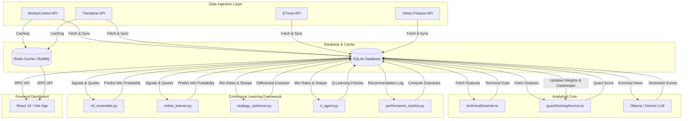

# 🚀 AlphaQuant Pro: Institutional-Grade Stock Intelligence

AlphaQuant Pro is a state-of-the-art, local-first quantitative stock ranking and intelligence platform for the Indian equity market (NSE/BSE). It synthesizes technical indicators, corporate fundamentals, derivatives (F&O) data, and news sentiment into actionable, multi-horizon consensus trading signals and leaderboards.

Equipped with a self-improving machine learning feedback loop, AlphaQuant Pro tracks its own predictions and automatically optimizes its scoring weights and model parameters over time.

---

## 🧬 System Architecture & Data Flow



---

## 🌟 Key Features

### 1. 🧬 Multi-Factor Consensus Engine
* **Cross-Provider Aggregation**: Normalizes and correlates screener data across **Trendlyne**, **Moneycontrol**, and **ETnow**.
* **Source & Category Deduplication**: Prevents correlated signals from inflating scores. Evaluates contributions based on source-category caps with exponential decay.
* **Consensus Bonus & Gating**: Grants score bonuses when multiple analytical domains (Technical, Fundamental, Momentum, Delivery) align, while gating low-probability setups.

### 2. 🤖 Machine Learning Feedback Loop
* **Stacked Ensemble Classifier**: Combines `GradientBoosting`, `RandomForest`, `ExtraTrees`, and `LogisticRegression` to estimate signal win probabilities.
* **Online SGD Learner**: Employs incremental stochastic gradient descent with a rolling window (default 180 days) to adapt to shifting market regimes.
* **RL Q-Learning Agent**: Acts as a meta-controller to gate signals, optimizing the decision policy based on reward propagation.
* **Differential Evolution Optimizer**: Periodically runs `scipy.optimize.differential_evolution` to discover optimal weights for screener sources and categories.

### 3. 📊 Derivatives (F&O) Intelligence Center
* **PCR & Open Interest (OI) Scanners**: Automates the ingestion of option chains, calculating Put/Call Ratios (PCR), implied volatility, and option build-up trends.
* **Buildup Analysis**: Identifies Long Buildup, Short Buildup, Long Unwinding, and Short Covering cycles.

### 4. 📰 Sentiment & News Scoring
* **Enriched News Ingestion**: Automatically tracks corporate actions, earnings announcements, order wins, and macro news.
* **FinBERT NLP Analysis**: Computes sentiment polarity (-1.0 to +1.0) and impact weights, utilizing a publisher quality-tier multiplier to scale inputs.

### 5. 🔍 NSE Stock Discovery System
* **Master Stock Database**: Syncs over 2,000+ NSE listed stocks with metadata (market cap, P/E, dividend yield, listing date).
* **Cascading Filters**: High-performance search and filtering by sector and industry, toggleable between visual card grids and tabular lists.

---

## 🛠️ Setup & Installation

### Prerequisites
* **Node.js** (v18+)
* **Python** (v3.10+)
* **Redis Server** (Optional; fallback to in-memory caching and `setInterval` polling is automated)
* **Ollama** (Optional; fallback to Gemini API is automated)

### 1. Environment Configuration
Create a `.env` file in the root directory:
```env
# Server Port
PORT=3000

# Database
DATABASE_URL=sqlite:///database.sqlite

# Redis Cache & Queues (Optional)
REDIS_HOST=localhost
REDIS_PORT=6379
REDIS_PASSWORD=

# AI & Sentiment APIs
GEMINI_API_KEY=your_gemini_api_key
OLLAMA_MODEL=mistral

# External Fallback Keys
FINNHUB_API_KEY=your_finnhub_key
```

### 2. Install Dependencies
```bash
# Install Node.js backend & frontend dependencies
npm install

# Install Python analytical engine dependencies
pip install -r requirements.txt
```

### 3. Initialize Database
Initialize the SQLite database schema and seed the NSE stock tables:
```bash
npx tsx scripts/init_db.js
```

---

## 🚀 Running the Platform

### Start Core Services
Ensure your local Redis server is running (if using Redis), then launch the unified development server:
```bash
# Starts both Express tRPC server and Vite Frontend
npm start
```
* **Web Interface**: [http://localhost:3000](http://localhost:3000)
* **tRPC Endpoints**: `/api/trpc`
* **WebSockets**: `ws://localhost:3000/signals`

---

## 📅 Scheduled Tasks & Daily Ops

The platform contains automated BullMQ queues (backed by Redis) that execute schedules. If Redis is down, it falls back to native `setInterval` loops. 

### Post-Market Close Pipeline (Daily, Mon-Fri at 4:30 PM IST)
To run these operations manually, you can execute the Python scripts in `src/server/`:

```bash
# 1. Fetch daily FII/DII flow statistics
python src/server/fii_dii_fetcher.py

# 2. Fetch and parse option chain Put/Call Ratios (PCR)
python src/server/pcr_fetcher.py

# 3. Analyze corporate news sentiment using FinBERT NLP
python src/server/finbert_scorer.py --days 1

# 4. Process institutional flows and block deals
python src/server/institutional_quant_engine.py

# 5. Resolve outcomes (Target / Stop-Loss) and log win rates
python src/server/performance_tracker.py --horizon 15

# 6. Train the incremental online SGD learner
python src/server/online_learner.py --window 180
```

### Periodic Maintenance (Weekly/Monthly)
```bash
# Retrain the Stacking Ensemble classifier (Weekly)
python src/server/ml_ensemble.py --train

# Re-optimize screener source & category weights via differential evolution (Monthly)
python src/server/strategy_optimizer.py

# Run a full historical backtest vs Nifty benchmark (Monthly)
python src/server/backtester.py --start 2023-01-01
```

---

## 🏗️ Architecture Stack
* **Frontend**: React 19, Tailwind CSS 4, Recharts, Framer Motion
* **Backend Adapter**: Express.js + tRPC (superjson serializer)
* **Background Jobs**: BullMQ + Redis (ioredis)
* **Database**: SQLite (`better-sqlite3` in WAL mode)
* **AI Engines**: Ollama (local Mistral/Llama3) + Gemini API fallback
* **Python Engine**: Pandas, Scikit-Learn, SciPy, PyTorch (FinBERT NLP)

---
*Built with ❤️ for quantitative traders demanding institutional-grade rigor.*
