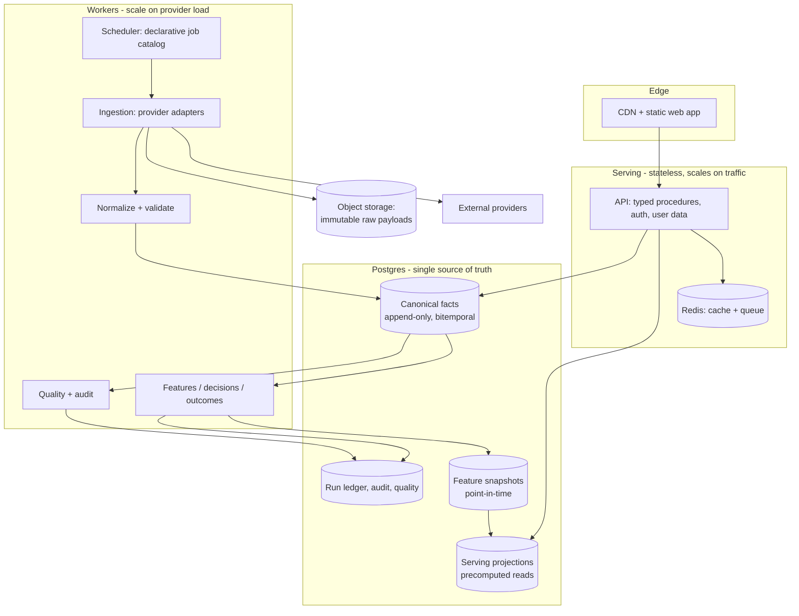

# Greenfield Build Specification

Companion to [GREENFIELD_STOCK_ANALYSIS_ARCHITECTURE.md](GREENFIELD_STOCK_ANALYSIS_ARCHITECTURE.md).
That document explains *why* (history, failure taxonomy, product boundary). This one is the
*buildable* specification: concrete architecture, engineering standards, full database DDL,
source-to-table mapping, and a copy-paste build prompt.

Grounding: `.claude/rules/*`, [DATA_SOURCE_INTEGRATION_GUIDE.md](DATA_SOURCE_INTEGRATION_GUIDE.md)
sections 1–16, [measurement-history.md](measurement-history.md), and the current code surfaces
(`queues.ts`, `dataQualityChecks.ts`, `db/schema.postgres.sql`, `package.json`).

---

# Part A — Ideal architecture

## A1. Shape

**One monorepo. Three deployables. Four data zones.**



**Deployables**

| Unit | Contains | Scales on | Never does |
|---|---|---|---|
| `web` | React SPA, static | CDN edge | Business logic, secrets |
| `api` | Typed procedures, auth, user data, read models | Request volume | Provider calls, Python, universe compute, training |
| `worker` | Scheduler, adapters, normalizers, features, decisions, quality | Provider count and data volume | Serve user requests |

**Why a modular monolith and not microservices:** the historical failures were *ownership and
correctness* failures (multiple score producers, drifting schedules, schema drift), not scaling
failures. Microservices multiply those failure classes and add network partitions, distributed
transactions, and version skew. One schema and one deploy unit per concern removes them. Module
boundaries (`packages/*`) are contract-enforced so extraction stays mechanical if load demands it.

## A2. Module boundaries

```text
apps/
  web/                       React 19 + Vite + typed client
  api/                       Express/Fastify + tRPC, auth, rate limit
  worker/                    scheduler + executors
packages/
  contracts/                 zod schemas, API types, job catalog types, enums
  db/                        migrations, repositories, point-in-time query API
  market-calendar/           sessions, cutoffs, publication lag, trading-day math
  provider-sdk/              HTTP policy, auth/session, raw capture, adapter interface
  ingestion/                 one adapter per provider endpoint family
  analytics/                 features, decisions, outcomes (TS orchestration)
  observability/             logger, tracer, metrics, run ledger, DQ registry
  testing/                   Postgres harness, payload fixtures, negative controls
python/
  research/                  backtests, model training, factor research only
infra/
  migrations-ci/, deploy/, containers/
```

**Hard rules**
- `api` may import `db` (read repositories), `contracts`, `observability`. Never `ingestion`, never `provider-sdk`.
- `ingestion` may never import `api`.
- Only `db` issues SQL. No SQL string in `api` or `ingestion`.
- Only `market-calendar` computes trading dates. No `new Date()` arithmetic elsewhere.
- Only `provider-sdk` performs outbound HTTP.

Enforce with an import-boundary lint rule in CI. This is what stops the historical "each fetcher
re-implements its own date logic / HTTP / SQL" sprawl.

## A3. Technology choices

| Concern | Choice | Rationale from this repo's history |
|---|---|---|
| DB | PostgreSQL 16 (+TimescaleDB only if bar volume proves it) | SQLite/Postgres dual-mode caused type drift, `%s`/`?` bugs, NaN-semantics bugs, false test passes |
| Migrations | `node-pg-migrate` (single chain, SQL files) | Hand-run `ALTER TABLE` and `CREATE TABLE IF NOT EXISTS` no-ops caused silent drift |
| API | tRPC + zod over HTTP | End-to-end types worked well; keep it |
| Queue | BullMQ + Redis | Worked; the failure was job *contracts*, not the queue |
| Cache | Redis, with correctness-independent fallback | Cache must never be required for correctness |
| Raw store | S3-compatible object storage | Enables replay; DB should not hold blobs |
| Analytics | Python 3.12 in a pinned, single venv | Two-venv/wrong-interpreter incidents |
| Auth | OIDC provider | Avoid hand-rolled session logic |
| Frontend | React 19 + Vite, one shell | Six coexisting shells multiplied maintenance |

## A4. Request path guarantee

```text
GET /api/... → validate → authz → Redis → serving projection (indexed, bounded) → response
```

Response envelope, always:

```json
{
  "data": {},
  "meta": {
    "as_of_session": "2026-08-12",
    "generated_at": "2026-08-12T10:15:00Z",
    "sources": ["nse", "yahoo"],
    "staleness": "fresh|stale|unavailable",
    "coverage": 0.98,
    "version": { "projection": "v3", "commit": "abc123" }
  }
}
```

Every number rendered in the UI must be traceable to `meta`. No silent fallback to a stale or
substituted value without a status flag.

---

# Part B — Best practices

## B1. Time and calendar

1. Never use `date.today()`, `new Date()`, `now()`, or weekday arithmetic to derive a trading date.
2. `market-calendar` exposes: `logicalSession(now)`, `previousSession(d)`, `nextSession(d)`,
   `sessionsBack(d, n)`, `isSession(d)`, `publicationCutoff(source, d)`.
3. All timestamps are `timestamptz` stored in UTC; all session dates are `date`.
4. Any window that includes "today" for a *ratio* must instead use the last **completed** session.
5. Post-midnight jobs resolve their write anchor from the calendar, never the wall clock.

## B2. Numbers and nullability

1. Reject non-finite values at ingestion; never write NaN/Inf.
2. `NULL` means unknown. Zero means measured zero. Add an availability enum where the difference
   matters (`available|withheld|not_applicable|error`).
3. Never `float(x or 0)` / `Number(x) || 0`. Use explicit finiteness checks.
4. `ORDER BY` on any numeric that could be NaN uses `NULLIF(col,'NaN'::float8)`.
5. Money and prices: `numeric(18,4)`. Ratios/scores: `double precision`. Never float for identity.

## B3. Provider adapters

Every adapter is a declarative object:

```ts
export const mcPriceFeed: ProviderEndpoint = {
  provider: 'moneycontrol',
  endpointKey: 'mc.pricefeed.equitycash',
  integrationClass: 'ingestion',
  requiredIds: ['mcsymbol'],
  method: 'GET',
  urlTemplate: 'https://priceapi.moneycontrol.com/pricefeed/nse/equitycash/{mcsymbol}',
  headers: { Referer: 'https://www.moneycontrol.com/' },
  timeoutMs: 8000,
  retry: { attempts: 3, backoff: 'exponential', jitter: true },
  rateLimit: { rps: 2, concurrency: 4 },
  maxBytes: 2_000_000,
  parserVersion: 'v3',
  schema: McPriceFeedSchema,          // zod; rejects HTML/empty/shape drift
  target: 'market_quote',
  publicationLagMinutes: 15,
  retainRaw: true,
};
```

Rules:
- **HTTP 200 is not success.** Validate content type, size, schema, identity fields, finiteness.
- **Never positional parsing for identity.** Symbol must come from a named field, validated
  against `^[A-Z0-9&\-]{1,20}$` and resolvable in `security`.
- **Never guess a provider ID.** Missing mapping → explicit coverage gap row, skip the symbol.
- **Session auth** (Trendlyne, NiftyTrader) lives in `provider-sdk` with refresh-on-401 and a
  circuit breaker; credentials never leave the worker.
- **Raw first, parse second.** Persist the payload + hash before parsing, so any parser bug is
  replayable rather than a permanent data loss.

## B4. Job contract

```ts
type JobResult =
  | { status: 'succeeded'; metrics: JobMetrics }
  | { status: 'skipped';   reason: string; metrics: JobMetrics }
  | { status: 'degraded';  reason: string; metrics: JobMetrics }
  | { status: 'failed';    error: Error;  metrics: JobMetrics };

type JobMetrics = {
  rowsSeen: number; rowsAccepted: number; rowsRejected: number;
  rowsWritten: number; symbolsCovered: number;
  inputWatermark: string | null; outputWatermark: string | null;
};
```

- `skipped` and `degraded` are **not** success and must never update a success heartbeat.
- Every job declares **postconditions** (min rows, min coverage, watermark advanced). Postcondition
  failure downgrades the result — the handler does not decide this ad hoc.
- The job catalog is declarative and is the *only* source of schedule truth:

```ts
{ id: 'nse.bhavcopy', cron: '0 12 * * 1-5', tz: 'Asia/Kolkata',
  calendar: 'NSE', requires: ['nse.security_master'],
  slaMinutes: 90, critical: true,
  postconditions: { minSymbols: 1500, watermark: 'session' } }
```

Scheduler registration, monitoring, dependency graph, SLA checks, and docs are **generated** from
this. No cron string is written twice.

## B5. Writes

1. Historical facts: `INSERT ... ON CONFLICT DO NOTHING` (append-only). Corrections arrive as a new
   version row, never an in-place update.
2. Never put a `*_at` provenance column in an `ON CONFLICT DO UPDATE SET` list.
3. Full-recomputation targets (projections) are rebuilt transactionally: write to a new
   `generation_id`, then flip a pointer. This removes the "stale rows the new gate excluded" class.
4. Every write carries `run_id`. Any row can be traced to its ingestion run and raw payload.
5. Provider-issued IDs are always `(provider, provider_id)` in the key.

## B6. Point-in-time access

One API. No exceptions.

```ts
db.pit.facts({ symbols, asOf: cutoffTimestamptz, kinds: ['fundamental','ownership'] })
db.pit.bars({ symbols, from, to, adjusted: true, asOf })
```

Implemented as `WHERE available_at <= :asOf` plus a version-latest window. Training, backtest,
replay, and live scoring all call this. A lint rule forbids `SELECT` from canonical fact tables
outside `packages/db`.

## B7. Measurement

Mandatory for any forward-return claim (from `.claude/rules/measurement.md`):

- per-date, then average — never pooled;
- winsorise; exclude `is_suspect`; liquidity floor (≥ ₹1cr ADT);
- next-session **open** entry; costs applied; turnover accounted;
- both tails graded; multiple-testing correction stated;
- `label_definition` and `signal_source` explicit in every comparison;
- harness reproduces a registered known result before any new claim is accepted.

Every persisted metric row records `run_id`, `code_commit`, `metric_version`, `data_watermark`,
`params_hash`. A report that contains a number not present in `audit_metric` is invalid.

## B8. Testing

| Layer | Rule |
|---|---|
| Unit | Pure functions: calendar, parsers, formulas, decision rules |
| Contract | Saved raw payloads incl. HTML, empty-200, schema-drift, NaN, missing-ID |
| Integration | Ephemeral **Postgres**, production migrations + production writers |
| Live canary | One per endpoint family, opt-in `RUN_LIVE_DATASOURCE_TESTS=1`, never in CI |
| Replay | raw object → canonical → projection, byte-stable |
| Authz | Every user-scoped procedure tested for cross-tenant read/write |
| Load | 2× launch traffic; cache-cold and DB-failover scenarios |

Non-negotiable: **negative control**. For every critical test, reintroduce the defect and prove the
test fails. Writer allowlists are *derived* from the source tree, never hand-listed.

## B9. Security

- OIDC; short-lived tokens validated server-side; no trust in client claims.
- Ownership checks inside repository methods (not routers), so a new router cannot bypass them.
- Parameterized SQL only. Distinct DB roles: `api_ro`, `ingest_rw`, `migrate`, `analytics_ro`.
- Secrets in a managed store; worker egress allowlist; API has **no** provider network access.
- Rate limits per IP and per user; body size caps; CSP; strict CORS; dependency + image scanning.
- **Audit every lockfile in the repo** — a stray second lockfile hides a whole vulnerable tree from
  `npm audit` (this happened here on 2026-08-12).

## B10. Deployment

- Immutable images tagged with commit.
- Migrations run as a separate gated step before rollout; app asserts migration level at boot.
- `/health/version` exposes commit, migration, job-catalog and model versions.
- Post-deploy smoke test queries written rows back from the target environment.
- Rollback and restore are rehearsed, not documented-only.

---

# Part C — Database schema

PostgreSQL 16. Conventions: `snake_case`; `timestamptz` for instants; `date` for sessions;
`numeric` for money; enums for closed sets; every fact table carries `run_id`.

## C0. Enums and extensions

```sql
CREATE EXTENSION IF NOT EXISTS pg_trgm;
CREATE EXTENSION IF NOT EXISTS pgcrypto;

CREATE TYPE exchange_code     AS ENUM ('NSE','BSE');
CREATE TYPE security_status   AS ENUM ('listed','suspended','delisted','merged');
CREATE TYPE run_status        AS ENUM ('running','succeeded','failed','skipped','degraded');
CREATE TYPE integration_class AS ENUM ('ingestion','read_through','discovery','supplemental','internal');
CREATE TYPE value_availability AS ENUM ('available','withheld','not_applicable','error');
CREATE TYPE bar_interval      AS ENUM ('1m','5m','15m','1d');
CREATE TYPE action_type       AS ENUM ('dividend','split','bonus','rights','merger','demerger','buyback');
CREATE TYPE event_type        AS ENUM ('announcement','earnings','board_meeting','agm','credit_rating',
                                       'surveillance','insider_trade','bulk_deal','block_deal','ipo');
CREATE TYPE signal_direction  AS ENUM ('long','short','neutral');
CREATE TYPE outcome_label     AS ENUM ('win','loss','neutral','pending','invalid');
CREATE TYPE model_state       AS ENUM ('candidate','shadow','approved','active','retired');
CREATE TYPE dq_severity       AS ENUM ('info','warn','fail');
```

## C1. Reference and identity

```sql
CREATE TABLE security (
  symbol          text PRIMARY KEY CHECK (symbol ~ '^[A-Z0-9&$-]{1,20}$'),
  isin            char(12),
  name            text NOT NULL,
  exchange        exchange_code NOT NULL DEFAULT 'NSE',
  series          text,
  sector          text,
  industry        text,
  status          security_status NOT NULL DEFAULT 'listed',
  listed_from     date,
  listed_to       date,
  face_value      numeric(12,4),
  created_at      timestamptz NOT NULL DEFAULT now(),
  updated_at      timestamptz NOT NULL DEFAULT now()
);
CREATE INDEX security_isin_idx   ON security (isin);
CREATE INDEX security_status_idx ON security (status);
CREATE INDEX security_name_trgm  ON security USING gin (name gin_trgm_ops);

-- Bitemporal provider mapping. Provider is ALWAYS part of the key.
CREATE TABLE provider_security_id (
  provider        text NOT NULL,
  provider_id     text NOT NULL,
  symbol          text NOT NULL REFERENCES security(symbol),
  valid_from      timestamptz NOT NULL DEFAULT now(),
  valid_to        timestamptz,
  verified_at     timestamptz,
  provenance      text NOT NULL,          -- 'seed' | 'autocomplete' | 'manual'
  confidence      double precision NOT NULL DEFAULT 1.0,
  PRIMARY KEY (provider, provider_id, valid_from)
);
CREATE UNIQUE INDEX provider_security_active_idx
  ON provider_security_id (provider, symbol) WHERE valid_to IS NULL;
CREATE INDEX provider_security_symbol_idx ON provider_security_id (symbol);

-- Explicit, queryable coverage gaps. Never guess an ID; record the gap.
CREATE TABLE provider_mapping_gap (
  provider     text NOT NULL,
  symbol       text NOT NULL REFERENCES security(symbol),
  endpoint_key text NOT NULL,
  first_seen   timestamptz NOT NULL DEFAULT now(),
  last_seen    timestamptz NOT NULL DEFAULT now(),
  attempts     integer NOT NULL DEFAULT 1,
  PRIMARY KEY (provider, symbol, endpoint_key)
);

CREATE TABLE trading_session (
  exchange     exchange_code NOT NULL,
  session_date date NOT NULL,
  open_at      timestamptz NOT NULL,
  close_at     timestamptz NOT NULL,
  is_holiday   boolean NOT NULL DEFAULT false,
  note         text,
  PRIMARY KEY (exchange, session_date)
);

CREATE TABLE index_definition (
  index_code  text PRIMARY KEY,
  name        text NOT NULL,
  provider_ids jsonb NOT NULL DEFAULT '{}'::jsonb
);

CREATE TABLE index_membership (
  index_code   text NOT NULL REFERENCES index_definition(index_code),
  symbol       text NOT NULL REFERENCES security(symbol),
  valid_from   date NOT NULL,
  valid_to     date,
  weight       double precision,
  PRIMARY KEY (index_code, symbol, valid_from)
);
```

`index_membership` being point-in-time is what makes survivorship-free benchmarks possible.

## C2. Provider registry and run ledger

```sql
CREATE TABLE provider (
  provider        text PRIMARY KEY,
  display_name    text NOT NULL,
  base_hosts      text[] NOT NULL,
  auth_mode       text NOT NULL,             -- 'none'|'session'|'jwt'|'api_key'
  terms_url       text,
  terms_version   text,
  redistribution  text NOT NULL,             -- 'prohibited'|'attributed'|'delayed'|'permitted'
  max_rps         double precision NOT NULL DEFAULT 1,
  enabled         boolean NOT NULL DEFAULT true
);

CREATE TABLE provider_endpoint (
  endpoint_key       text PRIMARY KEY,
  provider           text NOT NULL REFERENCES provider(provider),
  integration_class  integration_class NOT NULL,
  method             text NOT NULL DEFAULT 'GET',
  url_template       text NOT NULL,
  body_template      jsonb,
  required_ids       text[] NOT NULL DEFAULT '{}',
  parser_version     text NOT NULL,
  target_table       text,
  publication_lag_min integer NOT NULL DEFAULT 0,
  retain_raw         boolean NOT NULL DEFAULT true,
  enabled            boolean NOT NULL DEFAULT false,   -- promotion is explicit
  notes              text
);

CREATE TABLE job_definition (
  job_id        text PRIMARY KEY,
  description   text NOT NULL,
  cron          text,
  timezone      text NOT NULL DEFAULT 'Asia/Kolkata',
  calendar      text,
  depends_on    text[] NOT NULL DEFAULT '{}',
  sla_minutes   integer,
  critical      boolean NOT NULL DEFAULT false,
  postconditions jsonb NOT NULL DEFAULT '{}'::jsonb,
  enabled       boolean NOT NULL DEFAULT true,
  catalog_version text NOT NULL
);

CREATE TABLE ingestion_run (
  run_id          uuid PRIMARY KEY DEFAULT gen_random_uuid(),
  job_id          text NOT NULL REFERENCES job_definition(job_id),
  endpoint_key    text REFERENCES provider_endpoint(endpoint_key),
  started_at      timestamptz NOT NULL DEFAULT now(),
  finished_at     timestamptz,
  status          run_status NOT NULL DEFAULT 'running',
  skip_reason     text,
  input_watermark text,
  output_watermark text,
  rows_seen       bigint NOT NULL DEFAULT 0,
  rows_accepted   bigint NOT NULL DEFAULT 0,
  rows_rejected   bigint NOT NULL DEFAULT 0,
  rows_written    bigint NOT NULL DEFAULT 0,
  symbols_covered integer NOT NULL DEFAULT 0,
  code_commit     text NOT NULL,
  parser_version  text,
  error_summary   text,
  CHECK (status <> 'skipped' OR skip_reason IS NOT NULL)
);
CREATE INDEX ingestion_run_job_started_idx ON ingestion_run (job_id, started_at DESC);

CREATE TABLE raw_object (
  object_id        uuid PRIMARY KEY DEFAULT gen_random_uuid(),
  run_id           uuid NOT NULL REFERENCES ingestion_run(run_id),
  endpoint_key     text NOT NULL REFERENCES provider_endpoint(endpoint_key),
  request_hash     text NOT NULL,          -- identity for POST-defined screeners
  symbol           text REFERENCES security(symbol),
  fetched_at       timestamptz NOT NULL DEFAULT now(),
  provider_timestamp timestamptz,
  http_status      integer NOT NULL,
  content_type     text,
  content_hash     text NOT NULL,
  byte_size        bigint NOT NULL,
  storage_uri      text NOT NULL,
  parse_status     text NOT NULL DEFAULT 'pending'
);
CREATE INDEX raw_object_endpoint_time_idx ON raw_object (endpoint_key, fetched_at DESC);
CREATE INDEX raw_object_hash_idx          ON raw_object (content_hash);
```

`request_hash` is what makes ET/ETNow screeners addressable: their identity is the full POST body
tuple, not `viewId`.

## C3. Canonical market facts

```sql
CREATE TABLE market_bar (
  symbol        text NOT NULL REFERENCES security(symbol),
  session_date  date NOT NULL,
  interval      bar_interval NOT NULL,
  source        text NOT NULL,
  open          numeric(18,4), high numeric(18,4),
  low           numeric(18,4), close numeric(18,4),
  prev_close    numeric(18,4),
  volume        bigint,
  trades        bigint,
  turnover      numeric(20,2),
  vwap          numeric(18,4),
  is_suspect    boolean NOT NULL DEFAULT false,
  suspect_reason text,
  available_at  timestamptz NOT NULL,
  run_id        uuid NOT NULL REFERENCES ingestion_run(run_id),
  PRIMARY KEY (symbol, session_date, interval, source),
  CHECK (high IS NULL OR low IS NULL OR high >= low),
  CHECK (volume IS NULL OR volume >= 0)
) PARTITION BY RANGE (session_date);
-- yearly partitions; convert to a Timescale hypertable only if volume proves it necessary.

CREATE TABLE delivery_stat (
  symbol       text NOT NULL REFERENCES security(symbol),
  session_date date NOT NULL,
  source       text NOT NULL,
  delivery_qty bigint,
  delivery_pct double precision CHECK (delivery_pct BETWEEN 0 AND 100),
  available_at timestamptz NOT NULL,
  run_id       uuid NOT NULL REFERENCES ingestion_run(run_id),
  PRIMARY KEY (symbol, session_date, source)
);

CREATE TABLE index_bar (
  index_code   text NOT NULL REFERENCES index_definition(index_code),
  session_date date NOT NULL,
  source       text NOT NULL,
  open numeric(18,4), high numeric(18,4), low numeric(18,4), close numeric(18,4),
  pe numeric(12,4), pb numeric(12,4), div_yield numeric(12,4),
  available_at timestamptz NOT NULL,
  run_id       uuid NOT NULL REFERENCES ingestion_run(run_id),
  PRIMARY KEY (index_code, session_date, source)
);

CREATE TABLE corporate_action (
  source          text NOT NULL,
  source_event_id text NOT NULL,
  symbol          text NOT NULL REFERENCES security(symbol),
  action          action_type NOT NULL,
  ex_date         date,
  record_date     date,
  ratio_from      numeric(18,6),
  ratio_to        numeric(18,6),
  amount          numeric(18,4),
  announced_at    timestamptz,
  available_at    timestamptz NOT NULL,
  run_id          uuid NOT NULL REFERENCES ingestion_run(run_id),
  PRIMARY KEY (source, source_event_id)
);
CREATE INDEX corporate_action_symbol_ex_idx ON corporate_action (symbol, ex_date);

-- Derived, rebuildable adjustment factors. Never mutate raw bars.
CREATE TABLE price_adjustment (
  symbol       text NOT NULL REFERENCES security(symbol),
  effective_from date NOT NULL,
  factor       numeric(18,10) NOT NULL CHECK (factor > 0),
  reason       action_type NOT NULL,
  generation_id uuid NOT NULL,
  PRIMARY KEY (symbol, effective_from, generation_id)
);
```

Adjusted prices are a **view over** raw bars × adjustment factors. The historical split-adjustment
seam came from adjusting stored rows in place.

## C4. Fundamentals, ownership, estimates

```sql
CREATE TABLE fundamental_fact (
  symbol       text NOT NULL REFERENCES security(symbol),
  metric       text NOT NULL,
  period_end   date NOT NULL,
  period_type  text NOT NULL CHECK (period_type IN ('Q','H','FY','TTM')),
  source       text NOT NULL,
  value        numeric(24,6),
  unit         text,
  availability value_availability NOT NULL DEFAULT 'available',
  announced_at timestamptz,
  available_at timestamptz NOT NULL,
  fact_id      bigint GENERATED ALWAYS AS IDENTITY UNIQUE,
  restated_of  bigint REFERENCES fundamental_fact(fact_id),
  run_id       uuid NOT NULL REFERENCES ingestion_run(run_id),
  PRIMARY KEY (symbol, metric, period_end, period_type, source, available_at)
);
CREATE INDEX fundamental_pit_idx ON fundamental_fact (symbol, metric, available_at DESC);

CREATE TABLE ownership_fact (
  symbol       text NOT NULL REFERENCES security(symbol),
  holder_class text NOT NULL,        -- promoter|fii|dii|mf|public|pledged
  period_end   date NOT NULL,
  source       text NOT NULL,
  pct          double precision CHECK (pct BETWEEN 0 AND 100),
  available_at timestamptz NOT NULL,
  run_id       uuid NOT NULL REFERENCES ingestion_run(run_id),
  PRIMARY KEY (symbol, holder_class, period_end, source, available_at)
);

CREATE TABLE analyst_estimate (
  symbol       text NOT NULL REFERENCES security(symbol),
  metric       text NOT NULL,
  period_end   date NOT NULL,
  source       text NOT NULL,
  consensus    numeric(24,6),
  high numeric(24,6), low numeric(24,6), analysts integer,
  available_at timestamptz NOT NULL,
  run_id       uuid NOT NULL REFERENCES ingestion_run(run_id),
  PRIMARY KEY (symbol, metric, period_end, source, available_at)
);

CREATE TABLE market_flow (
  scope        text NOT NULL,        -- 'market' | index_code
  segment      text NOT NULL,        -- cash|fno|index_fut|stock_fut
  flow_date    date NOT NULL,
  source       text NOT NULL,
  fii_net numeric(20,2), dii_net numeric(20,2),
  available_at timestamptz NOT NULL,
  run_id       uuid NOT NULL REFERENCES ingestion_run(run_id),
  PRIMARY KEY (scope, segment, flow_date, source)
);
```

`restated_of` + `available_at` in the PK is what lets a vendor restate history without destroying
what was knowable at the time — the failure mode behind the `value_book_to_price` caveat.

## C5. Events, news, derivatives, screeners

```sql
CREATE TABLE event_fact (
  source          text NOT NULL,
  source_event_id text NOT NULL,
  symbol          text REFERENCES security(symbol),
  kind            event_type NOT NULL,
  effective_at    timestamptz,
  available_at    timestamptz NOT NULL,
  headline        text,
  payload         jsonb NOT NULL DEFAULT '{}'::jsonb,
  run_id          uuid NOT NULL REFERENCES ingestion_run(run_id),
  PRIMARY KEY (source, source_event_id)
);
CREATE INDEX event_fact_symbol_time_idx ON event_fact (symbol, kind, available_at DESC);

CREATE TABLE news_item (
  item_id      uuid PRIMARY KEY DEFAULT gen_random_uuid(),
  source       text NOT NULL,
  url_hash     text NOT NULL,
  url          text NOT NULL,
  title        text NOT NULL,
  published_at timestamptz,
  available_at timestamptz NOT NULL,
  language     text,
  run_id       uuid NOT NULL REFERENCES ingestion_run(run_id),
  UNIQUE (source, url_hash)
);

CREATE TABLE news_symbol_link (
  item_id    uuid NOT NULL REFERENCES news_item(item_id) ON DELETE CASCADE,
  symbol     text NOT NULL REFERENCES security(symbol),
  method     text NOT NULL,            -- 'query_tag'|'entity_match'|'manual'
  confidence double precision NOT NULL DEFAULT 1.0,
  PRIMARY KEY (item_id, symbol)
);

CREATE TABLE news_sentiment (
  item_id     uuid NOT NULL REFERENCES news_item(item_id) ON DELETE CASCADE,
  model       text NOT NULL,
  model_version text NOT NULL,
  score       double precision NOT NULL,
  scored_at   timestamptz NOT NULL DEFAULT now(),
  PRIMARY KEY (item_id, model, model_version)
);

CREATE TABLE derivative_stat (
  symbol       text NOT NULL REFERENCES security(symbol),
  session_date date NOT NULL,
  expiry       date NOT NULL,
  instrument   text NOT NULL,          -- fut|opt_ce|opt_pe
  strike       numeric(18,4) NOT NULL DEFAULT 0,   -- 0 = not applicable (futures)
  source       text NOT NULL,
  open_interest bigint,
  oi_change    bigint,
  iv           double precision,
  volume       bigint,
  available_at timestamptz NOT NULL,
  run_id       uuid NOT NULL REFERENCES ingestion_run(run_id),
  PRIMARY KEY (symbol, session_date, expiry, instrument, strike, source)
);
-- `strike` is NOT NULL with a sentinel because Postgres forbids expressions such as
-- COALESCE(strike,0) in a primary key, and a NULL strike would silently defeat the key.

CREATE TABLE screener_definition (
  provider      text NOT NULL REFERENCES provider(provider),
  provider_id   text NOT NULL,
  version       integer NOT NULL DEFAULT 1,
  name          text NOT NULL,
  request_hash  text NOT NULL,
  request_body  jsonb,
  category      text,
  enabled       boolean NOT NULL DEFAULT false,
  first_seen    timestamptz NOT NULL DEFAULT now(),
  PRIMARY KEY (provider, provider_id, version)
);
CREATE UNIQUE INDEX screener_request_idx ON screener_definition (provider, request_hash, version);

CREATE TABLE screener_membership (
  provider     text NOT NULL,
  provider_id  text NOT NULL,
  version      integer NOT NULL,
  symbol       text NOT NULL REFERENCES security(symbol),
  observed_at  timestamptz NOT NULL,
  rank         integer,
  run_id       uuid NOT NULL REFERENCES ingestion_run(run_id),
  PRIMARY KEY (provider, provider_id, version, symbol, observed_at),
  FOREIGN KEY (provider, provider_id, version)
    REFERENCES screener_definition(provider, provider_id, version)
) PARTITION BY RANGE (observed_at);
```

`screener_membership` is append-only and snapshot-based: the historical "irreproducible screener
weights" problem came from mutating membership in place. Note `(provider, provider_id)` throughout —
MoneyControl, Trendlyne, ETNow and ET Marketstats issue colliding numeric IDs.

## C6. Features, decisions, outcomes

```sql
CREATE TABLE feature_set (
  feature_set_version text PRIMARY KEY,
  spec        jsonb NOT NULL,
  created_at  timestamptz NOT NULL DEFAULT now(),
  code_commit text NOT NULL
);

CREATE TABLE feature_snapshot (
  symbol              text NOT NULL REFERENCES security(symbol),
  as_of_session       date NOT NULL,
  feature_set_version text NOT NULL REFERENCES feature_set(feature_set_version),
  facts_cutoff        timestamptz NOT NULL,
  values              jsonb NOT NULL,
  coverage            double precision NOT NULL CHECK (coverage BETWEEN 0 AND 1),
  generated_at        timestamptz NOT NULL DEFAULT now(),
  run_id              uuid NOT NULL REFERENCES ingestion_run(run_id),
  PRIMARY KEY (symbol, as_of_session, feature_set_version)
) PARTITION BY RANGE (as_of_session);

CREATE TABLE model_version (
  model        text NOT NULL,
  version      text NOT NULL,
  state        model_state NOT NULL DEFAULT 'candidate',
  artifact_uri text NOT NULL,
  artifact_hash text NOT NULL,
  trained_at   timestamptz NOT NULL,
  train_window daterange NOT NULL,
  embargo_days integer NOT NULL,
  metrics      jsonb NOT NULL DEFAULT '{}'::jsonb,
  promoted_at  timestamptz,
  retired_at   timestamptz,
  code_commit  text NOT NULL,
  PRIMARY KEY (model, version)
);
CREATE UNIQUE INDEX model_single_active_idx ON model_version (model) WHERE state = 'active';

CREATE TABLE engine_score (
  symbol        text NOT NULL REFERENCES security(symbol),
  as_of_session date NOT NULL,
  engine        text NOT NULL,
  engine_version text NOT NULL,
  score         double precision
    CHECK (score IS NULL OR (score > '-Infinity'::float8 AND score < 'Infinity'::float8)),
  components    jsonb NOT NULL DEFAULT '{}'::jsonb,
  facts_cutoff  timestamptz NOT NULL,
  generated_at  timestamptz NOT NULL DEFAULT now(),
  run_id        uuid NOT NULL REFERENCES ingestion_run(run_id),
  PRIMARY KEY (symbol, as_of_session, engine, engine_version)
);

-- Append-only. One ranker writes this. Re-runs create new rows, never overwrite.
CREATE TABLE recommendation (
  symbol          text NOT NULL REFERENCES security(symbol),
  as_of_session   date NOT NULL,
  ranker_version  text NOT NULL,
  generated_at    timestamptz NOT NULL,
  facts_cutoff    timestamptz NOT NULL,
  score           double precision,
  rank            integer,
  classification  text NOT NULL,
  conviction      text,
  engine_coverage integer NOT NULL,
  breakdown       jsonb NOT NULL DEFAULT '{}'::jsonb,
  veto_reasons    text[] NOT NULL DEFAULT '{}',
  is_publishable  boolean NOT NULL DEFAULT false,
  run_id          uuid NOT NULL REFERENCES ingestion_run(run_id),
  PRIMARY KEY (symbol, generated_at, ranker_version),
  CHECK (facts_cutoff <= generated_at)
);
CREATE INDEX recommendation_session_idx ON recommendation (as_of_session, ranker_version, rank);

CREATE TABLE signal (
  signal_id        uuid PRIMARY KEY DEFAULT gen_random_uuid(),
  symbol           text NOT NULL REFERENCES security(symbol),
  source_engine    text NOT NULL,
  engine_version   text NOT NULL,
  direction        signal_direction NOT NULL,
  effective_session date NOT NULL,
  facts_cutoff     timestamptz NOT NULL,
  generated_at     timestamptz NOT NULL,
  entry_reference  numeric(18,4),
  stop_loss        numeric(18,4),
  targets          numeric(18,4)[],
  metadata         jsonb NOT NULL DEFAULT '{}'::jsonb,
  run_id           uuid NOT NULL REFERENCES ingestion_run(run_id),
  CHECK (facts_cutoff <= generated_at)
);
CREATE INDEX signal_symbol_session_idx ON signal (symbol, effective_session);
CREATE UNIQUE INDEX signal_dedup_idx
  ON signal (symbol, effective_session, source_engine, engine_version, direction);

CREATE TABLE label_definition (
  label_definition text PRIMARY KEY,
  description      text NOT NULL,
  horizon_days     integer NOT NULL,
  rule             jsonb NOT NULL,
  entry_rule       text NOT NULL DEFAULT 'next_session_open'
);

CREATE TABLE signal_outcome (
  signal_id        uuid NOT NULL REFERENCES signal(signal_id) ON DELETE CASCADE,
  label_definition text NOT NULL REFERENCES label_definition(label_definition),
  resolved_at      timestamptz,
  entry_price      numeric(18,4),
  exit_price       numeric(18,4),
  realized_return  double precision,
  outcome          outcome_label NOT NULL DEFAULT 'pending',
  run_id           uuid REFERENCES ingestion_run(run_id),
  PRIMARY KEY (signal_id, label_definition)
);
```

Key points: `label_definition` is a **table**, so win rates can never be compared across
incompatible labels by accident; `signal` carries `facts_cutoff` so provenance filters are honest;
`recommendation` is append-only keyed on `generated_at`, which is what makes the ranker gradeable.

## C7. Serving projections

```sql
CREATE TABLE projection_generation (
  projection    text NOT NULL,
  generation_id uuid NOT NULL DEFAULT gen_random_uuid(),
  built_at      timestamptz NOT NULL DEFAULT now(),
  as_of_session date NOT NULL,
  is_current    boolean NOT NULL DEFAULT false,
  row_count     bigint NOT NULL,
  run_id        uuid NOT NULL REFERENCES ingestion_run(run_id),
  PRIMARY KEY (projection, generation_id)
);
CREATE UNIQUE INDEX projection_current_idx
  ON projection_generation (projection) WHERE is_current;

CREATE TABLE serving_stock_overview (
  generation_id uuid NOT NULL,
  symbol        text NOT NULL,
  as_of_session date NOT NULL,
  name text, sector text,
  last_close numeric(18,4), change_pct double precision,
  volume bigint, delivery_pct double precision,
  market_cap numeric(20,2), pe numeric(12,4),
  week52_high numeric(18,4), week52_low numeric(18,4),
  quality jsonb NOT NULL DEFAULT '{}'::jsonb,
  sources text[] NOT NULL,
  staleness text NOT NULL,
  PRIMARY KEY (generation_id, symbol)
);
CREATE INDEX serving_overview_sector_idx ON serving_stock_overview (generation_id, sector);

CREATE TABLE serving_screener_result (
  generation_id uuid NOT NULL,
  screener_key  text NOT NULL,
  rank          integer NOT NULL,
  symbol        text NOT NULL,
  metrics       jsonb NOT NULL DEFAULT '{}'::jsonb,
  PRIMARY KEY (generation_id, screener_key, symbol)
);
```

Writers build a new `generation_id`, then flip `is_current` in one transaction. Readers always join
through the current generation. This eliminates partial-rebuild and stale-row classes entirely.

## C8. Quality, audit, user

```sql
CREATE TABLE dq_check (
  check_id    text PRIMARY KEY,
  label       text NOT NULL,
  category    text NOT NULL,
  target_table text,
  severity    dq_severity NOT NULL DEFAULT 'warn',
  trading_day_aware boolean NOT NULL DEFAULT true,
  warn_days   integer,
  fail_days   integer,
  spec        jsonb NOT NULL DEFAULT '{}'::jsonb,
  enabled     boolean NOT NULL DEFAULT true
);

CREATE TABLE dq_result (
  check_id    text NOT NULL REFERENCES dq_check(check_id),
  evaluated_at timestamptz NOT NULL DEFAULT now(),
  status      dq_severity NOT NULL,
  detail      text,
  observed    jsonb NOT NULL DEFAULT '{}'::jsonb,
  run_id      uuid REFERENCES ingestion_run(run_id),
  PRIMARY KEY (check_id, evaluated_at)
);

CREATE TABLE audit_metric (
  run_id        uuid NOT NULL REFERENCES ingestion_run(run_id),
  metric_name   text NOT NULL,
  metric_version text NOT NULL,
  dimensions    jsonb NOT NULL DEFAULT '{}'::jsonb,
  value         double precision,
  n_observations bigint,
  data_watermark text NOT NULL,
  params_hash   text NOT NULL,
  code_commit   text NOT NULL,
  generated_at  timestamptz NOT NULL DEFAULT now(),
  PRIMARY KEY (run_id, metric_name, dimensions)
);

CREATE TABLE app_user (
  user_id     uuid PRIMARY KEY DEFAULT gen_random_uuid(),
  subject     text NOT NULL UNIQUE,       -- OIDC sub
  email       text,
  created_at  timestamptz NOT NULL DEFAULT now(),
  deleted_at  timestamptz
);

CREATE TABLE watchlist (
  watchlist_id uuid PRIMARY KEY DEFAULT gen_random_uuid(),
  user_id      uuid NOT NULL REFERENCES app_user(user_id) ON DELETE CASCADE,
  name         text NOT NULL,
  created_at   timestamptz NOT NULL DEFAULT now(),
  UNIQUE (user_id, name)
);

CREATE TABLE watchlist_item (
  watchlist_id uuid NOT NULL REFERENCES watchlist(watchlist_id) ON DELETE CASCADE,
  symbol       text NOT NULL REFERENCES security(symbol),
  added_at     timestamptz NOT NULL DEFAULT now(),
  PRIMARY KEY (watchlist_id, symbol)
);

CREATE TABLE portfolio_lot (
  lot_id     uuid PRIMARY KEY DEFAULT gen_random_uuid(),
  user_id    uuid NOT NULL REFERENCES app_user(user_id) ON DELETE CASCADE,
  symbol     text NOT NULL REFERENCES security(symbol),
  trade_date date NOT NULL,
  side       text NOT NULL CHECK (side IN ('buy','sell')),
  quantity   numeric(20,4) NOT NULL CHECK (quantity > 0),
  price      numeric(18,4) NOT NULL CHECK (price >= 0),
  fees       numeric(18,4) NOT NULL DEFAULT 0
);
CREATE INDEX portfolio_lot_user_idx ON portfolio_lot (user_id, symbol);

CREATE TABLE alert_rule (
  alert_id   uuid PRIMARY KEY DEFAULT gen_random_uuid(),
  user_id    uuid NOT NULL REFERENCES app_user(user_id) ON DELETE CASCADE,
  symbol     text REFERENCES security(symbol),
  rule       jsonb NOT NULL,
  channel    text NOT NULL,
  enabled    boolean NOT NULL DEFAULT true,
  last_fired_at timestamptz
);
```

Every user table keys on `user_id`; repository methods filter on it unconditionally. This is the
structural answer to the IDOR findings.

## C9. Schema rules checklist

1. Every provider-issued ID appears as `(provider, provider_id)`.
2. Every fact table has `available_at` and `run_id`.
3. No provenance column appears in an `ON CONFLICT DO UPDATE SET`.
4. Native types only: `date`, `timestamptz`, `numeric`, enums. No dates as `text`.
5. Score columns reject NaN with a finite-range `CHECK`. Do **not** write `CHECK (score = score)`:
   Postgres defines `NaN = NaN` as TRUE for total btree ordering, so that check passes NaN through.
   The same trap makes `x != x` useless as a NaN test in SQL.
6. Recomputed outputs use generation-flip, not delete-and-reinsert.
7. Partition append-heavy tables by time from day one.
8. Any new table ships with a `dq_check` row in the same migration.

---

# Part D — Datasource → table mapping

Derived from [DATA_SOURCE_INTEGRATION_GUIDE.md](DATA_SOURCE_INTEGRATION_GUIDE.md) §2–§9.
`Phase` is the build phase from the architecture doc.

| Provider | Endpoint family | Identifier | Target table | Phase |
|---|---|---|---|---|
| NSE archives | `sec_bhavdata_full_DDMMYYYY.csv` | NSE symbol | `market_bar`, `security`, `index_membership` | 1 |
| NSE archives | `MTO_DDMMYYYY.DAT` | NSE symbol | `delivery_stat` | 1 |
| NSE API | `api/block-deal` | NSE symbol | `event_fact` (`bulk_deal`/`block_deal`) | 2 |
| NSE API | `api/corporates-pit` | NSE symbol | `event_fact` (`insider_trade`) | 2 |
| NSE API | `api/fiidiiTradeReact` | market | `market_flow` | 2 |
| NSE API | `api/corporate-credit-rating` | NSE symbol | `event_fact` (`credit_rating`) | 2 |
| NSE API | surveillance ASM/GSM | NSE symbol | `event_fact` (`surveillance`) | 2 |
| NSE API | IPO calendar | issue | `event_fact` (`ipo`) | 2 |
| NSE API | `api/marketStatus`, `api/allIndices` | index | `index_bar`, read-through | 1 |
| NSE archives | `content/fo/` | symbol+expiry | `derivative_stat` | 3 |
| BSE | `AnnSubCategoryGetData/w` | scrip code | `event_fact` (`announcement`) | 2 |
| Yahoo | `v8/finance/chart/{sym}.NS` | `{symbol}.NS` | `market_bar` (fallback source) | 1 |
| Yahoo | `v7/finance/quote` | `{symbol}.NS` | read-through quote | 1 |
| Yahoo | `v10/quoteSummary` | `{symbol}.NS` | `fundamental_fact`, `security` sector | 2 |
| MoneyControl | `pricefeed/nse/equitycash/{mcsymbol}` | `mcsymbol` | `market_bar`, read-through | 1 |
| MoneyControl | `techCharts/.../history` | `mcsymbol` | `market_bar` | 1 |
| MoneyControl | `mcapi/v1/stock/*` | `mcsymbol`/`stockid` | `fundamental_fact`, `corporate_action` | 2 |
| MoneyControl | `mcapi/v1/earnings/*`, `ecalendar/*` | `mcsymbol` | `event_fact` (`earnings`) | 2 |
| MoneyControl | `mcapi/v1/indices/*` | index id | `index_bar` | 1 |
| MoneyControl | `proscanner`/`techscanner` | `(catId, scanId)` | `screener_definition`, `screener_membership` | 2 |
| MoneyControl | `deals/insight` | `mcsymbol` | `event_fact` | 3 |
| MoneyControl | `technicalCompanyData/oiData/*` | index | `derivative_stat` | 3 |
| Trendlyne | Kayal `all-in-one-screener-data-get` | `screenpk` | `screener_definition`, `screener_membership` | 2 |
| Trendlyne | `mapp/v1/stock/chart-data/{tlid}` | `tlid` | `fundamental_fact` | 2 |
| Trendlyne | `equity/overview-second-part/{tlid}` | `tlid` | `engine_score` (external component) | 3 |
| Trendlyne | `adv-technical-analysis/{tlid}` | `tlid` | `engine_score` | 3 |
| SmartOptions | `fno/option/chain/` | NSE symbol | `derivative_stat` | 3 |
| SmartOptions | `fno/market/filter/` | market | `screener_membership` | 3 |
| ETNow | `screenerByScreenerIdForWeb` | POST body hash | `screener_definition` (`request_hash`) | 2 |
| ET Marketstats | `et-screener/v2/technical-data` | operand tuple hash | `screener_definition` | 2 |
| ET Marketstats | `et-screener/v2/intraday-stats` | apiType tuple hash | `screener_definition` | 3 |
| ET Stats | `ET_Stats/mobile` | `companyid` | `fundamental_fact` | 2 |
| Indiatimes | `marketservices/shareholding` | `companyid` | `ownership_fact` | 2 |
| Indiatimes | `mfsInvestingInStock.htm` | `companyid` | `ownership_fact` (`mf`) | 3 |
| NiftyTrader | `option/option-chain-data` | NSE symbol | `derivative_stat` | 3 |
| NiftyTrader | `Option/oi-*`, `oi-pcr-data` | symbol/index | `derivative_stat` | 3 |
| NiftyTrader | `Screener/*-filter*` | POST template hash | `screener_definition` | 3 |
| MarketsMojo | `financials`, `finTrendGraph`, `shareholding`, `indices`, `technical_card` | `stockid` (shared with MC) | `fundamental_fact`, `ownership_fact`, `engine_score` | 3 |
| Trading80 | `header_info`, `getCardInfo`, `getCallAlerts` | `stockid` | `raw_object` → selective promote | 3 |
| TickerTape | `stocks/deals` | `tickertape_sid` | `event_fact` (deals) | 2 |
| TickerTape | `scorecard/{sid}` | `tickertape_sid` | `engine_score` (categorical; never coerce withheld→0) | 3 |
| TickerTape | `mmi/now` | market | `market_flow`/macro | 2 |
| TickerTape | `financials/income`, `estimates/history` | `sid` | `fundamental_fact`, `analyst_estimate` | 3 |
| InvestSights | `concall/recent`, `investors/*` | NSE symbol | `event_fact`, `ownership_fact` | 3 |
| InvestSights | `market/sector-rrg`, `sector-correlation` | sector | analytics tables | 3 |
| InvestSights | `fundamentals/market/fiidii` | market | `market_flow` (deep history) | 2 |
| InvestSights | `market/corporate-actions` | NSE symbol | `corporate_action` | 1 |
| TapeTide | `companies/{symbol}/score`, `/forecasts` | NSE symbol | `raw_object` → `engine_score` | 3 |
| StockEdge | `GetHighDeliveryQuantityStocks` | market-wide | `screener_membership` | 3 |
| TradeBrains | `fii-investments`, portal JSON, RSS | NSE symbol | `market_flow`, `news_item` | 3 |
| Finology | `ticker.finology.in` | NSE symbol/slug | read-through only (403s observed) | deferred |
| NDTV Profit | `stock-summary?symbol=` | NSE symbol | `derivative_stat` (futures basis) | 3 |
| AMFI | `DownloadSchemeData_Po.aspx` | scheme | **do not port** — returns HTML frameset | blocked |
| RSS (16 feeds) | LiveMint, BusinessLine, ZeeBiz, CNBC TV18, ET, FT, MarketWatch, Investing.com, TradeBrains, Google News | n/a | `news_item` + `news_symbol_link` | 2 |
| Google News | per-company RSS search | query symbol | `news_item` (force-tag query symbol) | 2 |
| GNews | `top-headlines`, `search` | api key | `news_item` (disabled by default; free tier delayed) | deferred |
| GDELT | `api/v2/doc/doc` | query | `news_item` (market-level tone; requires entity tagging) | 3 |
| Sensibull | `v1/current_events` | market | `event_fact` (persist explicitly) | 3 |

**Do not port:** MoneyControl RSS (frozen 2024 despite HTTP 200), ET ViewAndReco (NewsML not RSS),
dead Reuters/Yahoo/NDTV/Business Standard feeds, AMFI bulk download. Re-verify live before
restoring any of them; HTTP 200 is not evidence of freshness.

**Registry, not ingestion:** the 1,983-row normalized URL corpus, 438 ETNow bodies, 91 ET
Marketstats bodies, 1,052 Trendlyne `screenpk` seeds and 143 MoneyControl scan rows are imported as
`provider_endpoint`/`screener_definition` rows with `enabled = false`. Promotion requires a live
shape test, parser, writer, provenance and a `dq_check` row.

---

# Part E — Build prompt

Paste into a fresh session in an empty repository. It is self-contained.

````markdown
# Build: Indian equity research platform (greenfield)

You are building a free, public, high-performance Indian stock research website from scratch.
Work in strict phase order. Do not start a phase until the previous phase's exit criteria pass.

## Non-negotiable invariants

1. NSE symbol is the only canonical security identifier. Provider IDs are explicit mappings,
   keyed `(provider, provider_id)`. Never construct or guess a provider ID.
2. PostgreSQL 16 is the only relational database in every environment. No SQLite, no dual-mode.
3. Historical facts are append-only and bitemporal. Every fact carries `available_at` and `run_id`.
4. No fact may be used before its `available_at`. All historical reads go through one
   point-in-time API in `packages/db`. No SQL outside that package.
5. No user request may call a provider, spawn Python, train a model, or compute a whole-universe
   ranking. Requests read precomputed projections only.
6. A job result is `succeeded | skipped | degraded | failed`. Skip and degraded never update a
   success heartbeat. Success requires declared postconditions (rows, coverage, watermark).
7. Only `packages/market-calendar` computes trading dates. `date.today()`, `new Date()` arithmetic
   and weekday math are forbidden for any write anchor or window.
8. HTTP 200 is not success. Validate content type, size, schema, identity format and numeric
   finiteness. Never parse an identity field positionally.
9. Every displayed value carries provenance: source, `as_of_session`, `generated_at`, staleness.
10. One ranker owns public recommendations. Component engines write `engine_score` only.
11. `label_definition` is a table; never compare win rates across different label definitions.
12. Every external parser has saved-payload contract tests plus one opt-in live canary.
13. Every persisted table has a freshness/shape check created in the same migration.
14. Every critical test must be negative-controlled: reintroduce the bug, prove the test fails.
15. No LLM output may become a price, score, probability, direction or market fact.
16. Any metric in any report must exist as an `audit_metric` row with `run_id`, `code_commit`,
    `data_watermark` and `params_hash`. Never write a number a program did not compute.

## Stack

Monorepo. TypeScript 5.8 everywhere except research. React 19 + Vite (one shell, no versioned
dashboards). Fastify or Express + tRPC + zod. PostgreSQL 16 + node-pg-migrate. BullMQ + Redis.
S3-compatible object storage for raw payloads. Python 3.12 single pinned venv for research only.
Vitest + pytest + Testcontainers Postgres. OIDC auth.

Layout:
```
apps/{web,api,worker}
packages/{contracts,db,market-calendar,provider-sdk,ingestion,analytics,observability,testing}
python/research
infra/{migrations-ci,deploy,containers}
```
Enforce import boundaries in CI: `api` never imports `ingestion`/`provider-sdk`; only `db` issues
SQL; only `provider-sdk` performs outbound HTTP; only `market-calendar` computes trading dates.

## Phase 0 — Foundations

Deliver: `security`, `provider_security_id`, `provider_mapping_gap`, `trading_session`,
`index_definition`, `index_membership`, `provider`, `provider_endpoint`, `job_definition`,
`ingestion_run`, `raw_object`, `dq_check`, `dq_result`, `audit_metric`. Migration chain from zero.
Market calendar with NSE holidays. Declarative job catalog that generates scheduler registration,
dependency graph, SLA checks and monitoring. Provider SDK with timeout, bounded retry + jitter,
per-provider rate limit and concurrency, circuit breaker, size cap, raw capture, secret redaction.
Structured logging with `run_id` correlation. Local stack via one command; ephemeral Postgres test
harness.

Exit: `migrate up` from empty succeeds; one sample payload flows provider → `raw_object` →
canonical → projection with provenance intact; import-boundary lint passes.

## Phase 1 — Market core

Ingest NSE bhavcopy (`market_bar`, `security`, universe history), NSE delivery MTO
(`delivery_stat`), NSE indices (`index_bar`), corporate actions (`corporate_action` +
`price_adjustment` as a rebuildable view), with Yahoo `.NS` chart and MoneyControl pricefeed as
independent labelled fallbacks. Build `serving_stock_overview` via generation-flip. Ship the web
shell: market overview and company page with price history and provenance.

Exit: 10 consecutive scheduled sessions meet freshness and coverage checks; restore-from-backup
rehearsed; every displayed price shows source and timestamp; no request path calls a provider.

## Phase 2 — Research product

Add fundamentals (Yahoo quoteSummary, ET Stats, Trendlyne chart-data → `fundamental_fact`),
ownership (Indiatimes shareholding → `ownership_fact`), events (BSE announcements, NSE insider/
block-bulk/credit-rating/surveillance/IPO, MoneyControl earnings → `event_fact`), FII/DII
(`market_flow`), news (16 RSS feeds + Google News per-company + BSE, into `news_item` /
`news_symbol_link`), and screener membership from MoneyControl, Trendlyne Kayal, ETNow and ET
Marketstats (`screener_definition` keyed on `request_hash`, `screener_membership` append-only).
Add deterministic in-house screeners, watchlists, paper portfolios, alerts, export, and a public
data-health page.

Exit: authz tests pass for every user-scoped procedure; provider failures render explicit
stale/unavailable states; screener membership is reproducible from snapshots; live canaries pass
for every enabled endpoint family.

## Phase 3 — Analytical history

Build `feature_set` / `feature_snapshot` (point-in-time, cutoff-enforced), corporate-action
adjusted returns, and a research harness in `python/research`. The harness enforces: per-date then
average, winsorisation, `is_suspect` exclusion, ≥₹1cr ADT liquidity floor, next-session-open entry,
explicit costs and turnover, both-tail grading, multiple-testing correction. It must reproduce a
registered known result and fail deliberate leakage, exit-pricing and benchmark negative controls
before any of its numbers may be cited. Persist every result to `audit_metric`.

Exit: harness passes all negative controls; a deliberately leaky split is detected automatically;
no result is quotable without an `audit_metric` row.

## Phase 4 — Shadow decisions

Implement one baseline and candidate engines writing `engine_score`, plus a single deterministic
ranker writing append-only `recommendation` with `engine_coverage`, `veto_reasons`,
`facts_cutoff` and `is_publishable = false`. Add `signal`, `label_definition`, `signal_outcome`
and a set-based outcome resolver (never per-row loops). Model lifecycle:
`candidate → shadow → approved → active → retired`, one active per model enforced by a partial
unique index, artifacts versioned and hashed, promotion gated on out-of-sample performance across
multiple seeds plus a preregistered live shadow period.

Exit: preregistered independent-date minimum met; candidate beats baseline after costs and
multiple-testing correction; rollback of an active model rehearsed.

## Phase 5 — Public decision support

Publish recommendations only if Phase 4 passed. Show methodology, coverage, uncertainty,
conflicting evidence and full track record including losses. Optional grounded narrative layer may
only suppress, demote or flag — never raise a score or emit a number.

## Definition of done (every phase)

- `tsc --noEmit` and `vitest run` clean; `pytest` clean where Python changed.
- Migration from empty and upgrade from previous release both pass; schema drift check clean.
- New tables have `dq_check` rows; new fetchers have contract tests plus a live canary.
- Negative control demonstrated for every new critical test.
- Ran against the real target environment and queried the written rows back.
- `/health/version` reports the expected commit, migration and model versions.
````

---

## Verification of this document

- All local links resolve.
- DDL is Postgres-16 valid in structure; run it through the migration harness before use.
- Provider table is derived from the integration guide's §2–§9 inventories, including its
  blocked/dead-source caveats.
- No performance, cost, accuracy or coverage number is asserted here that was not read from a
  repository document in this session.
