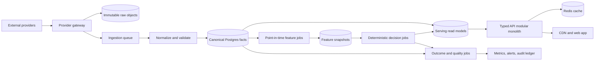

# Greenfield Stock Analysis Architecture

> **Companion document:** [GREENFIELD_BUILD_SPEC.md](GREENFIELD_BUILD_SPEC.md) contains the
> buildable specification — expanded architecture, engineering best-practice catalog, full
> PostgreSQL DDL, provider-to-table mapping, and a copy-paste from-scratch build prompt.
> This document is the *why*; that one is the *how*.

## Executive decision

Build a **Postgres-native modular monolith with separately scalable ingestion workers**, not a
microservice fleet and not a copy of the current application. Keep one canonical security identity,
one schema, one job catalog, one point-in-time data-access layer, one recommendation authority, and
one evidence trail from provider response to displayed value.

The first public product should be a trustworthy research site: market overview, company pages,
screeners, events, fundamentals, portfolios, alerts, and transparent historical analytics. It
should **not** market Buy/Sell recommendations until a point-in-time, cost-aware forward test and a
separate live shadow period show reproducible edge. The latest measurement rules say the incumbent
factor/ranker evidence does not currently clear that bar.

## Review scope and confidence

This blueprint is based on:

- all 1,029 Git commit subjects and repository-wide churn from the initial commit on 2026-05-08
  through 2026-08-12;
- the authoritative rule files in `.claude/rules/`;
- `docs/session-log.md`, `docs/measurement-history.md`, the dated July audits, the corrected August
  incident notes, `ACTION_ITEMS.md`, and the existing rebuild specifications;
- the current package scripts, service entry points, scheduling surfaces, schema, data-quality
  registry, and datasource integration guide.

This is a thematic review of every commit plus a detailed review of the authoritative incident and
architecture evidence. It is not a line-by-line replay of every one of the 1,029 patches.

### Evidence hierarchy

Use evidence in this order:

1. Current executable code, schema, tests, and live query output.
2. Current `.claude/rules/` files and `docs/measurement-history.md`.
3. Corrected incident entries in `docs/session-log.md`.
4. Dated audits, only where later evidence has not superseded them.
5. Design prompts and roadmaps as intent, never as proof.

Do not use generated audit numbers unless the producing program demonstrably queried the stated
database or source. The repository contains an August incident where evidence-shaped scripts and
reports used hardcoded results; that is itself a requirement for audit provenance below.

## What the history says

### Build phases

| Period | What happened | Greenfield lesson |
|---|---|---|
| May 2026 | Rapid expansion into RL, ML, screeners, research, news, F&O, deep learning, and many UI surfaces | Prove the data and feedback loop before expanding feature count |
| June 2026 | More models, routes, tables, jobs, and production-readiness work accumulated around parallel ownership paths | Establish canonical owners and schemas before adding producers |
| July 2026 | Audits found silent failures, look-ahead, sparse features, auth gaps, provider parsing defects, date bugs, N+1 queries, and invalid outcome comparisons | Make correctness, point-in-time access, and output monitoring architectural constraints |
| August 2026 | Composite-key, provenance, measurement-harness, scheduling, monitoring, and fabricated-evidence incidents were corrected | Treat measurement and operational metadata as production data |

The monthly commit distribution was 187 in May, 339 in June, 230 in July, and 273 through August
12. High churn concentrated in `queues.ts`, database schema, ML/ranking code, the original frontend
shell, routers, and signal services. Those are the areas where greenfield ownership must be most
explicit.

## Mistakes to design out

### 1. Feature breadth before a trusted foundation

The project added RL, deep learning, chat, multiple screeners, many dashboards, and many tables
before it had universal point-in-time access, complete outcome grading, or datasource health
coverage.

**Control:** no roadmap item enters development without an owner, source contract, quality checks,
consumer, retention rule, and measurable success criterion. Experimental data stays outside the
canonical feature/serving schemas until promoted.

### 2. Multiple scoring and signal authorities

Independent producers and overlapping signal/outcome tables made ownership and comparison
ambiguous.

**Control:** component engines write versioned component facts. Exactly one deterministic ranker
writes public recommendations. Exactly one outcome grader owns each label definition. Engine,
model version, label definition, and generation timestamp are mandatory keys or columns.

### 3. Schema drift between SQLite and Postgres

Different engines and types let development pass while production failed.

**Control:** PostgreSQL is the only relational engine in every environment. Tests use ephemeral
Postgres containers or schemas. One migration chain is the schema of record. CI applies migrations
from zero and compares the resulting schema to the expected snapshot.

### 4. Mutable history and corrupted provenance

Upserts changed generation timestamps, current snapshots were joined to historical dates, and
daily recomputations left stale excluded rows behind.

**Control:** raw observations, model outputs, recommendations, and audits are append-only facts.
Mutable tables are limited to explicit current-state projections. Historical facts carry
`observed_at`, `effective_at`, `available_at`, `fetched_at`, source, and version. Rebuild projections
from facts rather than mutating facts in place.

### 5. Provider identity confusion

Opaque IDs were guessed, raw symbols were substituted, and IDs from different providers collided.

**Control:** NSE symbol is canonical. Provider IDs live in a bitemporal mapping table with source,
verification status, and provenance. Every provider-issued identifier is keyed by
`(provider, provider_id)`. Missing mappings produce an explicit coverage gap, never a guess.

### 6. Positional and permissive parsing

A blind column-zero fallback wrote profile URLs as symbols and corrupted downstream tables.

**Control:** provider adapters parse named, versioned schemas; reject unexpected content type,
HTML, empty 200 responses, missing required fields, invalid tickers, and non-finite numerics. No
positional fallback may populate an identity field.

### 7. Job success used as data-success evidence

Workers returned success after skips, swallowed exceptions, zero-row writes, or failed subprocesses.

**Control:** a job result has one of `succeeded`, `failed`, `skipped`, or `degraded`; each state has
a reason and metrics. Success requires declared postconditions such as rows read, rows accepted,
rows rejected, rows written, coverage, and watermark. Output health is monitored independently.

### 8. Duplicated schedules and ownership metadata

Cron strings copied into registration, monitoring, and documentation drifted.

**Control:** one declarative job catalog generates scheduler registration, dependency graphs,
heartbeats, dashboards, and SLA checks. Times are stored with an explicit timezone and exchange
calendar policy.

### 9. Calendar dates treated as trading sessions

`date.today()`, weekday arithmetic, midnight-crossing jobs, and incomplete current-day windows
caused missing writes and false alerts.

**Control:** a shared exchange-calendar library owns logical trading session, publication lag,
cutoff, previous/next session, and trading-session windows. Business code cannot compute trading
dates directly.

### 10. Null, NaN, and stale values treated as real values

NaN passed truthiness checks, sorted above real values, and unavailable premium fields became zero.

**Control:** numeric facts use explicit availability status and validation constraints. Non-finite
values are rejected at ingestion. Missing, stale, not-applicable, and zero remain distinct.

### 11. Look-ahead and invalid measurement

Current snapshots leaked into history, random or row-based splits leaked forward labels, close-time
signals used same-close entry, pooled estimates hid date effects, and label definitions were mixed.

**Control:** one point-in-time query API and one purged, embargoed split utility are mandatory for
training, backtests, and replays. Evaluation uses next-session open, costs, liquidity filters,
suspect-bar exclusion, per-date aggregation, winsorisation, both tails, and named label definitions.

### 12. Measurement tooling was trusted without calibration

Backtest exit-pricing and benchmark bugs produced plausible but wrong conclusions.

**Control:** every measurement harness has invariant portfolios, known-result fixtures, a no-signal
baseline, benchmark reconciliation, and negative controls. A harness change must reproduce a known
result before its new result can be cited.

### 13. Tests that could not fail

Some tests reimplemented production logic, derived expectations from the tested constant, relied on
`all([])`, used incomplete writer allowlists, or used SQLite for Postgres-specific behavior.

**Control:** mutation or deliberate-break negative controls are mandatory for critical tests.
Discover writers from code or a registry rather than a hand-maintained list. Integration tests use
the production parser, writer, schema, and database engine.

### 14. Audit output without evidence provenance

Plausible hardcoded audit results entered the repository as though measured.

**Control:** every persisted metric records `run_id`, code commit, query or metric version, data
watermark, environment fingerprint, parameters, and artifact hash. Reports render from these facts;
they do not contain numbers that precede execution.

### 15. Security and deployment were late concerns

IDOR-style authorization gaps, undeployed migrations, wrong Python environments, and SQLite
fallbacks made local success differ from production behavior.

**Control:** tenant ownership is enforced in repository methods and tested. Startup validates
environment, database identity, migration level, model versions, and required secrets. Deployment
records the commit and migration watermark exposed by `/health/version`.

### 16. Frontend generations accumulated instead of being replaced

Multiple live dashboard shells multiplied maintenance and made fixes version-dependent.

**Control:** one application shell and one design system. New experiences use feature flags with an
expiry date and removal owner. A successful replacement deletes the old path in the same release
train.

## Product boundary

### Launch product

1. Market and sector overview with delayed/source-labelled quotes.
2. Company page with price history, corporate actions, fundamentals, ownership, events, news, and
   data provenance.
3. Transparent screeners using deterministic, inspectable filters.
4. Watchlists, paper portfolios, alerts, and export.
5. Corporate calendar and exchange announcements.
6. Data-health and methodology pages visible to users.
7. Historical factor/recommendation research labelled experimental until validated.

### Deliberately deferred

- Intraday trading signals and streaming every tick.
- LLM-generated prices, probabilities, or recommendations.
- RL weight control, autonomous agents, and a general chatbot.
- GPU models, per-user model inference, and user-authored backtests.
- Ingesting every captured endpoint merely because it exists.

These may be added only after the core pipeline meets its reliability objectives and the feature
has a measured user or predictive benefit.

## Target architecture



### Runtime units

Start with three deployable units in one monorepo:

1. **Web:** React/Vite static application served through a CDN.
2. **API:** stateless TypeScript modular monolith exposing typed HTTP procedures. It reads serving
   projections and owns user data; it never runs provider fetches or model training in a request.
3. **Worker:** scheduler plus TypeScript/Python task runners for ingestion, normalization, features,
   decisions, outcomes, and quality checks.

The worker can scale by queue and provider. Split a service only when independent scaling, fault
isolation, or team ownership is measured to require it. Preserve module contracts so extraction is
mechanical later.

### Monorepo shape

```text
apps/
  web/                  React application
  api/                  typed public API and auth
  worker/               scheduler and job executors
packages/
  contracts/            schemas and API contracts
  db/                   migrations, repositories, point-in-time queries
  market-calendar/      NSE/BSE sessions and publication cutoffs
  provider-sdk/         HTTP policy, rate limits, raw capture, adapter interface
  observability/        logs, traces, metrics, run ledger
  testing/              provider fixtures, Postgres harness, negative controls
python/
  analytics/            feature, research, and model code only
infra/
  containers/           reproducible local and production images
  deployment/           environment definitions and runbooks
```

Keep TypeScript at the product and orchestration boundary. Use Python only for analytics where its
ecosystem materially helps. Exchange data between runtimes through versioned database/queue
contracts, not ad hoc stdout strings.

## Data architecture

### Four data zones

1. **Raw:** immutable compressed payloads in object storage, partitioned by provider/date/endpoint;
   metadata and content hash in Postgres. Retain subject to provider terms.
2. **Canonical:** validated provider facts with canonical symbols, provenance, availability time,
   and correction/version semantics.
3. **Feature:** reproducible point-in-time snapshots generated only from facts available at the
   snapshot cutoff.
4. **Serving:** denormalized current projections and precomputed aggregates optimized for API reads.

Do not query raw payloads from user requests. Do not train from serving projections.

### Core schema

```text
security(symbol PK, isin, exchange, status, listed_from, listed_to)
provider_security_id(provider, provider_id, symbol, valid_from, valid_to,
                     verified_at, provenance, PK(provider, provider_id, valid_from))
trading_session(exchange, session_date, open_at, close_at, status, PK(exchange, session_date))
ingestion_run(run_id PK, job_id, provider, started_at, finished_at, status,
              input_watermark, rows_seen, rows_accepted, rows_rejected, rows_written,
              code_commit, parser_version, error_summary)
raw_object(object_id PK, run_id, provider, endpoint_key, fetched_at, provider_timestamp,
           content_hash, content_type, storage_uri, status)
market_bar(symbol, session_date, interval, source, open, high, low, close, volume,
           available_at, run_id, PK(symbol, session_date, interval, source))
corporate_action(symbol, action_type, ex_date, announced_at, source, source_event_id, run_id,
                 PK(source, source_event_id))
fundamental_fact(symbol, metric, period_end, period_type, value, unit, announced_at,
                 available_at, source, run_id, PK(symbol, metric, period_end, source, available_at))
event_fact(symbol, event_type, effective_at, available_at, source, source_event_id, payload, run_id,
           PK(source, source_event_id))
screener_definition(provider, provider_id, version, name, request_hash, enabled,
                    PK(provider, provider_id, version))
screener_membership(provider, provider_id, definition_version, symbol, observed_at, run_id,
                    PK(provider, provider_id, definition_version, symbol, observed_at))
feature_snapshot(symbol, as_of_session, feature_set_version, values, coverage, generated_at,
                 PK(symbol, as_of_session, feature_set_version))
engine_score(symbol, as_of_session, engine, engine_version, score, metadata, generated_at,
             PK(symbol, as_of_session, engine, engine_version))
recommendation(symbol, as_of_session, ranker_version, score, classification, coverage,
               generated_at, facts_cutoff, PK(symbol, generated_at, ranker_version))
signal(signal_id PK, symbol, source_engine, engine_version, direction, generated_at,
       effective_session, facts_cutoff, label_definition)
signal_outcome(signal_id, horizon, label_definition, resolved_at, realized_return, outcome,
               PK(signal_id, horizon, label_definition))
audit_metric(run_id, metric_name, metric_version, value, dimensions, data_watermark,
             code_commit, generated_at, PK(run_id, metric_name, dimensions))
```

Use native `date`, `timestamptz`, numeric, enum/check constraints, and JSON only for genuinely
provider-specific metadata. TimescaleDB is useful for large append-heavy market bars, but ordinary
partitioned Postgres is sufficient initially. Make this an operational choice based on measured
volume, not a prerequisite.

### Time semantics

Every fact distinguishes:

- **effective time:** when the market/company event applies;
- **available time:** when the system could legally and technically have known it;
- **observed time:** when this system saw it;
- **system time:** when this version was stored.

All historical features query `available_at <= decision_cutoff`. This one rule is shared by live
scoring, replay, backtest, and model training.

## Datasource strategy

### Priority order

**Tier 0: authoritative foundations**

- NSE: security master, bhavcopy/OHLCV, indices, corporate filings where available.
- BSE: announcements and BSE-specific corporate events.
- Corporate actions before adjusted-return computation.
- AMFI for mutual-fund reference data where the documented endpoint remains usable.

**Tier 1: resilient public fallbacks and core enrichment**

- Yahoo Finance for derived `.NS` quote/history fallback with explicit source and timestamp.
- Exchange announcements plus active RSS for news/event discovery.
- One carefully selected provider for fundamentals and ownership, based on coverage and terms.

**Tier 2: differentiated provider enrichment**

- MoneyControl: price, company, screener, news, and market intelligence using explicit mappings.
- Trendlyne/SmartOptions: authenticated fundamentals, screeners, and technical/F&O enrichment.
- Economic Times/ETNow/Indiatimes: POST-body-defined screeners and market statistics.
- NiftyTrader: F&O/option-chain fallback where permitted.
- MarketsMojo/Trading80, TickerTape, InvestSights, TapeTide, StockEdge, TradeBrains, Finology, and
  NDTV Profit only for a named product/data gap with a maintained adapter.
- GNews, GDELT, Google News, Sensibull events, and provider stock news as supplemental event feeds.

**Experimental registry**

Import the normalized URL and POST-request corpus as disabled registry metadata. Promote one
endpoint only after a real-network shape test, production parser, idempotent writer, provenance,
and freshness/quality policy exist. Captured URL count is not production coverage.

### Adapter contract

Each provider adapter declares:

```text
provider and endpoint key
integration class: ingestion, read-through, discovery, supplemental, internal
identifier requirements and resolver
request method/template/body schema
authentication/session policy
rate and concurrency budget
timeout/retry/circuit-breaker policy
response content-type and size limits
parser and schema version
target canonical fact type
publication lag and trading-calendar policy
raw-retention/licensing policy
freshness, coverage, shape, and plausibility SLOs
```

Shared HTTP infrastructure supplies bounded retries with jitter, per-provider concurrency and rate
limits, session renewal, circuit breaking, request correlation, and secret redaction. HTTP 200 is
not success until content and shape validation pass.

### Legal and product constraint

“Free to users” does not mean provider data is free to redistribute. Before launch, record for each
source: terms URL/version, permitted use, attribution, caching/retention, redistribution, delay,
rate limit, and deletion obligations. If real-time redistribution rights are absent, display
delayed data with source timestamp or link to the authoritative provider. This is a release gate,
not a later compliance task.

## Serving and performance

### Read path

1. CDN serves versioned static assets.
2. API validates input/auth and checks Redis.
3. Cache miss reads a precomputed serving projection through a bounded, indexed query.
4. Response includes data timestamp, source/provenance summary, and stale status.
5. Cache invalidation uses projection version/watermark, not broad wildcard deletes.

No user request may invoke a provider, run Python, compute a whole-universe rank, or scan an
unbounded time series.

### Initial engineering targets

These are proposed SLOs, not measurements of the current system:

- public cached API p95 under 150 ms at the application edge;
- uncached indexed API p95 under 500 ms;
- zero unbounded list endpoints; cursor pagination everywhere;
- market-close canonical data available within its provider-specific publication SLA;
- 99.9% successful serving requests excluding declared upstream-unavailable states;
- every displayed fact carries a watermark and stale state.

Use query budgets, `EXPLAIN` checks for critical read paths, slow-query tracing, connection pooling,
and load tests at 2x the expected launch traffic. Scale stateless API replicas first, provider
worker pools second, and Postgres read replicas only after query/index/caching evidence warrants it.

## Decisions and ML

### Deterministic system first

The canonical ranker consumes versioned component scores and emits a reproducible result with:

- score and rank;
- component breakdown;
- engine/data coverage;
- fact cutoff and generation time;
- quality gate and hard-veto reasons;
- ranker/model version.

Missing component scores do not silently renormalize into an apparently comparable score. The
ranker either uses an explicitly tested missingness policy or marks the output insufficient.

### Promotion lifecycle

`candidate -> shadow -> approved -> active -> retired`

Promotion requires:

1. point-in-time data and purge-by-date plus embargo;
2. comparison with a simple baseline and active model on untouched periods;
3. costs, liquidity, corporate actions, and survivorship-aware universe;
4. per-date results, uncertainty, multiple-testing correction, and both-tail diagnostics;
5. stable artifact validation across multiple seeds where applicable;
6. a live shadow period with realized outcomes;
7. reversible activation with immutable artifact/version history.

No calibrated probability controls gating or position sizing until its live discrimination and
calibration meet a preregistered threshold on enough independent dates. Do not invent the threshold
after seeing the result.

### LLM boundary

An LLM may summarize already-stored facts and produce supporting facts, contradictions, and an
invalidation narrative. It may not create prices, returns, probabilities, scores, directions, or
provider facts. Store model, prompt version, input fact IDs, and output. Its output can warn or
suppress only after separate evaluation; it can never increase a recommendation.

## Reliability, security, and observability

### Required telemetry per job

- run ID, job definition version, code commit, worker image, and environment;
- source watermark and target watermark;
- rows seen/accepted/rejected/written/deleted;
- latency, retries, rate-limit events, session refreshes, and circuit state;
- parser/schema version and raw object hashes;
- explicit skipped/degraded reason;
- postcondition results.

Monitor freshness, per-symbol density, latest complete session coverage, shape, range, non-finite
values, duplicates, identifier validity, and write volume. Naturally sparse data warns on absence;
it does not hard-fail simply because no insider trade occurred.

### Security baseline

- OIDC/OAuth authentication; short-lived server-validated tokens.
- Row ownership/tenant checks in repository methods for portfolios, watchlists, alerts, and notes.
- Parameterized SQL only; least-privilege DB roles for API, ingestion, migrations, and analytics.
- Secrets in a managed secret store, never logs or client bundles.
- Egress allowlists for workers and no provider network access from the API process.
- Per-user/IP rate limits, request size limits, CSP, strict CORS, CSRF protection where cookies are
  used, and dependency/container scanning.
- Encrypted backups, restore drills, retention/deletion policy, and an auditable admin path.

### Health endpoints

- `/health/live`: process is alive; no dependency calls.
- `/health/ready`: required dependencies and migration level are usable.
- `/health/version`: commit, image, schema migration, job catalog, and active model versions.
- `/health/data`: summarized current watermarks and declared degraded sources.

## Testing and release gates

### Test pyramid

1. Pure unit tests for parsers, calendars, formulas, and decision rules.
2. Contract tests against saved raw payloads, including malformed/empty/HTML/schema-drift cases.
3. Ephemeral-Postgres integration tests using production migrations and writers.
4. One opt-in real-network canary per provider endpoint family using the production resolver,
   request, parser, and writer.
5. Replay tests from raw object through canonical fact and serving projection.
6. API authorization and pagination tests.
7. Browser tests for the small set of critical user journeys.
8. Load and failure-injection tests for queue contention, provider throttling, cache loss, and DB
   failover.

### Mandatory gates

- migration from empty database and upgrade from last release both pass;
- schema drift check passes;
- parser negative control fails when the protected defect is reintroduced;
- every new ingestion target has freshness plus shape/coverage checks;
- every new scoring change includes reproducible measurement evidence;
- deployment smoke test queries written rows back from the target environment;
- active commit, migration, and model versions match the release manifest;
- rollback and restore procedures have been exercised.

## Cost-aware scaling

Keep the product free by minimizing always-on compute, not by depending on a particular vendor's
temporary free tier.

- Static frontend on a CDN.
- One small stateless API deployment, scaled to zero only if acceptable for latency.
- One managed or self-hosted Postgres with automated backups.
- Redis only for queue/cache workloads that justify it; never make cache availability correctness-
  critical.
- Batch provider ingestion and analytics around publication windows.
- Object storage for compressed raw payloads and older analytical extracts.
- CPU-first analytics; no GPU or always-on LLM dependency at launch.
- Budgets and quotas per provider, job, user, and environment.

The architecture scales horizontally, but the MVP does not pay the operational tax before demand
exists.

## Delivery plan

### Phase 0: contracts and compliance

Deliver security identity, provider registry, terms/redistribution register, exchange calendar,
schema migrations, run ledger, and local ephemeral-Postgres environment.

**Exit:** one command creates the stack from zero; one sample provider payload traverses raw,
canonical, and serving zones with provenance intact.

### Phase 1: trustworthy market core

Implement NSE security master, bhavcopy/OHLCV, corporate actions, BSE announcements, and Yahoo
fallback. Build market/company read models and basic web pages.

**Exit:** two weeks of scheduled runs meet declared freshness/coverage checks; restore test passes;
all displayed prices have source and timestamp.

### Phase 2: research product

Add one fundamentals/ownership provider, deterministic screeners, events/news, watchlists,
portfolios, and alerts. Add raw-payload replay and a public data-health page.

**Exit:** critical browser journeys pass; provider failures produce explicit stale/unavailable
states; no request path calls a provider.

### Phase 3: analytical history

Build point-in-time feature snapshots, corporate-action-adjusted returns, factor research harness,
and immutable experiment/audit records. Keep results internal or labelled experimental.

**Exit:** harness reproduces registered controls and survives deliberate leakage/exit-pricing
negative controls.

### Phase 4: shadow decisions

Run one simple baseline and selected candidate models in shadow. Persist recommendations and
outcomes without public Buy/Sell claims.

**Exit:** preregistered live observation period and independent-date minimum are met; model remains
better than baseline after costs and corrections.

### Phase 5: public decision support

Expose a recommendation only if Phase 4 passes. Show methodology, date, source coverage,
uncertainty, conflicts, and track record. Add the optional grounded narrative layer last.

**Exit:** rollback, model retirement, incident response, and user-facing correction workflows are
tested.

## Non-negotiable invariants

1. NSE symbol is canonical; provider IDs are explicit and provider-scoped.
2. Postgres is the only relational behavior contract.
3. Historical facts are append-only and point-in-time queryable.
4. No fact is used before its `available_at` time.
5. No provider call or analytical recomputation occurs in a user request.
6. Job success requires data postconditions; skip and degraded are distinct states.
7. Every displayed datum has provenance, timestamp, and stale state.
8. Every external parser has saved-payload tests and a real-network canary.
9. Every live table has freshness plus shape/coverage monitoring.
10. One ranker owns public recommendations; component engines cannot bypass it.
11. Label definition and source are part of every outcome contract.
12. Tests and audit reports must prove they can fail.
13. Measurement code is calibrated against known controls before new claims are accepted.
14. LLM output never becomes a market fact, score, price, probability, or direction.
15. A feature flag has an owner, expiry, and deletion plan.

## Source documents

- [Project operating instructions](../CLAUDE.md)
- [Datasource integration guide](DATA_SOURCE_INTEGRATION_GUIDE.md)
- [Measurement rules](../.claude/rules/measurement.md)
- [Measurement investigation history](measurement-history.md)
- [Recurring bug classes](../.claude/rules/recurring-bugs.md)
- [Scoring authority](../.claude/rules/scoring-authority.md)
- [Datasource and identifier rules](../.claude/rules/data-sources.md)
- [Historical session log](session-log.md)
- [Existing rebuild prompt](NEW_SYSTEM_MASTER_PROMPT.md)
- [July full-stack audit](audit-2026-07-28/FULL_STACK_AUDIT.md)
- [Data-bias and quant audit](audit-2026-07-30/DATA_BIAS_AND_QUANT_STRATEGY_AUDIT.md)
- [Intraday audit](audit-2026-07-31/INTRADAY_PIPELINE_AND_STRATEGY_AUDIT.md)
- [Endpoint/data review](audit-2026-07-31/ENDPOINT_DATA_REVIEW_AND_QUANT_VALUE.md)