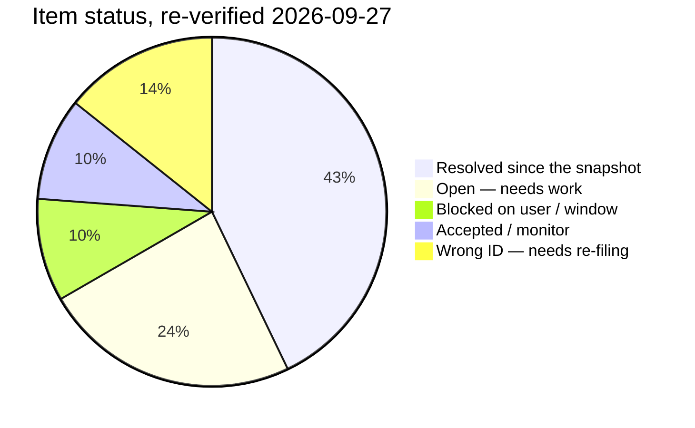

# Bharat Stock Intelligence — Gaps, Opportunities & Open Items

> Analysis as of 2026-09-26, sourced from [audit-findings.md](file:///d:/Github/bharat-stock-intelligence/docs/audit-findings.md), [session-log.md](file:///d:/Github/bharat-stock-intelligence/docs/session-log.md), [measurement.md](file:///d:/Github/bharat-stock-intelligence/.claude/rules/measurement.md), and codebase inspection.

---

## 1. Open Audit Findings (26 items as listed on 2026-09-26)

> **Status row-by-row re-verified 2026-09-27:** of the 21 IDs itemised below, **9 are resolved or
> superseded**, **5 still need work**, **2 are blocked on your decision/window**, **2 are
> accepted/monitor**, and **3 carry the wrong ID** (they must be re-filed). Each row now says so
> inline. The headline corrections: the chatbot and express fixes are **live**, the coordinated DL
> retrain **has landed**, `regime_edge_status` **is written**, and the "`#1 unbuilt`" intraday
> grading harness **has existed since July**.

These are tracked rows in `audit-findings.md` that have **not been closed**. Grouped by urgency and blocking reason.

### 🔴 Blocked by User Action / Deployment

| ID | Summary | Blocker |
|---|---|---|
| **AF-20260925-01** | Production venv out of sync with `requirements.txt`. **CORRECTED 2026-09-27 — `websockets` is NOT missing**: it is installed (**16.0**) and `import websockets` succeeds; only its `dist-info` was destroyed by a failed uninstall, so `pip show`/`pip check` report it absent against 4 packages. **Runtime impact today: nil.** `transformers` declared 5.10.1 / installed 5.9.0; `protobuf` 7.35.0 vs `opentelemetry-proto<7`. Also found: `websockets` was declared in **no** manifest (now pinned 16.0). (AF-20260927-15) | Maintenance window: stop 4 pm2 services → `pip install --force-reinstall --no-deps websockets==16.0`, `pip install -r requirements.txt`, resolve `protobuf<7`, restart, re-run `pip check`. |
| **AF-20260925-05** | 3 chatbot market tools fixed (`get_sector_momentum`, `get_signal_accuracy`, `get_top_confluence_stocks`). **RESOLVED 2026-09-27 — LIVE**, was listed here as "NOT DEPLOYED": `chatbot` (pid 20076) started 2026-09-27 10:52, *after* `market_tool.py`'s 09-25 16:02 write, and `pytest tests/chatbot/` = **52 passed** against live Postgres. | none |
| **AF-20260925-04** | `npm audit fix` applied (9→3 vulnerabilities) — `express` patch **NOW LIVE**, was listed here as "NOT live": `node_modules/express` = 4.22.3 (09-25) and `bharat-server` restarted 2026-09-27 15:02, after it. | none |
| **AF-20260910-26** | **ID CORRECTED 2026-09-27: this is -26, not -27.** `AF-20260910-27` is the repo-doctor log-classifier finding, still open. -26: `scripts/install-pm2-autostart.ps1` fallback path broken — **PARTIAL**: a privilege-free per-user Startup `.cmd` → `pm2 resurrect` rung was added and installed 2026-09-18. | Your call: accept the fallback, or run the elevated command. |

### 🟠 Evidence / Measurement Needed Before Acting

| ID | Summary | What's Needed |
|---|---|---|
| **AF-20260913-02** | **SUPERSEDED 2026-09-27 — the coordinated retrain HAS landed.** Live `model_registry`: **BiLSTM v6 trained 2026-09-20 08:42** (cv_roc_auc 0.5208), **ensemble `20260926_121251` trained 2026-09-26 06:42** (0.5361); the ledger's own reconciliation block reads "Retrain confirmed executed 2026-09-21 … **All four DEPENDS items now CLOSED**". | none — was listed here as still blocked. |
| **AF-20260913-05** | `dl` weight **PAUSED to 0.0 in all five regimes** — re-verified 2026-09-27 by reading `unified_ranker.REGIME_WEIGHTS` live (`'dl': 0.0` in BULL/BEAR/HIGH_VOL/CRASH/SIDEWAYS). The ledger closed this row as *pause stable*, not as *restored*. `dl_score` still reads ~0 on the ranker panel (5d +0.010/0.506), so there is still no restoration case. | Restore only from the promoted model's realised `factor_edge_history` reading — which does not exist. |
| **AF-20260906-01** | DL walk-forward AUC was inflated (date overlap); harness fixed. **An honest number now exists**: BiLSTM v6, `cv_roc_auc 0.5208`, trained 2026-09-20 — barely above random, which is the honest answer rather than no answer. | none for now; re-grade when a promoted model's edge accrues. |
| **AF-20260910-30** | **NUMBER CORRECTED 2026-09-27: 474 bars / 87 symbols → 8,789 bars / 2,328 symbols (18×)**, dominated by one rule added since: **8,499 bars on 2,320 symbols = "closed session: universe-wide flat zero-volume bar"**, plus `nonpositive_price` 84, `impossible_move` 71, `ohlc_inconsistent` 31, unclassified 104; 8,720 are 2026 rows. The quarantine grew; the question it poses is now bigger. | Spot-check a sample against NSE bhavcopy to confirm/clear — now a **large** EVIDENCE item, not a small one. |
| **AF-20260905-25** | **WRONG ID 2026-09-27: no row in `docs/audit-findings.md` mentions `ensemble_score`.** AF-20260905-25 is the Trendlyne zero-item-run monitoring reversal (closed 2026-09-05). The underlying question — is the ensemble's own score graded? — belongs to `win_probability`/`ml_score` rows, which are graded (no edge). | Re-file under a correct ID if the question is still wanted. |

### 🟡 Investigate / Fix (Code Changes Needed)

| ID | Summary | Effort |
|---|---|---|
| **AF-20260925-02** | **All 29 silent broad-`except` handlers are now TRIAGED** — this digest recorded the mid-pass state ("25 remain"). The ledger's own later update: 4 fixed in `outcome_resolver.py`; the other 25 checked against live Postgres or by reading, **no further defect found**; `cs_ranker`/`online_learner` sites moot (models deactivated 2026-08-31); the 4 signal-surface sites (`scoring_engine.py`, `unified_ranker.py`) deliberately left unchanged because a log-only diff there trips `verify-gate.mjs`'s backtest-evidence requirement. | none — read as closed, but the row still carries no close date. |
| **AF-20260918-06** | `sector_global_corr` step failed once (2.9% rate, transient). | Re-open only if it fails again |
| **AF-20260917-20** | Unified-ranker timeout + missing `unified_recommendations` write on 09-17. **Partly resolved:** the budget is now **45 min** (lock 55 min) in `queues.ts`, a bounded make-up run was added, and `commandCenter`'s manual run was aligned to the same budget (AF-20260927-07); the ledger has a "CLOSED AS VERIFIED 2026-09-19" block for this ID. **CLOSED 2026-09-28 — this digest's claim was WRONG.** The race was fixed on 2026-09-22 by a poll-wait freshness gate in `digests.jobs.ts`: `unifiedRankingIsFresh()` reads `MAX(generated_at)` from `unified_recommendations` and polls every 60s for up to 75 min, so the digest waits for the ranker instead of racing it; on give-up it files a `success: false` step naming the gate, which distinguishes "input not ready" from "nothing sent". Live `job_run_history`: 09-23 waited 3s, 09-25 waited 367s, and **09-24 waited 4,401s (73 min)** — the ranker's 17:45 timeout-killed run plus its make-up leg — and still delivered. `jobRegistry.ts` graceMinutes 90 already covers the ~18:18 worst case, and its comment records that a later fixed slot was considered and REJECTED because it "would just re-create the race whenever the ranker runs long or the host wakes late". | none — and **do not move the cron**, that would undo the gate. No `bharat-server` restart is needed for this, so it is out of the maintenance window. |
| **AF-20260917-21** | Step-level error text needed for `screener-performance` 4-step failures. | Investigate with fresh failure logs |
| **AF-20260917-23** | Unindexed `MAX(ts)` probes causing live DB contention. **CLOSED 2026-09-26** — migration `20260926130000` added `idx_marketsmojo_tech_hist_date`, live-verified with `EXPLAIN ANALYZE`. | none |
| **AF-20260910-06** | **ID CORRECTED 2026-09-27: this row is Trendlyne rate-limit classification (closed 2026-09-10), not the metric-confusion item.** The observation itself is still live: `model_registry.cv_roc_auc` holds **2.119** for `exit_policy`. | Re-file under a correct ID if still wanted. |
| **AF-20260909-12** | **ID CORRECTED 2026-09-27: the `mover-screener-capture` race is AF-20260909-02 — FIXED.** `queues.ts` moved `mover-capture-daily` 16:05 → **16:50 IST**, with a comment naming the 2026-09-08 date-loss incident. AF-20260909-12 itself is the ml-weekly-retrain make-up (pending-verify). | none |
| **AF-20260831-03** | Corrupt `1965-03-06` rows in `ohlcv_adjustment_factors`. **CLOSED / permanently fixed 2026-09-26** (root cause: `ohlcv_adjust.py`'s cross-validation with no date filter); **live count 2026-09-27 = 0**. | none |
| **AF-20260829-12** | Stale config or scheduling gap — still open (EVIDENCE, deliberately not actioned). | Investigate when the before/after measurement can settle it |
| **AF-20260910-01** | **ID CORRECTED 2026-09-27: AF-20260910-01 is the `queues.ts` heartbeat single-writer fix (closed 2026-09-10), not the `integrity_sweep.py` anchoring item.** `scripts/integrity_sweep.py` still exists. | Re-file the anchoring item under a correct ID if still wanted. |

### ⚪ Accepted / Calendar-Blocked

| ID | Summary | When |
|---|---|---|
| **AF-20260816-15** | libuv native abort (`UV_HANDLE_CLOSING`). Rare, not reproducible. | Accepted |
| **AF-20260910-12** | No DL retrain completed since 08-25 at time of writing; champion from 06-17. | Blocked on AF-20260913-02 |

---

## 2. Major Gaps & Missing Capabilities

### ✅ Intraday Outcome Grading — BUILT (this section's premise was wrong)

**CORRECTED 2026-09-27 — the harness exists, is wired in, and is current.**
`src/server/intraday_outcome_resolver.py` grades every intraday LONG/SHORT recommendation as a
paper trade on **15-minute bars**: entry = the open of the first bar strictly after `cycle_at`,
stop hit → LOSS, target hit → WIN, stop-before-target when one bar touches both (conservative),
session-close square-off otherwise, plus an explicit intraday execution-cost model — and long and
short are resolved and gated independently. It is wired into the daily chain at `queues.ts:1313`
(300s budget) and writes `intraday_recommendation_outcomes`: **13,859 rows over 40 cycles,
2026-07-17 → 2026-09-25** (the last trading session), with `job_heartbeat.outcome-resolver` =
success, 132 runs / 7 fails. Its own docstring records the 2026-07-31 audit that stopped it grading
intraday signals against whole-day bars — a defect that had manufactured 122 STOP_GAP and 42
TARGET_GAP exits that never happened.

> **Impact — restated:** intraday win rates are measurable today, so this is no longer the
> instrumentation hole this document called it. What stays a *research candidate* is any specific
> intraday **edge** — and whether it survives costs is the same open question as everything in §4.

### 🟡 The Ranker Cost Backtest — BUILT AND RUN (first readings exist)

`unified_score` has a real IC (+0.051 @5d) measured over 35 dates (eff 5.4). **CORRECTED
2026-09-27: a cost-aware `factor_backtest.py` pass had indeed never been run, and it could not
have been** — `run_backtest()` only accepts factors computed from the `stock_ohlcv` panel, so a
table-scored factor like `unified_score` was unreachable. The path now exists
(`--scores-table/--scores-col`, dated by `generated_at`) and both cadences have been run:

| cadence | periods | net excess / period | t | one-way turnover | cost drag |
|---|---|---|---|---|---|
| 5-session | **3** (0.06y) | +1.315% | (4.49) | 0.673 | **16.97%/yr** |
| 1-session | **24** (0.1y) | +0.075% | (0.73) | 0.399 | **50.3%/yr** |

Neither run clears the verdict floor (20 periods **and** ≥1 year), so the harness prints
`INSUFFICIENT POWER` and refuses a verdict — the 3-period t=4.49 must not be quoted. **The
readable finding is turnover: 17–50%/yr of cost drag at 25bps/side.** A verdict cannot exist
before ~**2027-08**, because `unified_recommendations` starts 2026-08-10.

> **Impact — restated:** the question is now answered "not yet measurable, and here is the hurdle
> rate" rather than unasked.

### 🟠 Production venv Drift

The production Python environment is out of sync with the pinned manifest. `websockets` has a half-removed dist-info directory, `protobuf` breaks `opentelemetry-proto`, and `transformers` is a minor version behind. A locked `.pyd` file from a running service prevented the last install attempt.

> **Impact:** Untested library versions in production; any new import could surface the mismatch.

### 🟡 Dead / Empty Infrastructure Tables

Confirmed dead or empty tables that represent unfinished features:

| Table | Status (re-verified live 2026-09-27) |
|---|---|
| `tick_data` | **0 chunks** — no tick source exists ✅ (still accurate) |
| `bulk_deals` | **8 rows**, dead since 05-19 ✅ — but note `block_deals` **14,564** is the live half |
| `screener_runs`, `technical_scans`, `signal_actions`, `price_alerts` | **CORRECTED: `screener_runs` 63 and `technical_scans` 29 are NOT empty**; `signal_actions` and `price_alerts` are 0 ✅ |
| `backtest_strategies` | **0** — strategy registry never built ✅ (`backtesting_runs` 1,390+ is where real runs land) |
| `regime_edge_status` | **CORRECTED: 6 rows, `computed_at` 2026-09-25T15:43** — `scoring_engine._refresh_edge_status()` writes it nightly. The "writer never built" claim is false. |
| `finstack_cashflow_history` / `et_cashflow_history` | **CORRECTED: ET is 11,700 rows, not 30** (390×); `finstack` 28, still sparse |
| `order_book_snapshots`, `timeframe_scores` | **0** ✅ |
| `marketsmojo_stock_picks` | **CORRECTED: 7 rows, not empty** (matches the 09-09 audit's "mojo picks 7") |
| `data_ingestion_dlq` | **0 rows AND no writer anywhere in the codebase** — only readers (`worker_service.py:89`, `market_intelligence_mcp.py:107`). "Never wired" ✅ accurate. |

### 🟡 Missing Monitoring & Observability

1. **`signal_registry` view** — recommended but unbuilt (re-verified 2026-09-27: `to_regclass('public.signal_registry')` IS NULL and no code references it). Still a genuine gap.
2. **`completeness_watermarks` table** — not built under that name. The ontology work added **`market_data_watermark`** with exactly the intended shape (`dataset`/`partition_key`/`as_of`/`input_watermark`/`output_watermark`/`completeness_status`) but it holds **0 rows — no writer**, so the underlying gap stands.
3. **`regime_edge_status` writer** — ~~the table exists but nothing populates it~~ **CORRECTED 2026-09-27: BUILT.** `scoring_engine._refresh_edge_status()` populates it; live table has **6 rows** (per-regime AUCs + `__GLOBAL__` 0.6082) stamped 2026-09-25T15:43.
4. **Pytest schema reaper** — **CORRECTED 2026-09-27: BUILT.** `pg_test_support.purge_orphan_schemas()` is invoked at `pg_test_support.py:83`, and `conftest.py` claims a **session advisory lock** for each connection so the reaper cannot drop a live run's schema (the 2026-08-27 incident where a reaper corrupted a running pytest is exactly what that lock prevents).

---

## 3. Areas of Opportunity

### 🟢 Near-Term (Actionable Now)

| Opportunity | Why It Matters | Effort |
|---|---|---|
| **Run `factor_backtest.py` on `unified_score`** | ~~The ranker has never been cost-tested. This is a single command. Even negative would be informative.~~ **DONE 2026-09-27 — and it was never one command: `run_backtest()` only accepts factors computed from the price panel, so a table-scored factor was unreachable until `--scores-table/--scores-col` was built.** Two cadences run: 3 periods / 24 periods, neither reaches the verdict floor; **turnover reads 16.97%/yr (5-session) and 50.3%/yr (daily)**. | ✅ done |
| **Grade `screener_momentum_score` post-reclassification** | **19 dates** (was 14 as of 09-20; live 2026-09-27, 08-31..09-25) — one session short, so it clears with the next session, **2026-09-28**, not ~09-29/10-06. | 1 command, after 09-28 |
| **Grade analyst-revision trio** | `eps_revision_3m_pct` / `target_revision_3m_pct` / `analyst_count_chg` — **14 dates** (was 9), max 09-25. Clears the 20-date floor ~**2026-10-06**. | Calendar-blocked |
| **Grade `basis` from F&O OI history** | ~~Run `factor_edge.py --entry open` on this column.~~ **DONE 2026-09-26T12:45: rank_IC +0.1355, 22 dates, eff 22.0 → verdict `USABLE`.** OI panel now 26 dates, and `measurement.md` — which still carried the older 17-date "lead" reading — has been corrected (AF-20260927-17). | ✅ done |
| **Deploy pending fixes** | ~~Chatbot tools, express security patch, venv sync — all committed, none live.~~ **Chatbot tools and express patch are LIVE** (verified 2026-09-27 by process start time vs file mtime, plus 52/52 chatbot tests against live Postgres). Only the **venv sync** remains, and it needs a service-stop window. | 1 maintenance window |
| **Backfill fundamentals from Trendlyne** | **Wired** — `trendlyne_pe_history` = **4,190,967 rows, 2013-12-24 → 2026-09-25**, and `factor_backtest.py:574,584` already registers it (with `trendlyne_pb_history`) as a factor source, alongside `backfill_pe_valuation_bands.py`. | verify no retrospective restatement, then grade a value factor |

### 🟡 Medium-Term (Design + Build)

| Opportunity | Why It Matters |
|---|---|
| **Intraday outcome grading pipeline** | ~~The #1 unbuilt capability. MFE/MAE/first-touch labels from `intraday_ohlcv` against `intraday_recommendations`.~~ **BUILT and current** (see §2): `intraday_recommendation_outcomes` holds **13,859 rows**, refreshed after every session. What is left to build is grading the *candidates* this produces against costs, not the labels. |
| **Confluence composite as a standalone factor** | `confluence_score` reads +0.069 → +0.153 IC across horizons on the 2026-09-26 close-entry run (5/10/21d on 28/24/13 dates, LOW-DATA) and **already carries the ranker**. A cost-aware backtest would prove or disprove the most promising engine — **and it is now genuinely one command**: `factor_backtest.py --factor external_score --scores-table unified_recommendations --scores-col confluence_score` (the same path built for `unified_score`, AF-20260927-13). |
| **Low-volatility factor via a different construction** | `atr_pct` has the strongest, most horizon-persistent IC (−0.077 @21d on liquid names) but dies on costs because bottom-50 turnover is 41-83%. A sector-neutral or percentile-rank construction could reduce turnover. |
| **Regime-conditional ranker weights** | BEAR regime reads **negative** across all horizons (5d −0.191, 10d −0.144). Zeroing the ranker in BEAR (or hedging) is a testable idea. |
| **DL model rebuild** | Deep history inputs landed, scaling parity fixed, walk-forward harness corrected — ~~the retrain itself is the missing piece~~ **DONE: BiLSTM v6 trained 2026-09-20 (cv_roc_auc 0.5208), ensemble retrained 2026-09-26 (0.5361).** The remaining question is evidence, not infrastructure: `dl` weight stays **0.0** and `dl_score` still reads ~0 on the ranker panel, so it cannot be restored yet. |

### 🔵 Strategic (Longer Horizon)

| Opportunity | Why It Matters |
|---|---|
| **The capitulation triple is the ONE validated edge** | `gap_down AND open_eq_low AND top_loser`: t=+3.48, p=0.0005, clears Bonferroni. But capacity-constrained (~₹0.46cr/signal-day). Building automated execution for this at personal/prop scale is the highest-EV production work. |
| **Trendlyne PE/PB deep history for value factors** | 4.16M rows back to 2013. Could unlock fundamental factor testing with 10+ years of history instead of 3 months. |
| **Institutional flow signals** | `delivery_pct` has a real directional signal (quintile spread +0.19pp/day, t=+7.82) but fails as a long-only factor. Combining with flow/volume data or using it as a filter rather than a standalone factor is untested. |

---

## 4. Summary Scorecard

> The pie counts the 21 IDs listed in §1 only. Separately, §2's four capability gaps now split
> **2 built** (`regime_edge_status` writer, pytest schema reaper) / **3 still unbuilt**
> (`signal_registry` view, a watermark writer for `market_data_watermark`, a `data_ingestion_dlq`
> writer) — the two "built" items are counted as resolved above, the three unbuilt ones are not in §1.

### Top 5 Actions by Impact

1. **Sync the production venv** — one maintenance window. Runtime impact today is *nil* (verified:
   `websockets` 16.0 imports), but `pip check` cannot verify a production environment whose metadata
   is gone, and `transformers`/`protobuf` still drift from the manifest. (AF-20260927-15)
2. ~~Re-sequence `recommendations-digest` to ≥23:30 IST~~ — **WITHDRAWN 2026-09-28: already
   fixed on 2026-09-22, and moving the cron would RE-CREATE the race it claims to fix.** The
   digest poll-waits up to 75 min on `unified_recommendations.generated_at` before sending; on
   09-24 that wait measured 4,401s and still delivered the ranking. `jobRegistry.ts` documents
   the deliberate rejection of a later fixed slot. Nothing to do, and no restart needed.
   (AF-20260917-20 — my earlier claim here was checked against the code and found wrong.)
3. **Re-grade `screener_momentum_score` on 2026-09-28** — one command; the panel reaches 20 dates
   with the next session.
4. **Build the `signal_registry` view and a watermark writer** — the last two real capability gaps
   left in §2.
5. **Do not act on the ranker's t-statistic until ~2027-08.** The first cost-aware readings exist and
   both fall under the verdict floor; the number that is readable now is **turnover: 17–50%/yr of
   cost drag**.

> [!IMPORTANT]
> **The cost-aware test has now been run, and it did not pass.** `unified_score` returns
> **+1.315%/period over 3 periods (t=4.49)** and **+0.075%/period over 24 periods (t=0.73)** —
> neither reaches the verdict floor (20 periods AND ≥1 year), so the harness prints
> `INSUFFICIENT POWER` and refuses a verdict, and the 3-period t-stat must not be quoted. What
> survives that gate is the mechanical number: **one-way turnover of 0.673 per 5 sessions
> (16.97%/yr) and 0.399 per session (50.3%/yr) at 25bps/side.** The dominant finding stands in a
> sharper form — every factor that has been cost-tested either failed or, in the ranker's case,
> cannot yet clear a hurdle of **17–50%/yr** — and the next honest step is a longer panel, not a
> re-interpretation of these runs.

---

## Verification pass — 2026-09-27 (live)

> Appended by an agent session. The analysis above is preserved as the **2026-09-26 snapshot**; every
> claim below was re-checked on 2026-09-27 against live production (`scripts/sql.py`), the running pm2
> processes, `git`, `factor_edge_history` and `.claude/rules/measurement.md`. Note this box IS
> production: pm2 runs `src/server/chatbot/app.py` with cwd `D:\Github\bharat-stock-intelligence`.

### Now resolved (the snapshot lists these as open / pending / blocked)

| Snapshot item | Live status 2026-09-27 | Evidence |
|---|---|---|
| AF-20260925-05 — chatbot tools "**NOT DEPLOYED**" | **LIVE** | `chatbot` pid 20076 started 2026-09-27 10:52:20, *after* `src/server/chatbot/tools/market_tool.py` mtime 2026-09-25 16:02:54 — the running process imported the fixed module. `pytest tests/chatbot/` = **52 passed in 260s, exit 0** against live Postgres. |
| AF-20260925-04 — express patch "NOT live" | **LIVE** | `node_modules/express/package.json` = **4.22.3** (installed 2026-09-25 13:48); `bharat-server` pid 31064 started **2026-09-27 15:02:04** — the restart the row was waiting on has happened. |
| AF-20260917-23 — unindexed `MAX(ts)` probes | **CLOSED 2026-09-26** | Ledger row: migration `20260926130000`, `marketsmojo_technical_history(date DESC)`, live-verified. |
| AF-20260831-03 — corrupt `1965-03-06` rows | **CLOSED / permanently fixed 2026-09-26** | live `SELECT count(*) FROM ohlcv_adjustment_factors WHERE ex_date::text LIKE '1965%'` = **0**. |
| `mover-screener-capture` race (listed as AF-20260909-12) | **FIXED — real ID is AF-20260909-02** | `queues.ts` moved `mover-capture-daily` 16:05 → **16:50 IST**, with a comment naming the 2026-09-08 date-loss incident. |
| AF-20260913-02 — "coordinated retrain has never completed cleanly" | **SUPERSEDED — retrains landed** | live `model_registry`: **BiLSTM v6** trained 2026-09-20 08:42 (cv_roc_auc 0.5208); **ensemble `20260926_121251`** trained 2026-09-26 06:42 (0.5361). The ledger's own reconciliation block reads "Retrain confirmed executed 2026-09-21 … **All four DEPENDS items now CLOSED**". |
| AF-20260910-12 — no DL retrain since 08-25 | **moot** | same evidence as above. |
| §2 "**Intraday Outcome Grading — THE #1 Unbuilt Feature**" | **BUILT — this was never the gap described** | `src/server/intraday_outcome_resolver.py` grades every intraday signal on **15m bars** (entry = next bar's open, stop-before-target on an ambiguous bar, explicit execution-cost model, long/short gated independently), wired at `queues.ts:1313`; `intraday_recommendation_outcomes` = **13,859 rows / 40 cycles / 2026-07-17 → 2026-09-25**; `job_heartbeat.outcome-resolver` = success, 132 runs / 7 fails. Its docstring records the 2026-07-31 audit that removed the old daily-bar grading error. |
| §3/§4 "Grade `basis` 1d from OI history" (top-5 #5) | **DONE 2026-09-26** | `factor_edge_history`: `basis` / `stock_futures_oi_history` / h=1 → rank_IC **+0.1355**, **22 dates, eff 22.0, verdict `USABLE`** (run 2026-09-26T12:45). OI history now spans 26 dates (2026-08-21..09-25). |
| §2 "`regime_edge_status` — Empty, writer never built" | **WRITER EXISTS, table populated** | `scoring_engine._refresh_edge_status()`; live table = **6 rows**, `computed_at` 2026-09-25T15:43 (per-regime AUCs + `__GLOBAL__` 0.6082). |
| §2 "Pytest schema reaper — `conftest.py` does not [have one]" | **BUILT** | `pg_test_support.purge_orphan_schemas()` (invoked at `pg_test_support.py:83`); conftest claims a **session advisory lock** so the reaper cannot drop a live run's schema. |
| §2 `et_cashflow_history` "ET: 30 rows" | **11,700 rows** | live count (390x the snapshot). |
| §3 "Backfill fundamentals from Trendlyne — verify, then wire in" | **wired** | `trendlyne_pe_history` = **4,190,967 rows, 2013-12-24 → 2026-09-25** (fresh as of the last session) and registered as a factor source in `factor_backtest.py:574,584` (+ `backfill_pe_valuation_bands.py`). |

### Still genuinely open (snapshot correct)

- **AF-20260925-01 — venv drift: re-verified, unchanged.** `pip check` still reports `websockets`
  "not installed" (required by `google-genai`, `langgraph-sdk`, `langsmith`, `yfinance`),
  `opentelemetry-proto 1.42.1 requires protobuf<7,>=5 but you have 7.35.0`, `Ignoring invalid
  distribution ~ebsockets`, and `transformers 5.9.0` vs the manifest's `5.10.1`. The 2026-09-27
  manifest alignment (`curl_cffi==0.16.2`) does **not** fix the installed environment — this is
  still the one item that needs the service-stop window you approve.
- **AF-20260925-02** — 4 of 29 silent broad-`except` handlers fixed (`outcome_resolver.py`); **25
  remain** (`iv_features.py`, `niftytrader_live_screener_job.py`, `trendlyne_overview_fetcher.py`,
  `unified_ranker.py`, …), each needing a per-site degrade-vs-abort call.
- **AF-20260918-06** (sector_global_corr, 2.9% rate, "re-open if it recurs") ·
  **AF-20260917-21** (screener-performance step errors — still needs the per-step error text) ·
  **AF-20260829-12** (EVIDENCE, stale config/scheduling) · **AF-20260816-15** (libuv — ACCEPT,
  downgraded 2026-08-18).
- **`signal_registry` view** — still unbuilt: `to_regclass('public.signal_registry')` IS NULL and no
  code references it.
- **`completeness_watermarks`** — not built under that name. The ontology work added
  `market_data_watermark` with the right shape (`dataset`/`partition_key`/`as_of`/`input_watermark`/
  `output_watermark`/`completeness_status`) but it holds **0 rows — no writer** → the underlying gap
  stands.
- **`data_ingestion_dlq`** — 0 rows **and no writer anywhere in the codebase** (only readers:
  `worker_service.py:89`, `market_intelligence_mcp.py:107`; `tableFreshnessCoverage.test.ts` documents
  it as MCP-monitored, not freshness-monitored). "Never wired" is accurate.
- **Ranker cost-aware backtest — still never run.** `measurement.md` (refresh 2026-09-26) says so
  twice, and no `factor_backtest` row for `unified_score` exists in any doc. The panel is now
  essentially at the bar: **19** post-shrink distinct `computed_at` dates vs `MIN_DATES_RELIABLE=20`.
- **`dl` weight still 0.0** in all five regimes (read live from `unified_ranker.REGIME_WEIGHTS`), and
  `dl_score` still reads ~0 (5d +0.010/0.506) → still no restoration case.
- **`screener_momentum_score` post-reclass** (14 dates) and the **analyst-revision trio** (9 dates)
  remain under the 20-date floor → calendar-blocked, as stated. **`confluence_score`** remains LOW-DATA
  (5d +0.069/28 dates · 21d +0.153/13) with no cost-aware pass.
- Empty tables confirmed live: `tick_data` **0 chunks**, `signal_actions` / `price_alerts` /
  `backtest_strategies` / `order_book_snapshots` / `timeframe_scores` = **0**, `bulk_deals` **8** (dead
  since 05-19 — `block_deals` 14,564 is the live half). *Not* empty after all: `screener_runs` 63,
  `technical_scans` 29, `marketsmojo_stock_picks` 7.

### Numbers and IDs this snapshot gets wrong

- **"474 `is_suspect` bars across 87 symbols"** → live **8,789 bars / 2,328 symbols**, dominated by one
  rule added later: **8,499 bars on 2,320 symbols** = *"closed session: universe-wide flat zero-volume
  bar"*, plus `nonpositive_price` 84, `impossible_move` 71, `ohlc_inconsistent` 31 and 104 unclassified;
  8,720 of them are 2026 rows. The EVIDENCE item is ~18x larger than this document says.
- **Wrong ledger IDs** (the summary does not match the row that carries the ID):
  - the `scripts/install-pm2-autostart.ps1` finding is **AF-20260910-26**, not -27 (AF-20260910-27 is
    the repo-doctor log classifier, still INVESTIGATE/open). -26 is partially closed: a privilege-free
    per-user Startup `.cmd` → `pm2 resurrect` rung was added 2026-09-18; it still needs elevation or
    your explicit acceptance.
  - AF-20260910-06 (ledger: Trendlyne rate-limit, closed 09-10), AF-20260910-01 (ledger: `queues.ts`
    heartbeat single-writer fix, closed 09-10), AF-20260909-12 (ledger: ml-weekly-retrain make-up,
    pending-verify) and AF-20260905-25 (ledger: Trendlyne zero-item-run monitoring, closed 09-05) —
    **none of those rows is the finding summarised here**. No ledger row mentions `ensemble_score` at all.
- **Tracker defect found while cross-checking:** `docs/audit-findings.md` contains **two rows with the
  ID `AF-20260917-20`** (one temporal-test, closed 09-17; one job-wiring/unified-ranker timeout, still
  open). One of them must be renumbered.
- **The quirk behind the mis-mapped row is still real:** `model_registry.cv_roc_auc` still stores
  values > 1 (`exit_policy` = **2.119**) — the metric-confusion observation is live; only its ID pairing
  is wrong.
- **Repo-wide consequence:** `.claude/rules/measurement.md` is now one run stale on the platform's
  strongest lead — its F&O table still carries the 2026-09-19 17-date "`basis` is a **lead**, not a
  result", while the 2026-09-26 run above reads **`USABLE` at 22 dates**.
- State at verification time: HEAD `5b01a447`; working tree = `M src/server/queues.ts`,
  `?? gaps_and_opportunities.md`. Per the one-tracker rule this file duplicates
  `docs/audit-findings.md` — move it under `docs/` as a dated report or delete it.
