# Bharat Stock Intelligence — Market Knowledge Graph

*Ontology version 1.1.0. Generated by `python -m ontology export` — do not edit by hand; edit `src/server/ontology/definitions/` instead.*

A semantic layer over the `bharat_intel` Postgres database. It answers the questions a
schema cannot: what a value *is* (measure? label? model output?), when it was knowable,
whether a model may train on it, which controlled vocabulary governs it, who writes the
table, and which external standard it aligns to.

| | |
|---|---|
| Classes | 58 |
| Properties | 309 |
| Data cards (tables) | 65 |
| Column bindings | 729 |
| Typed relations | 39 |
| Executable metrics | 18 |
| Controlled vocabularies | 32 (145 terms) |

## How to use it

```bash
cd src/server
python -m ontology verify                    # integrity of the layer itself
python -m ontology export --out ../docs/ontology
python -m ontology coverage --fresh          # drift vs the live database
python -m ontology ask "delivery percentage"  # lexical concept search
python -m ontology context "explain a swing signal for INFY"
python -m ontology card stock_ohlcv          # what a table is and is not
```

```python
from ontology import build_ontology, ai, search

onto = build_ontology()
print(ai.context_pack(onto, "what explains a swing signal?", max_chars=3000))
print(search.search(onto, "delivery", kinds=("metric",), limit=5)[0].line())
```

In SQL (after `python -m ontology store`):

```sql
SELECT column_name, semantic_type, leakage_risk, usable_as_feature, training_use
FROM kg_v_column WHERE table_name = 'stock_ohlcv' ORDER BY column_name;

SELECT * FROM kg_v_never_feature;   -- columns that must never enter X
```

## Guardrails

These travel with every context pack (`ai.GUARDRAILS`) and are also published in the
graph itself as `bsi:Guardrails`.

1. Columns with leakage_risk 'high' or 'target' are NEVER features. Columns whose semantic_type is 'label' ARE the target.
2. `technical_signals`, `feature_store`, score-typed columns and the recommendation tables are platform OUTPUTS: a model may predict something else from them, but feeding an engine score back in as a feature leaks that engine into its own inputs.
3. Point-in-time: entry is the NEXT session's open after `signal_date`. A feature must have been knowable before that open.
4. Labels are not comparable across `label_definition` values (`path_barrier` vs `terminal_pct2`). Filter it before aggregating any accuracy number.
5. `PENDING` outcome rows have not elapsed yet and are not negative examples.
6. Mixing `adjustment_basis` values inside one price series invalidates every result derived from it.
7. `screener_*` tables are vendor OPINIONS used to surface candidates. They are never ground truth, and their aggregate score no longer clears the USABLE bar.
8. Read `eff_dates` before any rank-IC reading: overlapping forward windows inflate a correlation by roughly the horizon factor.
9. Every historical read is an as-of read: a feature value must come from rows whose data was knowable at or before entry — never from today's state projected back.
10. Nothing in this layer is investment advice or a solicitation to trade; it describes data semantics only, and any output built from it is not financial advice.

## Diagram

```mermaid
flowchart LR
  %% Bharat Stock Intelligence ontology — layers, classes and their tables
  %% Generated by `python -m ontology export`; do not edit by hand.
  subgraph identity["Identity & reference"]
    direction TB
    Instrument["Instrument<br/>market_instrument"]
    Issuer["Issuer<br/>market_issuer"]
    Listing["Listing<br/>market_listing"]
    ProviderIdentifier["Provider identifier<br/>market_identifier, market_identifier_gap"]
    Equity["Equity<br/>stock_master, nse_stocks"]
    Index["Index"]
    Sector["Sector"]
    Exchange["Exchange"]
    ScripCodeMapping["Vendor scrip-code mapping<br/>mc_scid_map"]
    CompanyProfile["CompanyProfile<br/>company_profiles"]
  end
  subgraph observation["Observations (point-in-time facts)"]
    direction TB
    Observation["Observation"]
    Bar["Daily bar<br/>stock_ohlcv"]
    IntradayBar["Intraday bar<br/>intraday_ohlcv"]
    DeliveryObservation["Delivery observation<br/>stock_delivery_data, stock_delivery_volu..."]
    CorporateAction["Corporate action<br/>corporate_actions"]
    FundamentalSnapshot["Fundamental snapshot<br/>fundamentals_history"]
    AnalystEstimate["Analyst estimate<br/>analyst_estimates_history"]
    EarningsSurprise["Earnings surprise<br/>eps_surprise_history"]
    InsiderTransaction["Insider transaction<br/>insider_trades"]
    BlockDeal["Block / bulk deal<br/>block_deals"]
    MFHolding["Mutual-fund holding<br/>stock_mf_holdings"]
    NewsItem["News item<br/>news_sentiment_items, news_symbol_link"]
    OptionChainRow["Option chain row<br/>so_option_chain"]
    FuturesPositioning["Futures positioning<br/>stock_futures_oi_history, fno_rollover"]
    IndexDerivativesSnapshot["Index derivatives snapshot<br/>index_max_pain, nt_index_pcr_ts"]
    MoverSnapshot["Mover snapshot<br/>mover_snapshots"]
  end
  subgraph context["Market context & regime"]
    direction TB
    RegimeState["Regime state<br/>market_regimes, intraday_regime_history"]
    BreadthObservation["Breadth observation<br/>market_breadth"]
    SectorRotationPoint["Sector rotation point<br/>sector_rrg_history"]
  end
  subgraph derived["Derived intelligence (platform-computed)"]
    direction TB
    PlatformOutput["Platform output"]
    FeatureVector["Feature vector<br/>feature_store"]
    TechnicalSignal["Technical signal<br/>technical_signals"]
    EngineScore["Engine score<br/>confluence_signals, engine_composite_sco..."]
    Recommendation["Recommendation<br/>unified_recommendations, unified_recomme..."]
    ModelArtifact["Model artifact<br/>model_registry"]
    FeatureImportance["Feature importance<br/>feature_importance_log"]
    MarketClaim["Market claim<br/>market_claim"]
    DecisionEvent["Decision event<br/>market_decision_event, market_decision_e..."]
  end
  subgraph candidate["Candidate generation (vendor opinions)"]
    direction TB
    CandidateRecord["Candidate record"]
    Screener["Screener<br/>screener_master"]
    ScreenerAppearance["Screener appearance<br/>live_screener_appearances"]
    EventTrigger["Event trigger<br/>stock_event_triggers"]
  end
  subgraph outcome["Outcomes & labels (ground truth)"]
    direction TB
    OutcomeRecord["Outcome record"]
    EdgeReading["Edge reading<br/>factor_edge_history"]
    SignalOutcome["Signal outcome<br/>signal_outcomes, unified_signal_outcomes"]
    SignalExcursion["Signal excursion<br/>signal_excursions"]
    ScreenerOutcome["Screener outcome<br/>live_screener_outcomes"]
    DecisionOutcome["Decision outcome<br/>market_decision_outcome"]
  end
  subgraph governance["Provenance, quality & governance"]
    direction TB
    GovernanceRecord["Governance record"]
    Endpoint["Data endpoint<br/>market_endpoint_registry, url_endpoints"]
    JobRun["Job run<br/>job_heartbeat"]
    DataQualityCheck["Data-quality check<br/>data_quality_results"]
    DataContract["Data contract<br/>market_data_contract"]
    FeatureDefinition["Semantic feature definition<br/>semantic_feature_definition"]
    DataWatermark["Data completeness watermark<br/>market_data_watermark"]
    GraphNode["Instance graph node<br/>market_graph_node"]
    GraphEdge["Instance graph edge<br/>market_graph_edge"]
    EvidenceRecord["Evidence record<br/>market_evidence, market_claim_evidence"]
  end

  Listing -.->|subclass| Instrument
  Equity -.->|subclass| Instrument
  CompanyProfile -.->|subclass| Instrument
  Bar -.->|subclass| Observation
  IntradayBar -.->|subclass| Observation
  DeliveryObservation -.->|subclass| Observation
  CorporateAction -.->|subclass| Observation
  FundamentalSnapshot -.->|subclass| Observation
  AnalystEstimate -.->|subclass| Observation
  EarningsSurprise -.->|subclass| Observation
  InsiderTransaction -.->|subclass| Observation
  BlockDeal -.->|subclass| Observation
  MFHolding -.->|subclass| Observation
  NewsItem -.->|subclass| Observation
  OptionChainRow -.->|subclass| Observation
  FuturesPositioning -.->|subclass| Observation
  IndexDerivativesSnapshot -.->|subclass| Observation
  MoverSnapshot -.->|subclass| Observation
  FeatureVector -.->|subclass| PlatformOutput
  TechnicalSignal -.->|subclass| PlatformOutput
  EngineScore -.->|subclass| PlatformOutput
  Recommendation -.->|subclass| PlatformOutput
  ModelArtifact -.->|subclass| PlatformOutput
  FeatureImportance -.->|subclass| PlatformOutput
  EdgeReading -.->|subclass| OutcomeRecord
  SignalOutcome -.->|subclass| OutcomeRecord
  SignalExcursion -.->|subclass| OutcomeRecord
  ScreenerAppearance -.->|subclass| CandidateRecord
  ScreenerOutcome -.->|subclass| OutcomeRecord
  EventTrigger -.->|subclass| CandidateRecord
  Endpoint -.->|subclass| GovernanceRecord
  JobRun -.->|subclass| GovernanceRecord
  DataQualityCheck -.->|subclass| GovernanceRecord
  DataContract -.->|subclass| GovernanceRecord
  FeatureDefinition -.->|subclass| GovernanceRecord
  DataWatermark -.->|subclass| GovernanceRecord
  GraphNode -.->|subclass| GovernanceRecord
  GraphEdge -.->|subclass| GovernanceRecord
  EvidenceRecord -.->|subclass| GovernanceRecord

  Equity -->|instrumentHasBar| Bar
  Equity -->|instrumentHasIntradayBar| IntradayBar
  Equity -->|instrumentHasDelivery| DeliveryObservation
  Equity -->|instrumentHasCorporateAction| CorporateAction
  Equity -->|instrumentHasFundamentalSnapsh...| FundamentalSnapshot
  Equity -->|instrumentHasAnalystEstimate| AnalystEstimate
  Equity -->|instrumentHasEarningsSurprise| EarningsSurprise
  Equity -->|instrumentHasInsiderTransactio...| InsiderTransaction
  Equity -->|instrumentHasBlockDeal| BlockDeal
  Equity -->|instrumentHasMFHolding| MFHolding
  Equity -->|instrumentHasOptionChain| OptionChainRow
  Equity -->|instrumentHasFuturesPositionin...| FuturesPositioning
  Equity -->|instrumentHasFeatureVector| FeatureVector
  Equity -->|instrumentHasTechnicalSignal| TechnicalSignal
  Equity -->|instrumentServedRecommendation| Recommendation
  TechnicalSignal -->|signalResolvedToOutcome| SignalOutcome
  SignalOutcome -->|outcomeHasExcursion| SignalExcursion
  NewsItem -->|newsMentionsInstrument| Equity
  Equity -->|instrumentHasEventTrigger| EventTrigger
  Equity -->|instrumentHasMoverSnapshot| MoverSnapshot
  Screener -->|screenerSurfacesInstrument| Equity
  ScreenerAppearance -->|appearanceHasOutcome| ScreenerOutcome
  Index -->|indexHasDerivativesSnapshot| IndexDerivativesSnapshot
  RegimeState -->|regimeConditionsBar| Bar
  RegimeState -->|regimeModulatesEngineWeight| EngineScore
  SectorRotationPoint -->|sectorRotationInformsInstrumen...| Equity
  EdgeReading -->|edgeReadingGatesModelInput| ModelArtifact
  ModelArtifact -->|modelProducesImportance| FeatureImportance
  Endpoint -->|endpointServesObservation| Observation
  Issuer -->|issuerIssuesInstrument| Instrument
  Instrument -->|instrumentHasListing| Listing
  Instrument -->|instrumentHasProviderIdentifie...| ProviderIdentifier
  GraphNode -->|graphNodeConnects| GraphNode
  EvidenceRecord -->|evidenceSupportsClaim| MarketClaim
  DecisionEvent -->|decisionHasEvidence| EvidenceRecord
  DecisionEvent -->|decisionHasOutcome| DecisionOutcome
  DataContract -->|contractDescribesFeature| FeatureDefinition
  DataWatermark -->|watermarkGatesDecision| DecisionEvent
  JobRun -->|jobProducesOutput| PlatformOutput

  tbl_stock_ohlcv["stock_ohlcv"]:::tbl -.-> Bar
  tbl_intraday_ohlcv["intraday_ohlcv"]:::tbl -.-> IntradayBar
  tbl_stock_delivery_data["stock_delivery_data"]:::tbl -.-> DeliveryObservation
  tbl_stock_delivery_volume["stock_delivery_volume"]:::tbl -.-> DeliveryObservation
  tbl_stock_master["stock_master"]:::tbl -.-> Equity
  tbl_company_profiles["company_profiles"]:::tbl -.-> CompanyProfile
  tbl_corporate_actions["corporate_actions"]:::tbl -.-> CorporateAction
  tbl_fundamentals_history["fundamentals_history"]:::tbl -.-> FundamentalSnapshot
  tbl_analyst_estimates_history["analyst_estimates_history"]:::tbl -.-> AnalystEstimate
  tbl_eps_surprise_history["eps_surprise_history"]:::tbl -.-> EarningsSurprise
  tbl_insider_trades["insider_trades"]:::tbl -.-> InsiderTransaction
  tbl_block_deals["block_deals"]:::tbl -.-> BlockDeal
  tbl_stock_mf_holdings["stock_mf_holdings"]:::tbl -.-> MFHolding
  tbl_news_sentiment_items["news_sentiment_items"]:::tbl -.-> NewsItem
  tbl_news_symbol_link["news_symbol_link"]:::tbl -.-> NewsItem
  tbl_so_option_chain["so_option_chain"]:::tbl -.-> OptionChainRow
  tbl_stock_futures_oi_history["stock_futures_oi_history"]:::tbl -.-> FuturesPositioning
  tbl_fno_rollover["fno_rollover"]:::tbl -.-> FuturesPositioning
  tbl_index_max_pain["index_max_pain"]:::tbl -.-> IndexDerivativesSnapshot
  tbl_nt_index_pcr_ts["nt_index_pcr_ts"]:::tbl -.-> IndexDerivativesSnapshot
  tbl_mover_snapshots["mover_snapshots"]:::tbl -.-> MoverSnapshot
  tbl_stock_event_triggers["stock_event_triggers"]:::tbl -.-> EventTrigger
  tbl_market_regimes["market_regimes"]:::tbl -.-> RegimeState
  tbl_market_breadth["market_breadth"]:::tbl -.-> BreadthObservation
  tbl_intraday_regime_history["intraday_regime_history"]:::tbl -.-> RegimeState
  tbl_sector_rrg_history["sector_rrg_history"]:::tbl -.-> SectorRotationPoint
  tbl_technical_signals["technical_signals"]:::tbl -.-> TechnicalSignal
  tbl_feature_store["feature_store"]:::tbl -.-> FeatureVector
  tbl_unified_recommendations["unified_recommendations"]:::tbl -.-> Recommendation
  tbl_unified_recommendations_history["unified_recommendations_history"]:::tbl -.-> Recommendation
  tbl_intraday_recommendations["intraday_recommendations"]:::tbl -.-> Recommendation
  tbl_confluence_signals["confluence_signals"]:::tbl -.-> EngineScore
  tbl_engine_composite_scores["engine_composite_scores"]:::tbl -.-> EngineScore
  tbl_signal_outcomes["signal_outcomes"]:::tbl -.-> SignalOutcome
  tbl_unified_signal_outcomes["unified_signal_outcomes"]:::tbl -.-> SignalOutcome
  tbl_signal_excursions["signal_excursions"]:::tbl -.-> SignalExcursion
  tbl_screener_master["screener_master"]:::tbl -.-> Screener
  tbl_stock_scores["stock_scores"]:::tbl -.-> EngineScore
  tbl_live_screener_appearances["live_screener_appearances"]:::tbl -.-> ScreenerAppearance
  tbl_live_screener_outcomes["live_screener_outcomes"]:::tbl -.-> ScreenerOutcome
  tbl_job_heartbeat["job_heartbeat"]:::tbl -.-> JobRun
  tbl_data_quality_results["data_quality_results"]:::tbl -.-> DataQualityCheck
  tbl_model_registry["model_registry"]:::tbl -.-> ModelArtifact
  tbl_feature_importance_log["feature_importance_log"]:::tbl -.-> FeatureImportance
  tbl_factor_edge_history["factor_edge_history"]:::tbl -.-> EdgeReading
  tbl_market_endpoint_registry["market_endpoint_registry"]:::tbl -.-> Endpoint
  tbl_url_endpoints["url_endpoints"]:::tbl -.-> Endpoint
  tbl_nse_stocks["nse_stocks"]:::tbl -.-> Equity
  tbl_mc_scid_map["mc_scid_map"]:::tbl -.-> ScripCodeMapping
  tbl_market_issuer["market_issuer"]:::tbl -.-> Issuer
  tbl_market_instrument["market_instrument"]:::tbl -.-> Instrument
  tbl_market_listing["market_listing"]:::tbl -.-> Listing
  tbl_market_identifier["market_identifier"]:::tbl -.-> ProviderIdentifier
  tbl_market_identifier_gap["market_identifier_gap"]:::tbl -.-> ProviderIdentifier
  tbl_market_graph_node["market_graph_node"]:::tbl -.-> GraphNode
  tbl_market_graph_edge["market_graph_edge"]:::tbl -.-> GraphEdge
  tbl_market_evidence["market_evidence"]:::tbl -.-> EvidenceRecord
  tbl_market_claim["market_claim"]:::tbl -.-> MarketClaim
  tbl_market_claim_evidence["market_claim_evidence"]:::tbl -.-> EvidenceRecord
  tbl_market_decision_event["market_decision_event"]:::tbl -.-> DecisionEvent
  tbl_market_decision_evidence["market_decision_evidence"]:::tbl -.-> DecisionEvent
  tbl_market_decision_outcome["market_decision_outcome"]:::tbl -.-> DecisionOutcome
  tbl_market_data_contract["market_data_contract"]:::tbl -.-> DataContract
  tbl_semantic_feature_definition["semantic_feature_definition"]:::tbl -.-> FeatureDefinition
  tbl_market_data_watermark["market_data_watermark"]:::tbl -.-> DataWatermark

  classDef tbl fill:#eef2f7,stroke:#94a3b8,stroke-dasharray:3 3;
```



## Concept layers

### Identity & reference (`identity`)

#### `Instrument` — Instrument

Anything that is quoted and traded. The canonical instrument identity is table-backed in `market_instrument`; legacy observation tables still key on the exchange ticker.

- **Grain**: instrument_key
- **Key**: `instrument_key`
- **Realized by**: `market_instrument`

#### `Issuer` — Issuer

The legal issuer behind one or more instruments. ISIN issuer-prefix keys are authoritative when a checksum-valid ISIN is available; symbol-only rows remain explicitly provisional.

- **Grain**: issuer_key
- **Key**: `issuer_key`
- **Realized by**: `market_issuer`

#### `Listing` — Listing

One tradable exchange/segment/symbol representation of an instrument.

- **Grain**: listing_key
- **Key**: `listing_key`
- **Subclass of**: `Instrument`
- **Realized by**: `market_listing`

#### `ProviderIdentifier` — Provider identifier

A provider-qualified identifier for an instrument. Provider and scheme are part of the identity; collisions are recorded rather than resolved by row order.

- **Grain**: (provider, scheme, identifier_value)
- **Key**: `provider`, `scheme`, `identifier_value`
- **Realized by**: `market_identifier`, `market_identifier_gap`

#### `Equity` — Equity

A listed equity, one row per exchange ticker. This is the platform's universal join key and the subject of every other class.

- **Grain**: one row per exchange ticker in `stock_master`
- **Key**: `symbol`, `isin`
- **Subclass of**: `Instrument`
- **Realized by**: `stock_master`, `nse_stocks`
- **Caveat**: Keyed on ticker, not ISIN: a company listed on both NSE and BSE is two rows here and one instrument in any ISIN-first model (see alignment.py).
- **Caveat**: `stock_master.sector` was EMPTY for every row as of 2026-09-21; sector is populated downstream (technical_signals.sector, unified_recommendations.sector).

#### `Index` — Index

A market index used as a benchmark or as a derivatives underlying (NIFTY 50, BANK NIFTY, SENSEX, INDIA VIX, GIFT NIFTY, ...).

- **Grain**: one row per index
- **Key**: `index_name`
- **Caveat**: A *reference* class: the index exists only as a column value on `nt_index_pcr_ts`, `index_ohlcv`, `nt_fno_expiry` and the option tables. `stock_master` carries no index master, so an index is whatever a fetcher wrote — normalise case before joining across tables.

#### `Sector` — Sector

An industry grouping used for relative-strength and rotation analysis. Stored as free text across several tables rather than resolved to a scheme.

- **Grain**: one row per label, no canonical table
- **Key**: `sector`
- **Caveat**: A *reference* class with no master table: the label comes from whichever fetcher wrote the row (`technical_signals.sector`, `unified_recommendations.sector`), so cross-table sector joins can silently lose or double-count names. Resolve to a spelling before aggregating.

#### `Exchange` — Exchange

The venue an instrument is admitted to. A two-value dimension (NSE / BSE): usually encoded inside `symbol`, but carried as its own column in seven tables (nse_stocks, market_holidays, nt_fno_expiry, stock_earnings_dates, institutional_deal_signals, mc_advance_decline, mc_chart_patterns).

- **Grain**: dimension
- **Key**: `exchange`
- **Caveat**: A *reference* class: it has no card because no single table is the exchange. `nse_stocks.exchange` is the canonical column and the other six are pass-through copies written by different fetchers.

#### `ScripCodeMapping` — Vendor scrip-code mapping

The vendor's private scid mapped onto the platform symbol and issuer name — the only sanctioned route from one to the other.

- **Grain**: (scid, symbol)
- **Key**: `scid`, `symbol`
- **Realized by**: `mc_scid_map`
- **Caveat**: Not enforced as unique: after a vendor scrip merge, one symbol can appear under more than one scid, so a symbol->scid join can fan out.

#### `CompanyProfile` — CompanyProfile

Narrative and high-level attributes about the issuer behind a ticker.

- **Grain**: one row per symbol
- **Key**: `symbol`
- **Subclass of**: `Instrument`
- **Realized by**: `company_profiles`
- **Caveat**: Description text is vendor-authored and free-form; `growth_score` and `ai_analysis` are derived, not observed.

### Observations (point-in-time facts) (`observation`)

#### `Observation` — Observation

Abstract parent for anything measured at a point in time without the platform adding an opinion to it. Raw or vendor-supplied; never a label.

- **Key**: `symbol`

#### `Bar` — Daily bar

One daily OHLCV bar per symbol per trading session — the platform's only self-owned source of truth.

- **Grain**: (symbol, date)
- **Key**: `symbol`, `date`
- **Subclass of**: `Observation`
- **Realized by**: `stock_ohlcv`
- **Caveat**: Price basis is recorded per row in `adjustment_basis` (nse_bhavcopy_raw | split_only | split_dividend). Mixing bases inside one series corrupts any backtest silently — this is a documented recurring bug class in this repo.
- **Caveat**: Quarantined bars are flagged, not deleted: filter `is_suspect = 0` before building a training panel. `suspect_reason` names the cause.

#### `IntradayBar` — Intraday bar

Sub-daily OHLCV with VWAP. Currently a single interval (15m) of recent history.

- **Grain**: (symbol, datetime, series)
- **Key**: `symbol`, `datetime`, `series`
- **Subclass of**: `Observation`
- **Realized by**: `intraday_ohlcv`
- **Caveat**: Shallow history relative to the daily panel; not a substitute for `stock_ohlcv` in any long-horizon study.
- **Caveat**: The key's `series` property is the bar interval (`15m`), NOT an NSE series symbol — the same `series` property is overloaded across the schema (see its bindings), so a join must qualify the table too.
- **Caveat**: 3.88M rows are stored in a single `datetime` column that mixes the exchange date and the clock time; it is a TIMESTAMP, not a trading-date column, so it does not join to `stock_ohlcv.date` without a cast.

#### `DeliveryObservation` — Delivery observation

The deliverable-to-traded quantity ratio — the highest-frequency ownership-behaviour proxy the platform owns, and a T+1 lag by construction.

- **Grain**: (symbol, date)
- **Key**: `symbol`, `date`
- **Subclass of**: `Observation`
- **Realized by**: `stock_delivery_data`, `stock_delivery_volume`
- **Caveat**: Two writers exist (`stock_delivery_data`, `stock_delivery_volume`) with different column names and different series coverage — check which one a study used.

#### `CorporateAction` — Corporate action

A capital-structure event with a price consequence (dividend, split, bonus, rights) plus the record/ex dates that make it usable point-in-time.

- **Grain**: (symbol, ex_date, action_type)
- **Key**: `symbol`, `ex_date`, `action_type`
- **Subclass of**: `Observation`
- **Realized by**: `corporate_actions`
- **Caveat**: The same table also carries `Quarterly Results` rows, which are not capital actions at all — filter `action_type` before computing an adjustment factor.

#### `FundamentalSnapshot` — Fundamental snapshot

Vendor-supplied accounting ratios and market-cap for a symbol, captured with an as-of date. Lagging information: the publication delay is the point-in-time risk.

- **Grain**: (symbol, as_of_date)
- **Key**: `symbol`, `as_of_date`
- **Subclass of**: `Observation`
- **Realized by**: `fundamentals_history`
- **Caveat**: Vendor restatements make re-fetched history differ from what was known at the time; only the as-of-captured row is point-in-time honest.

#### `AnalystEstimate` — Analyst estimate

Consensus ratings, target prices and next-period estimates captured as a dated snapshot. Genuinely leading information; short panel relative to the news table.

- **Grain**: (symbol, as_of_date)
- **Key**: `symbol`, `as_of_date`
- **Subclass of**: `Observation`
- **Realized by**: `analyst_estimates_history`
- **Caveat**: The revision trio (eps/target revision, analyst-count change) is carried downstream into `technical_signals` and is not yet graded.

#### `EarningsSurprise` — Earnings surprise

Actual versus estimated net profit and revenue for a quarter, with the surprise computed per line. Coincident for the print, leading for the drift after it.

- **Grain**: (symbol, quarter)
- **Key**: `symbol`, `series`
- **Subclass of**: `Observation`
- **Realized by**: `eps_surprise_history`
- **Caveat**: Keyed by vendor `scid` in the source table while every other table keys on `symbol` — the join runs through `mc_scid_map`.
- **Caveat**: The `quarter` column is MISNAMED: it holds a result DATE rendered as free text (`'May 30, 2026'`), not a fiscal-quarter label, so it will not sort lexicographically and will not parse as an ISO date. Cast at read time.
- **Caveat**: `scid` is stored as TEXT, so the symbol join is a string match, not a numeric one.

#### `InsiderTransaction` — Insider transaction

A promoter/insider buy or sell filing. Leading in principle; graded weak as a standalone signal on this platform and kept as a confluence input.

- **Grain**: (symbol, date, acquirer, transaction)
- **Key**: `symbol`, `date`, `company_name`, `trade_type`
- **Subclass of**: `Observation`
- **Realized by**: `insider_trades`
- **Caveat**: Filed with a lag; treat the filing date as the earliest knowable time, not the trade date.
- **Caveat**: `acquirerName` is vendor free text, NOT a foreign key to `stock_master` — it cannot be joined to a symbol and must be matched by name at best.
- **Caveat**: `valueInr` is rupees as a bare number with no currency or unit column, unlike `block_deals.value_cr` which is crores. Same semantic field, two different multipliers; do not union them without normalising.

#### `BlockDeal` — Block / bulk deal

An off-book or bulk transaction with quantity, price and value. Value is stored in CRORES as a bare number, with no currency or unit term attached.

- **Grain**: (symbol, date, deal)
- **Key**: `symbol`, `date`, `id`
- **Subclass of**: `Observation`
- **Realized by**: `block_deals`
- **Caveat**: `trade_type` is stored in mixed case by different fetchers — normalise with UPPER() before aggregating buys and sells.

#### `MFHolding` — Mutual-fund holding

Aggregate mutual-fund ownership of a symbol: holding percentage, fund count and the change versus the previous disclosure.

- **Grain**: (symbol, disclosure date)
- **Key**: `symbol`, `date`
- **Subclass of**: `Observation`
- **Realized by**: `stock_mf_holdings`

#### `NewsItem` — News item

A news article or exchange announcement with vendor sentiment, a FinBERT tone ensemble, an impact bucket and the symbols it mentions. 15 years deep — the only panel here that supports a real event study.

- **Grain**: one row per article/announcement
- **Key**: `id`
- **Subclass of**: `Observation`
- **Realized by**: `news_sentiment_items`, `news_symbol_link`
- **Caveat**: Two sentiment sources coexist (`sentiment` from the vendor, `tone_*` from FinBERT) and can disagree; `sentiment_conflict` flags it. Whichever one a study used must be stated.
- **Caveat**: `symbols_json` is a JSON array — a mention is NOT a foreign key. Join through `news_symbol_link` or the JSON expansion, never by string match.

#### `OptionChainRow` — Option chain row

One strike, one expiry, one session: call and put leg premium, volume, open interest, IV and greeks. A grid, not a time series.

- **Grain**: (symbol, date, expiry, strike)
- **Key**: `symbol`, `date`, `expiry`, `strike`
- **Subclass of**: `Observation`
- **Realized by**: `so_option_chain`
- **Caveat**: Index panels are deep; STOCK option panels are shallow. Any stock-level derivatives study inherits that shallow panel.

#### `FuturesPositioning` — Futures positioning

Stock-futures open interest, buildup label, rollover percentage, basis and cost of carry for one expiry and session.

- **Grain**: (symbol, date, expiry)
- **Key**: `symbol`, `date`, `expiry`
- **Subclass of**: `Observation`
- **Realized by**: `stock_futures_oi_history`, `fno_rollover`
- **Caveat**: LOW-DATA: the stock-futures panel covers roughly two weeks of dates. Any 'measured' claim built on it is a calendar artefact, not an edge — this is the specific finding the master report's LOW-DATA verdict records.

#### `IndexDerivativesSnapshot` — Index derivatives snapshot

Index-level positioning: PCR (single-strike time series and EOD), max pain, and aggregate call/put open interest.

- **Grain**: (index_name, date, expiry)
- **Key**: `index_name`, `date`, `expiry`
- **Subclass of**: `Observation`
- **Realized by**: `index_max_pain`, `nt_index_pcr_ts`
- **Caveat**: The index panel is far deeper than the stock panel but remains ungraded as a standalone signal — treated here as a research candidate.

#### `MoverSnapshot` — Mover snapshot

A ranked intraday mover list entry from a vendor feed: the platform's within-day event backbone alongside the event triggers.

- **Grain**: (source, trade_date, symbol, rank)
- **Key**: `source`, `date`, `symbol`, `rank_position`
- **Subclass of**: `Observation`
- **Realized by**: `mover_snapshots`
- **Caveat**: Rank is per source per capture, so a rank is only comparable within one source and one instant.

### Market context & regime (`context`)

#### `RegimeState` — Regime state

The macro regime for a session, with its posterior probability and the decoded HMM path. Also covers the intraday regime panel.

- **Grain**: one row per date
- **Key**: `date`
- **Realized by**: `market_regimes`, `intraday_regime_history`
- **Caveat**: This is a weight GATE on this platform — it re-blends engine weights — not a directional signal. Treating a regime label as alpha inverts its role.

#### `BreadthObservation` — Breadth observation

Market-wide participation statistics: share of the universe above its 200-day average, advance/decline ratio, net highs minus lows.

- **Grain**: one row per date
- **Key**: `date`
- **Realized by**: `market_breadth`
- **Caveat**: Computed over this platform's own universe definition, so the numbers are not comparable to a vendor's breadth series without re-basing.

#### `SectorRotationPoint` — Sector rotation point

Weekly relative-rotation coordinates and quadrant per sector — the intended input to sector-plus-stock relative strength.

- **Grain**: (sector, week_date)
- **Key**: `sector`, `week_date`
- **Realized by**: `sector_rrg_history`
- **Caveat**: The sector-to-stock relative-strength link is a RESEARCH CANDIDATE: the master report names it as an experiment, not an established edge.

### Derived intelligence (platform-computed) (`derived`)

#### `PlatformOutput` — Platform output

Abstract parent for anything this platform computes and serves. Every subclass is an OPINION of this system, not an observation of the market.

- **Key**: `symbol`

#### `FeatureVector` — Feature vector

The rolling per-symbol, per-date feature panel the models train on. Features, not information: they re-express price, flow and vendor data.

- **Grain**: (symbol, date, timeframe)
- **Key**: `symbol`, `date`, `timeframe`
- **Subclass of**: `PlatformOutput`
- **Realized by**: `feature_store`
- **Caveat**: A feature's meaning is defined by `feature_engineering.py` at a specific commit, not by this ontology. Cite the feature version when a result depends on it.
- **Caveat**: Pre-rebuild rows are not comparable with post-rebuild rows.

#### `TechnicalSignal` — Technical signal

The wide per-symbol, per-date technical panel: indicators, regime stamp, flow and fundamental context columns, plus the model's probability outputs.

- **Grain**: (symbol, date)
- **Key**: `symbol`, `date`
- **Subclass of**: `PlatformOutput`
- **Realized by**: `technical_signals`
- **Caveat**: Over 300 columns of mixed provenance: raw indicators, vendor opinions (ext_* / mc_* / tl_* prefixes) and model outputs sit side by side. The binding table marks which is which.
- **Caveat**: `win_probability` and `calibrated_win_probability` are model OUTPUTS and must not be fed back in as features.

#### `EngineScore` — Engine score

A single engine's, or the multi-engine composite's, score for a symbol and date with its engine-coverage count.

- **Grain**: (symbol, date)
- **Key**: `symbol`, `date`
- **Subclass of**: `PlatformOutput`
- **Realized by**: `confluence_signals`, `engine_composite_scores`, `stock_scores`
- **Caveat**: Engine contributions are measured here, not assumed: only the confluence engine carries a growing positive reading, the ML ensemble adds roughly +0.02, and the DL / cross-sectional / smart-money engines measured 0.0 across all regimes.

#### `Recommendation` — Recommendation

The served trade: composite score, conviction bucket, action label, entry zone, stop, targets, risk/reward and position size for one symbol, date and timeframe.

- **Grain**: (symbol, computed_at, timeframe)
- **Key**: `symbol`, `computed_at`, `timeframe`
- **Subclass of**: `PlatformOutput`
- **Realized by**: `unified_recommendations`, `unified_recommendations_history`, `intraday_recommendations`
- **Caveat**: `computed_at` is TEXT here and native TIMESTAMPTZ in `confluence_signals` — cast before joining the two.
- **Caveat**: `trade_reasoning` is generated text: an explanation, never evidence.
- **Caveat**: The history table carries the raw meta-label behind `position_size_pct`, which the serving table does not.

#### `ModelArtifact` — Model artifact

A registered trained model: type, version, evaluation metrics, feature count, horizon and active flag.

- **Grain**: one row per version
- **Key**: `id`
- **Subclass of**: `PlatformOutput`
- **Realized by**: `model_registry`
- **Caveat**: Promotion is gated on holdout error plus a margin; a row existing does not mean the model is serving.

#### `FeatureImportance` — Feature importance

Per-model, per-run feature importance with rank — the audit trail behind which inputs a model actually used.

- **Grain**: (model, run, feature)
- **Key**: `id`
- **Subclass of**: `PlatformOutput`
- **Realized by**: `feature_importance_log`

#### `MarketClaim` — Market claim

An explicit, status-bearing assertion about a market entity, separate from raw evidence.

- **Grain**: claim_key
- **Key**: `claim_key`
- **Realized by**: `market_claim`

#### `DecisionEvent` — Decision event

An append-only, reconstructable decision record with cutoff, versions, quality, and structured supporting or contradictory evidence.

- **Grain**: decision_key
- **Key**: `decision_key`
- **Realized by**: `market_decision_event`, `market_decision_evidence`

### Candidate generation (vendor opinions) (`candidate`)

#### `CandidateRecord` — Candidate record

Abstract parent for vendor-opinion streams. These SURFACE candidates; they are never ground truth.

- **Key**: `symbol`

#### `Screener` — Screener

A vendor screener definition with its inferred sentiment, category, reliability tier and classification confidence.

- **Grain**: one row per screener
- **Key**: `id`
- **Realized by**: `screener_master`
- **Caveat**: Sentiment, category and tier are INFERRED by this platform, not supplied by the vendor: they are model output about a vendor product.
- **Caveat**: A screener is a candidate generator, never evidence — its aggregate momentum score no longer clears the USABLE bar.

#### `ScreenerAppearance` — Screener appearance

A single surfacing event: this screener listed this symbol at this instant, with the price, change and volume at that moment.

- **Grain**: (run_id, symbol, filter_key)
- **Key**: `id`
- **Subclass of**: `CandidateRecord`
- **Realized by**: `live_screener_appearances`
- **Caveat**: 12.25M rows and growing: always bound a query by run_id or symbol.
- **Caveat**: Surfacing time is the only knowable time; the screener's internal logic is not visible.

#### `EventTrigger` — Event trigger

Detector output: which composite trigger classes fired for a symbol on a date, with news counts and bullish-tenure state.

- **Grain**: (symbol, date)
- **Key**: `symbol`, `date`
- **Subclass of**: `CandidateRecord`
- **Realized by**: `stock_event_triggers`
- **Caveat**: `triggers` is a comma-joined string carrying inline thresholds (`CROWDED_NEWS p90`) — parse the class token, never the whole value.

### Outcomes & labels (ground truth) (`outcome`)

#### `OutcomeRecord` — Outcome record

Abstract parent for resolved results. Labels live here and nowhere else: nothing in this branch may ever appear on the input side of a model.

- **Key**: `symbol`, `signal_date`

#### `EdgeReading` — Edge reading

One factor-grading result: rank-IC and hit-AUC for a table/column, per regime and horizon, with the effective-date count and a verdict.

- **Grain**: (run_at, table_name, score_col, horizon_days, regime)
- **Key**: `source`, `name`, `horizon_days`, `verdict`
- **Subclass of**: `OutcomeRecord`
- **Realized by**: `factor_edge_history`
- **Caveat**: Read `eff_dates` BEFORE the reading. Overlapping forward windows inflate a correlation by roughly the horizon factor, and the effective-date count is the guard that exposes it — too few effective dates makes a reading a calendar artefact rather than an edge.

#### `SignalOutcome` — Signal outcome

The resolved result of a signal: entry, exit, horizon, return and the outcome label, under one of two possibly-different labelling rules.

- **Grain**: (symbol, signal_date, horizon_days, signal_source)
- **Key**: `symbol`, `signal_date`, `horizon_days`
- **Subclass of**: `OutcomeRecord`
- **Realized by**: `signal_outcomes`, `unified_signal_outcomes`
- **Caveat**: Labels are NOT comparable across `label_definition` (`path_barrier` vs `terminal_pct2`). Always filter on it before aggregating accuracy.
- **Caveat**: `PENDING` rows have not elapsed — they are not negative examples.
- **Caveat**: `NO_ENTRY_PRICE` / `SUSPECT_DATA` are integrity exits, not labels.

#### `SignalExcursion` — Signal excursion

Path statistics inside the evaluation window: maximum favourable and adverse excursion, days to each, and whether MFE preceded MAE.

- **Grain**: (symbol, signal_date, horizon_days)
- **Key**: `symbol`, `signal_date`, `horizon_days`
- **Subclass of**: `OutcomeRecord`
- **Realized by**: `signal_excursions`
- **Caveat**: This is what makes a stop-loss study possible: the terminal return alone cannot tell you whether the trade was ever viable.

#### `ScreenerOutcome` — Screener outcome

Forward returns pre-tracked and attached to an appearance at surfacing time.

- **Grain**: (appearance_id, symbol)
- **Key**: `id`, `symbol`
- **Subclass of**: `OutcomeRecord`
- **Realized by**: `live_screener_outcomes`
- **Caveat**: The platform's largest pre-labelled dataset (9.2M outcomes) and the reason screener research is worth doing — but the labels are forward returns from the surfacing price, so any attribution belongs to the SCREENER, not to an engine that happened to agree with it.

#### `DecisionOutcome` — Decision outcome

A realized outcome attached to a decision under an explicit label definition and horizon.

- **Grain**: (decision_key, label_definition, horizon_days)
- **Key**: `decision_key`, `label_definition`, `horizon_days`
- **Realized by**: `market_decision_outcome`

### Provenance, quality & governance (`governance`)

#### `GovernanceRecord` — Governance record

Abstract parent for operational metadata. These answer 'when was this true and who wrote it', which on this platform is the difference between a usable value and a guess.

- **Key**: `id`

#### `Endpoint` — Data endpoint

A discovered, verified market-data endpoint: provider, domain, scope, update frequency and the template to call it. The platform's data-sourcing registry.

- **Grain**: one row per endpoint
- **Key**: `id`
- **Subclass of**: `GovernanceRecord`
- **Realized by**: `market_endpoint_registry`, `url_endpoints`
- **Caveat**: This registry is the mandatory first stop when a source stops returning data — 3,408 verified endpoints exist here and a 'dead vendor' conclusion is not admissible until they have been checked.

#### `JobRun` — Job run

Per-job heartbeat: last status, last success, last error and run/failure counts.

- **Grain**: one row per job
- **Key**: `job_name`
- **Subclass of**: `GovernanceRecord`
- **Realized by**: `job_heartbeat`
- **Caveat**: `last_run_at` is the last ATTEMPT; `last_success_at` is what freshness should be judged against. A job that runs and fails updates the former only.
- **Caveat**: A step exiting 0 is not evidence that data was written; this repo treats 'data not successfully written' as an error regardless of log level.

#### `DataQualityCheck` — Data-quality check

The result of one named validation check: category, criticality, status and a detail string.

- **Grain**: (check_id, checked_at)
- **Key**: `check_id`
- **Subclass of**: `GovernanceRecord`
- **Realized by**: `data_quality_results`
- **Caveat**: Status is stored lowercase (`pass` / `warn`), so a case-sensitive comparison against 'PASS' matches nothing.

#### `DataContract` — Data contract

A versioned machine-readable contract describing one dataset's grain, timing, source, training use, and physical lineage.

- **Grain**: contract_key
- **Key**: `contract_key`
- **Subclass of**: `GovernanceRecord`
- **Realized by**: `market_data_contract`

#### `FeatureDefinition` — Semantic feature definition

A versioned authored definition of a model-facing property, including leakage and feature-use constraints.

- **Grain**: feature_key
- **Key**: `feature_key`
- **Subclass of**: `GovernanceRecord`
- **Realized by**: `semantic_feature_definition`

#### `DataWatermark` — Data completeness watermark

Producer-published completeness and input/output boundary for a dataset partition.

- **Grain**: (dataset, partition_key)
- **Key**: `dataset`, `partition_key`
- **Subclass of**: `GovernanceRecord`
- **Realized by**: `market_data_watermark`

#### `GraphNode` — Instance graph node

A canonical entity projected into the bitemporal market graph.

- **Grain**: node_key
- **Key**: `node_key`
- **Subclass of**: `GovernanceRecord`
- **Realized by**: `market_graph_node`

#### `GraphEdge` — Instance graph edge

A typed, bitemporal assertion between graph nodes or a literal object value.

- **Grain**: assertion_key
- **Key**: `assertion_key`
- **Subclass of**: `GovernanceRecord`
- **Realized by**: `market_graph_edge`

#### `EvidenceRecord` — Evidence record

Source material retained separately from the claim extracted or inferred from it.

- **Grain**: evidence_key
- **Key**: `evidence_key`
- **Subclass of**: `GovernanceRecord`
- **Realized by**: `market_evidence`, `market_claim_evidence`

## Properties

The axes a column definition cannot carry. `usable as feature` is derived, not
authored: `leakage_risk` of `high`/`target` and `semantic_type` of `label` are both
excluded, and the two are not the same case.

| property | type | unit | timing | derivation | leakage | feature? | label? | tables |
|---|---|---|---|---|---|---|---|---|
| `accepted_rows` | count | count | context | platform | none | yes | — | 1 |
| `active_screener_count` | count | count | coincident | platform | none | yes | — | 1 |
| `attempts` | count | count | context | platform | none | yes | — | 1 |
| `bearish_screener_count` | count | count | coincident | platform | none | yes | — | 4 |
| `bullish_screener_count` | count | count | coincident | platform | none | yes | — | 4 |
| `eff_dates` | count | count | coincident | platform | none | yes | — | 1 |
| `engine_coverage_count` | count | count | coincident | platform | none | yes | — | 3 |
| `expected_rows` | count | count | context | platform | none | yes | — | 1 |
| `horizon_days` | count | count | coincident | platform | none | yes | — | 6 |
| `importance` | count | count | coincident | platform | none | yes | — | 1 |
| `n_analysts` | count | count | coincident | platform | none | yes | — | 2 |
| `news_count_5d` | count | count | coincident | platform | none | yes | — | 1 |
| `num_funds` | count | count | coincident | platform | none | yes | — | 1 |
| `rank_position` | count | count | coincident | platform | none | yes | — | 2 |
| `rejected_rows` | count | count | context | platform | none | yes | — | 1 |
| `stocks_count` | count | count | coincident | platform | none | yes | — | 1 |
| `auth_type` | dimension | — | context | vendor | none | yes | — | 1 |
| `cadence` | dimension | — | context | raw | none | yes | — | 1 |
| `category` | dimension | — | context | vendor | none | yes | — | 7 |
| `claim_status` | dimension | — | context | raw | none | yes | — | 1 |
| `completeness_status` | dimension | — | context | raw | none | yes | — | 1 |
| `confidence_kind` | dimension | — | context | raw | none | yes | — | 1 |
| `data_domain` | dimension | — | context | vendor | none | yes | — | 1 |
| `dataset` | dimension | — | context | raw | none | yes | — | 2 |
| `datatype` | dimension | — | context | raw | none | yes | — | 1 |
| `decision_status` | dimension | — | context | raw | none | yes | — | 1 |
| `derivation` | dimension | — | context | raw | none | yes | — | 1 |
| `evidence_type` | dimension | — | context | raw | none | yes | — | 1 |
| `exchange` | dimension | — | context | raw | none | yes | — | 2 |
| `extraction_method` | dimension | — | context | raw | none | yes | — | 1 |
| `grain` | dimension | — | context | raw | none | yes | — | 1 |
| `horizon` | dimension | — | context | raw | none | yes | — | 1 |
| `index_name` | dimension | — | context | raw | none | yes | — | 2 |
| `industry` | dimension | — | context | raw | none | yes | — | 2 |
| `instrument_type` | dimension | — | context | raw | none | yes | — | 1 |
| `knowledge_cutoff_kind` | dimension | — | context | raw | none | yes | — | 1 |
| `leakage_risk` | dimension | — | context | raw | none | yes | — | 1 |
| `listing_status` | dimension | — | context | raw | none | yes | — | 1 |
| `market_segment` | dimension | — | context | raw | none | yes | — | 1 |
| `method` | dimension | — | context | vendor | none | yes | — | 3 |
| `metric` | dimension | — | context | raw | none | yes | — | 1 |
| `node_type` | dimension | — | context | raw | none | yes | — | 1 |
| `outcome_status` | dimension | — | context | raw | none | yes | — | 1 |
| `output_fields` | dimension | — | context | vendor | none | yes | — | 1 |
| `predicate` | dimension | — | context | raw | none | yes | — | 2 |
| `quality_status` | dimension | — | context | raw | none | yes | — | 1 |
| `relation` | dimension | — | context | raw | none | yes | — | 2 |
| `scope` | dimension | — | context | vendor | none | yes | — | 1 |
| `sector` | dimension | — | context | raw | none | yes | — | 6 |
| `semantic_type` | dimension | — | context | raw | none | yes | — | 1 |
| `series` | dimension | — | context | raw | none | yes | — | 3 |
| `session` | dimension | — | context | raw | none | yes | — | 1 |
| `source` | dimension | — | context | raw | none | yes | — | 18 |
| `source_kind` | dimension | — | context | raw | none | yes | — | 1 |
| `source_table` | dimension | — | context | raw | none | yes | — | 3 |
| `source_type` | dimension | — | context | raw | none | yes | — | 1 |
| `stance` | dimension | — | context | raw | none | yes | — | 1 |
| `time_semantics` | dimension | — | context | raw | none | yes | — | 1 |
| `timing` | dimension | — | context | raw | none | yes | — | 1 |
| `training_use` | dimension | — | context | raw | none | yes | — | 1 |
| `unit` | dimension | — | context | raw | none | yes | — | 2 |
| `update_frequency` | dimension | — | context | vendor | none | yes | — | 1 |
| `url_template` | dimension | — | context | vendor | none | yes | — | 2 |
| `version` | dimension | — | context | raw | none | yes | — | 1 |
| `action_type` | enum | — | context | raw | none | yes | — | 1 |
| `adjustment_basis` | enum | — | context | raw | none | yes | — | 1 |
| `classification` | enum | — | context | platform | none | yes | — | 6 |
| `conviction_level` | enum | — | context | platform | none | yes | — | 4 |
| `impact` | enum | — | context | vendor | none | yes | — | 1 |
| `inferred_category` | enum | — | context | platform | none | yes | — | 1 |
| `inferred_sentiment` | enum | — | context | platform | none | yes | — | 1 |
| `intraday_regime` | enum | — | context | platform | none | yes | — | 2 |
| `oi_buildup` | enum | — | context | raw | none | yes | — | 1 |
| `option_buildup` | enum | — | context | vendor | none | yes | — | 1 |
| `quadrant` | enum | — | context | platform | none | yes | — | 1 |
| `regime` | enum | — | context | raw | none | yes | — | 4 |
| `sentiment` | enum | — | context | vendor | none | yes | — | 1 |
| `signal_source` | enum | — | context | platform | none | yes | — | 2 |
| `status` | enum | — | context | platform | none | yes | — | 1 |
| `suspect_reason` | enum | — | context | raw | none | yes | — | 1 |
| `tier` | enum | — | context | platform | none | yes | — | 1 |
| `timeframe` | enum | — | context | raw | none | yes | — | 5 |
| `tone_label` | enum | — | context | platform | none | yes | — | 1 |
| `trade_type` | enum | — | context | raw | none | yes | — | 2 |
| `verdict` | enum | — | context | platform | none | yes | — | 1 |
| `above_sma200` | flag | — | coincident | raw | none | yes | — | 2 |
| `active` | flag | — | context | platform | none | yes | — | 2 |
| `ai_scored` | flag | — | coincident | raw | none | yes | — | 1 |
| `asm_flag` | flag | — | coincident | raw | none | yes | — | 2 |
| `fcf_positive` | flag | — | coincident | raw | none | yes | — | 1 |
| `high_growth_scope` | flag | — | coincident | raw | none | yes | — | 1 |
| `is_label` | flag | — | context | platform | none | yes | — | 1 |
| `is_suspect` | flag | — | coincident | raw | none | yes | — | 2 |
| `sentiment_conflict` | flag | — | coincident | raw | none | yes | — | 1 |
| `usable_as_feature` | flag | — | context | platform | none | yes | — | 1 |
| `assertion_key` | identifier | — | context | raw | none | NO | — | 1 |
| `check_id` | identifier | — | context | raw | none | NO | — | 1 |
| `claim_key` | identifier | — | context | raw | none | NO | — | 2 |
| `company_name` | identifier | — | context | raw | none | NO | — | 5 |
| `content_hash` | identifier | — | context | raw | none | NO | — | 1 |
| `contract_key` | identifier | — | context | raw | none | NO | — | 1 |
| `contract_version` | identifier | — | context | raw | none | NO | — | 1 |
| `decision_key` | identifier | — | context | raw | none | NO | — | 3 |
| `evidence_key` | identifier | — | context | raw | none | NO | — | 3 |
| `extraction_version` | identifier | — | context | raw | none | NO | — | 1 |
| `feature_key` | identifier | — | context | raw | none | NO | — | 1 |
| `feature_set_version` | identifier | — | context | raw | none | NO | — | 1 |
| `id` | identifier | — | context | raw | none | NO | — | 20 |
| `identifier_value` | identifier | — | context | raw | none | NO | — | 2 |
| `identity_basis` | identifier | — | context | raw | none | NO | — | 2 |
| `instrument_key` | identifier | — | context | raw | none | NO | — | 1 |
| `isin` | identifier | — | context | raw | none | NO | — | 3 |
| `issuer_key` | identifier | — | context | raw | none | NO | — | 1 |
| `listing_key` | identifier | — | context | raw | none | NO | — | 1 |
| `mapping_key` | identifier | — | context | raw | none | NO | — | 1 |
| `mapping_status` | identifier | — | context | raw | none | NO | — | 1 |
| `node_key` | identifier | — | context | raw | none | NO | — | 1 |
| `ontology_version` | identifier | — | context | raw | none | NO | — | 1 |
| `partition_key` | identifier | — | context | raw | none | NO | — | 1 |
| `property_name` | identifier | — | context | raw | none | NO | — | 1 |
| `provider` | identifier | — | context | raw | none | NO | — | 2 |
| `ranker_policy_version` | identifier | — | context | raw | none | NO | — | 1 |
| `revision` | identifier | — | context | raw | none | NO | — | 1 |
| `run_ref` | identifier | — | context | raw | none | NO | — | 1 |
| `scheme` | identifier | — | context | raw | none | NO | — | 2 |
| `scid` | identifier | — | context | raw | none | NO | — | 2 |
| `source_key` | identifier | — | context | raw | none | NO | — | 1 |
| `source_ref` | identifier | — | context | raw | none | NO | — | 9 |
| `source_uri` | identifier | — | context | raw | none | NO | — | 1 |
| `source_version` | identifier | — | context | raw | none | NO | — | 1 |
| `superseded_by` | identifier | — | context | raw | none | NO | — | 1 |
| `symbol` | identifier | — | context | raw | none | NO | — | 37 |
| `attributes` | json | — | context | platform | none | NO | — | 4 |
| `candidate_instrument_ids` | json | — | context | platform | none | NO | — | 1 |
| `content` | json | — | context | platform | none | NO | — | 1 |
| `contract` | json | — | context | platform | none | NO | — | 1 |
| `data_watermarks` | json | — | context | platform | none | NO | — | 1 |
| `features_json` | json | — | context | platform | none | NO | — | 1 |
| `guardrails` | json | — | context | platform | none | NO | — | 1 |
| `model_versions` | json | — | context | platform | none | NO | — | 1 |
| `object_value` | json | — | context | platform | none | NO | — | 2 |
| `payload_json` | json | — | context | platform | none | NO | — | 1 |
| `physical_bindings` | json | — | context | platform | none | NO | — | 1 |
| `quality_snapshot` | json | — | context | platform | none | NO | — | 1 |
| `screener_ids_json` | json | — | context | platform | none | NO | — | 1 |
| `screener_names_json` | json | — | context | platform | none | NO | — | 2 |
| `screener_weights_json` | json | — | context | platform | none | NO | — | 1 |
| `signals_json` | json | — | context | platform | none | NO | — | 2 |
| `symbols_json` | json | — | context | platform | none | NO | — | 1 |
| `top_features_json` | json | — | context | platform | none | NO | — | 1 |
| `triggers` | json | — | context | platform | none | NO | — | 1 |
| `value_json` | json | — | context | platform | none | NO | — | 1 |
| `veto_reasons` | json | — | context | platform | none | NO | — | 1 |
| `viterbi_path_json` | json | — | context | platform | none | NO | — | 1 |
| `exit_reason` | label | — | target | label | target | NO | yes | 1 |
| `label_definition` | label | — | target | label | target | NO | yes | 3 |
| `mae_pct` | label | percent | target | label | target | NO | yes | 2 |
| `max_return_pct` | label | percent | target | label | target | NO | yes | 1 |
| `mfe_pct` | label | percent | target | label | target | NO | yes | 2 |
| `outcome` | label | — | target | label | target | NO | yes | 2 |
| `return_pct` | label | percent | target | label | target | NO | yes | 5 |
| `close` | measure | per_share_INR | coincident | raw | none | yes | — | 5 |
| `cmp` | measure | per_share_INR | coincident | raw | none | yes | — | 3 |
| `contracts` | measure | shares | coincident | raw | none | yes | — | 1 |
| `current_price` | measure | per_share_INR | coincident | vendor | none | yes | — | 1 |
| `current_volume` | measure | — | coincident | vendor | none | yes | — | 1 |
| `deliverable_qty` | measure | shares | coincident | raw | none | yes | — | 1 |
| `delivery_qty` | measure | shares | lagging | raw | none | yes | — | 1 |
| `entry_price` | measure | per_share_INR | coincident | raw | low | yes | — | 6 |
| `entry_zone_high` | measure | per_share_INR | coincident | platform | none | yes | — | 2 |
| `entry_zone_low` | measure | per_share_INR | coincident | platform | none | yes | — | 3 |
| `eps_actual` | measure | per_share_INR | coincident | vendor | none | yes | — | 1 |
| `eps_estimate` | measure | per_share_INR | coincident | vendor | none | yes | — | 1 |
| `eps_surprise` | measure | per_share_INR | coincident | vendor | none | yes | — | 1 |
| `exit_price` | measure | per_share_INR | coincident | raw | high | NO | — | 3 |
| `futures_price` | measure | per_share_INR | coincident | vendor | none | yes | — | 1 |
| `high` | measure | per_share_INR | coincident | raw | none | yes | — | 2 |
| `iv_rank` | measure | percent | coincident | vendor | none | yes | — | 1 |
| `lot_size` | measure | shares | coincident | raw | none | yes | — | 2 |
| `low` | measure | per_share_INR | coincident | raw | none | yes | — | 2 |
| `market_cap` | measure | INR_or_crore_UNDECLARED | lagging | raw | none | yes | — | 3 |
| `max_pain` | measure | index_points | coincident | raw | none | yes | — | 1 |
| `np_surprise` | measure | crore_INR | coincident | vendor | none | yes | — | 1 |
| `oi_change` | measure | contracts | coincident | vendor | none | yes | — | 1 |
| `open` | measure | per_share_INR | coincident | raw | none | yes | — | 2 |
| `open_interest` | measure | contracts | coincident | raw | none | yes | — | 2 |
| `option_iv` | measure | per_share_INR | coincident | vendor | none | yes | — | 1 |
| `option_oi` | measure | per_share_INR | coincident | vendor | none | yes | — | 2 |
| `option_oi_chg_pct` | measure | per_share_INR | coincident | vendor | none | yes | — | 1 |
| `option_premium` | measure | per_share_INR | coincident | vendor | none | yes | — | 1 |
| `option_volume` | measure | per_share_INR | coincident | vendor | none | yes | — | 1 |
| `pcr` | measure | ratio | coincident | vendor | none | yes | — | 2 |
| `pcr_oi` | measure | ratio | coincident | vendor | none | yes | — | 3 |
| `quantity` | measure | — | coincident | raw | none | yes | — | 2 |
| `spot_price` | measure | per_share_INR | coincident | vendor | none | yes | — | 2 |
| `stop_loss` | measure | per_share_INR | coincident | platform | none | yes | — | 5 |
| `strike` | measure | per_share_INR | coincident | raw | none | yes | — | 1 |
| `target_1` | measure | per_share_INR | coincident | platform | none | yes | — | 4 |
| `target_2` | measure | per_share_INR | coincident | platform | none | yes | — | 2 |
| `target_3` | measure | per_share_INR | coincident | platform | none | yes | — | 2 |
| `target_mean` | measure | per_share_INR | coincident | vendor | none | yes | — | 1 |
| `total_oi` | measure | shares | coincident | raw | none | yes | — | 1 |
| `traded_qty` | measure | shares | coincident | raw | none | yes | — | 2 |
| `value_cr` | measure | — | coincident | vendor | none | yes | — | 2 |
| `value_inr` | measure | — | coincident | vendor | none | yes | — | 2 |
| `volume` | measure | — | coincident | raw | none | yes | — | 4 |
| `vwap` | measure | per_share_INR | coincident | raw | none | yes | — | 2 |
| `fail_count` | operational | — | context | platform | none | NO | — | 1 |
| `job_name` | operational | — | context | platform | none | NO | — | 1 |
| `last_status` | operational | — | context | platform | none | NO | — | 1 |
| `run_count` | operational | — | context | platform | none | NO | — | 1 |
| `calibrated_win_probability` | probability | probability | coincident | platform | high | NO | — | 1 |
| `regime_prob` | probability | probability | context | platform | high | NO | — | 1 |
| `win_probability` | probability | probability | coincident | platform | high | NO | — | 3 |
| `adv_decline_ratio` | ratio | percent | coincident | raw | none | yes | — | 1 |
| `basis` | ratio | per_share_INR | coincident | raw | none | yes | — | 1 |
| `bb_width` | ratio | ratio | coincident | raw | none | yes | — | 2 |
| `change_pct` | ratio | percent | coincident | raw | none | yes | — | 3 |
| `confidence` | ratio | probability | context | platform | none | yes | — | 3 |
| `contribution` | ratio | ratio | context | platform | none | yes | — | 1 |
| `cost_of_carry_ann` | ratio | percent | coincident | raw | none | yes | — | 2 |
| `debt_to_equity` | ratio | percent | coincident | raw | none | yes | — | 1 |
| `delivery_pct` | ratio | percent | lagging | raw | none | yes | — | 3 |
| `dii_3d_net` | ratio | ratio | lagging | raw | none | yes | — | 1 |
| `earnings_growth` | ratio | percent | coincident | raw | none | yes | — | 1 |
| `fii_3d_net` | ratio | ratio | lagging | raw | none | yes | — | 1 |
| `hit_auc` | ratio | information_coefficient | context | platform | none | yes | — | 1 |
| `iv_hv_ratio` | ratio | ratio | coincident | raw | none | yes | — | 1 |
| `mf_holding_pct` | ratio | percent | coincident | raw | none | yes | — | 2 |
| `oi_pct_change` | ratio | percent | coincident | raw | none | yes | — | 2 |
| `operating_margins` | ratio | percent | coincident | raw | none | yes | — | 2 |
| `pct_above_200dma` | ratio | percent | coincident | raw | none | yes | — | 1 |
| `pct_transacted` | ratio | percent | coincident | raw | none | yes | — | 1 |
| `pledge_pct` | ratio | percent | lagging | raw | none | yes | — | 2 |
| `position_size_pct` | ratio | ratio | coincident | raw | none | yes | — | 3 |
| `price_to_book` | ratio | percent | coincident | raw | none | yes | — | 1 |
| `rank_ic` | ratio | information_coefficient | context | platform | none | yes | — | 1 |
| `return_on_equity` | ratio | percent | coincident | raw | none | yes | — | 2 |
| `revenue_growth` | ratio | percent | coincident | raw | none | yes | — | 1 |
| `risk_reward` | ratio | ratio | coincident | raw | none | yes | — | 3 |
| `rollover_pct` | ratio | percent | coincident | raw | none | yes | — | 3 |
| `sentiment_score` | ratio | score_minus1_1 | leading | platform | none | yes | — | 5 |
| `tone_score` | ratio | score_minus1_1 | leading | platform | none | yes | — | 1 |
| `volume_ratio` | ratio | ratio | coincident | raw | none | yes | — | 2 |
| `adx` | score | index_points | coincident | platform | none | yes | — | 2 |
| `atr` | score | per_share_INR | coincident | platform | none | yes | — | 3 |
| `breakout_score` | score | score_0_100 | coincident | platform | none | yes | — | 3 |
| `composite` | score | score_0_100 | coincident | platform | none | yes | — | 3 |
| `confluence_score` | score | score_0_100 | coincident | platform | none | yes | — | 3 |
| `cs_score` | score | score_0_100 | coincident | platform | none | yes | — | 3 |
| `dl_score` | score | score_0_100 | coincident | platform | none | yes | — | 2 |
| `fundamental_score` | score | score_0_100 | coincident | platform | none | yes | — | 4 |
| `macd` | score | per_share_INR | coincident | platform | none | yes | — | 2 |
| `ml_breakout_probability` | score | probability | coincident | platform | none | yes | — | 1 |
| `ml_score` | score | score_0_100 | coincident | platform | none | yes | — | 2 |
| `ml_trend_probability` | score | probability | coincident | platform | none | yes | — | 1 |
| `piotroski_f_score` | score | score_0_100 | coincident | platform | none | yes | — | 1 |
| `rsi` | score | index_points | coincident | platform | none | yes | — | 3 |
| `screener_stock_score` | score | score_0_100 | coincident | platform | none | yes | — | 3 |
| `signal_score` | score | score_0_100 | coincident | platform | none | yes | — | 3 |
| `sma200` | score | per_share_INR | coincident | platform | none | yes | — | 2 |
| `sma50` | score | per_share_INR | coincident | platform | none | yes | — | 2 |
| `smart_money_score` | score | score_0_100 | coincident | platform | none | yes | — | 2 |
| `technical_score` | score | score_0_100 | coincident | platform | none | yes | — | 2 |
| `unified_score` | score | score_0_100 | coincident | platform | none | yes | — | 3 |
| `ai_insight` | text | — | context | raw | none | NO | — | 2 |
| `client_name` | text | — | context | raw | none | NO | — | 1 |
| `description` | text | — | context | raw | none | NO | — | 3 |
| `detail` | text | — | context | raw | none | NO | — | 1 |
| `last_error` | text | — | context | raw | none | NO | — | 1 |
| `legal_name` | text | — | context | raw | none | NO | — | 1 |
| `name` | text | — | context | raw | none | NO | — | 9 |
| `note` | text | — | context | raw | none | NO | — | 2 |
| `pit_notes` | text | — | context | raw | none | NO | — | 1 |
| `reason` | text | — | context | raw | none | NO | — | 1 |
| `summary` | text | — | context | raw | none | NO | — | 1 |
| `target_url` | text | — | context | raw | none | NO | — | 1 |
| `title` | text | — | context | raw | none | NO | — | 1 |
| `trade_reasoning` | text | — | context | raw | none | NO | — | 3 |
| `url` | text | — | context | raw | none | NO | — | 1 |
| `use_case` | text | — | context | raw | none | NO | — | 1 |
| `as_of` | timestamp | — | context | raw | none | NO | — | 1 |
| `as_of_date` | timestamp | calendar_day | context | raw | none | NO | — | 2 |
| `available_at` | timestamp | — | context | raw | none | NO | — | 9 |
| `captured_at` | timestamp | — | context | raw | none | NO | — | 5 |
| `check_date` | timestamp | calendar_day | context | raw | high | NO | — | 3 |
| `computed_at` | timestamp | — | context | raw | none | NO | — | 19 |
| `created_at` | timestamp | — | context | raw | none | NO | — | 4 |
| `date` | timestamp | calendar_day | context | raw | none | NO | — | 19 |
| `datetime` | timestamp | — | context | raw | none | NO | — | 2 |
| `ex_date` | timestamp | calendar_day | context | raw | none | NO | — | 1 |
| `expiry` | timestamp | calendar_day | context | raw | none | NO | — | 6 |
| `fetched_at` | timestamp | — | context | raw | none | NO | — | 12 |
| `first_seen` | timestamp | — | context | raw | none | NO | — | 1 |
| `generated_at` | timestamp | — | context | raw | none | NO | — | 1 |
| `input_watermark` | timestamp | — | context | raw | none | NO | — | 1 |
| `knowledge_cutoff` | timestamp | — | context | raw | none | NO | — | 1 |
| `last_seen` | timestamp | — | context | raw | none | NO | — | 1 |
| `last_updated` | timestamp | — | context | raw | none | NO | — | 8 |
| `observed_at` | timestamp | — | context | raw | none | NO | — | 2 |
| `output_watermark` | timestamp | — | context | raw | none | NO | — | 1 |
| `published_at` | timestamp | — | leading | raw | none | NO | — | 2 |
| `recorded_at` | timestamp | — | context | raw | none | NO | — | 9 |
| `resolved_at` | timestamp | — | context | raw | none | NO | — | 1 |
| `signal_date` | timestamp | calendar_day | context | raw | none | NO | — | 3 |
| `updated_at` | timestamp | — | context | raw | none | NO | — | 2 |
| `valid_from` | timestamp | — | context | raw | none | NO | — | 6 |
| `valid_to` | timestamp | — | context | raw | none | NO | — | 6 |
| `week_date` | timestamp | calendar_day | context | raw | none | NO | — | 1 |

## Relations

`graded_status` mirrors `factor_edge_history`: an edge claimed here without a
`measured` reading is marked as such rather than asserted as fact.

| relation | domain | range | cardinality | graded | realized by | traversal |
|---|---|---|---|---|---|---|
| `instrumentHasBar` | Equity | Bar | 1:N | live | `stock_ohlcv`, `stock_master` | stock_ohlcv.symbol = stock_master.symbol |
| `instrumentHasIntradayBar` | Equity | IntradayBar | 1:N | live | `intraday_ohlcv`, `stock_master` | — |
| `instrumentHasDelivery` | Equity | DeliveryObservation | 1:N | research-candidate | `stock_delivery_data`, `stock_master` | — |
| `instrumentHasCorporateAction` | Equity | CorporateAction | 1:N | live | `corporate_actions`, `stock_master` | — |
| `instrumentHasFundamentalSnapshot` | Equity | FundamentalSnapshot | 1:N | measured | `fundamentals_history`, `stock_master` | — |
| `instrumentHasAnalystEstimate` | Equity | AnalystEstimate | 1:N | ungraded | `analyst_estimates_history`, `stock_master` | — |
| `instrumentHasEarningsSurprise` | Equity | EarningsSurprise | 1:N | ungraded | `eps_surprise_history`, `mc_scid_map`, `stock_master` | — |
| `instrumentHasInsiderTransaction` | Equity | InsiderTransaction | 1:N | measured | `insider_trades`, `stock_master` | — |
| `instrumentHasBlockDeal` | Equity | BlockDeal | 1:N | measured | `block_deals`, `stock_master` | — |
| `instrumentHasMFHolding` | Equity | MFHolding | 1:N | ungraded | `stock_mf_holdings`, `stock_master` | — |
| `instrumentHasOptionChain` | Equity | OptionChainRow | 1:N | ungraded | `so_option_chain`, `stock_master` | — |
| `instrumentHasFuturesPositioning` | Equity | FuturesPositioning | 1:N | low-data | `stock_futures_oi_history`, `fno_rollover`, `stock_master` | — |
| `instrumentHasFeatureVector` | Equity | FeatureVector | 1:N | live | `feature_store`, `stock_master` | — |
| `instrumentHasTechnicalSignal` | Equity | TechnicalSignal | 1:N | live | `technical_signals`, `stock_master` | — |
| `instrumentServedRecommendation` | Equity | Recommendation | 1:N | live | `unified_recommendations`, `unified_recommendations_history`, `stock_master` | — |
| `signalResolvedToOutcome` | TechnicalSignal | SignalOutcome | N:1 | live | `signal_outcomes`, `technical_signals` | — |
| `outcomeHasExcursion` | SignalOutcome | SignalExcursion | 1:1 | live | `signal_excursions`, `signal_outcomes` | — |
| `newsMentionsInstrument` | NewsItem | Equity | N:M | measured | `news_symbol_link`, `news_sentiment_items`, `stock_master` | — |
| `instrumentHasEventTrigger` | Equity | EventTrigger | 1:N | ungraded | `stock_event_triggers`, `stock_master` | — |
| `instrumentHasMoverSnapshot` | Equity | MoverSnapshot | 1:N | measured | `mover_snapshots`, `stock_master` | — |
| `screenerSurfacesInstrument` | Screener | Equity | N:M | live | `live_screener_appearances`, `screener_master`, `stock_master` | — |
| `appearanceHasOutcome` | ScreenerAppearance | ScreenerOutcome | 1:1 | live | `live_screener_outcomes`, `live_screener_appearances` | — |
| `indexHasDerivativesSnapshot` | Index | IndexDerivativesSnapshot | 1:N | ungraded | `index_max_pain`, `nt_index_pcr_ts` | — |
| `regimeConditionsBar` | RegimeState | Bar | 1:N | live | `market_regimes`, `stock_ohlcv` | — |
| `regimeModulatesEngineWeight` | RegimeState | EngineScore | 1:N | live | `market_regimes`, `engine_composite_scores` | — |
| `sectorRotationInformsInstrument` | SectorRotationPoint | Equity | N:M | research-candidate | `sector_rrg_history`, `technical_signals` | — |
| `edgeReadingGatesModelInput` | EdgeReading | ModelArtifact | N:1 | measured | `factor_edge_history`, `model_registry` | — |
| `modelProducesImportance` | ModelArtifact | FeatureImportance | 1:N | live | `feature_importance_log`, `model_registry` | — |
| `endpointServesObservation` | Endpoint | Observation | N:M | live | `market_endpoint_registry`, `url_endpoints` | — |
| `issuerIssuesInstrument` | Issuer | Instrument | 1:N | live | `market_issuer`, `market_instrument` | — |
| `instrumentHasListing` | Instrument | Listing | 1:N | live | `market_instrument`, `market_listing` | — |
| `instrumentHasProviderIdentifier` | Instrument | ProviderIdentifier | 1:N | live | `market_instrument`, `market_identifier`, `market_identifier_gap` | — |
| `graphNodeConnects` | GraphNode | GraphNode | 1:N | live | `market_graph_node`, `market_graph_edge` | — |
| `evidenceSupportsClaim` | EvidenceRecord | MarketClaim | N:M | ungraded | `market_evidence`, `market_claim`, `market_claim_evidence` | — |
| `decisionHasEvidence` | DecisionEvent | EvidenceRecord | 1:N | live | `market_decision_event`, `market_decision_evidence` | — |
| `decisionHasOutcome` | DecisionEvent | DecisionOutcome | 1:N | live | `market_decision_event`, `market_decision_outcome` | — |
| `contractDescribesFeature` | DataContract | FeatureDefinition | N:M | live | `market_data_contract`, `semantic_feature_definition` | — |
| `watermarkGatesDecision` | DataWatermark | DecisionEvent | 1:N | live | `market_data_watermark`, `market_decision_event` | — |
| `jobProducesOutput` | JobRun | PlatformOutput | 1:N | live | `job_heartbeat` | — |

## Metrics

Each metric is a *question* with a runnable realization. `:symbol` and `:as_of` are named binds — substitute them, never the SQL.

### `delivery_surprise_z` — Delivery surprise z-score

Today's NSE delivery percentage as a z-score against the symbol's own trailing 20-session history: unusual ownership behaviour on a session, the T+1-lag edge the master report names.

- **Of**: `Equity`  ·  **Unit**: z  ·  **Grain**: one row per symbol per as-of session
- **Cadence**: daily  ·  **Timing**: leading  ·  **Derivation**: derived
- **Leakage risk**: none  ·  **Graded**: research-candidate
- **Sources**: `stock_delivery_data`
- **Safe to run live**: yes
- **Caveat**: Delivery data lands T+1: the z-score for session D is knowable only during session D+1, so any same-session use is a look-ahead.
- **Caveat**: Self-referenced (vs the symbol's own history), not cross-sectional.

```sql
WITH hist AS (
    SELECT date AS d, delivery_pct AS dp
    FROM stock_delivery_data
    WHERE symbol = :symbol AND delivery_pct IS NOT NULL
), stats AS (
    SELECT d, dp,
           avg(dp) OVER (ORDER BY d ROWS BETWEEN 20 PRECEDING AND 1 PRECEDING) AS mu,
           stddev_samp(dp) OVER (ORDER BY d ROWS BETWEEN 20 PRECEDING AND 1 PRECEDING) AS sd
    FROM hist
)
SELECT d AS as_of, dp AS delivery_pct,
       CASE WHEN sd > 0 THEN (dp - mu) / sd ELSE 0.0 END AS delivery_surprise_z
FROM stats
WHERE d <= :as_of
ORDER BY d DESC
LIMIT 1
```

### `close_price` — Closing price (basis-tagged)

The most recent clean closing price on or before an as-of date, excluding quarantined bars.

- **Of**: `Bar`  ·  **Unit**: per_share_INR  ·  **Grain**: (symbol, date)
- **Cadence**: per_session  ·  **Timing**: coincident  ·  **Derivation**: raw
- **Leakage risk**: none  ·  **Graded**: live
- **Sources**: `stock_ohlcv`
- **Safe to run live**: yes
- **Caveat**: The price is in whatever basis `adjustment_basis` names: mixing bases across a series is a silent backtest corruption.
- **Caveat**: `is_suspect = 0` is applied — a quarantined bar is excluded, not corrected.

```sql
SELECT o.close AS close_price, o.date AS as_of, o.adjustment_basis
FROM stock_ohlcv o
WHERE o.symbol = :symbol AND o.date <= :as_of AND o.is_suspect = 0
ORDER BY o.date DESC
LIMIT 1
```

### `delivery_pct_latest` — Latest delivery percentage

Delivered shares as a share of traded shares on the most recent session at or before the as-of date.

- **Of**: `DeliveryObservation`  ·  **Unit**: percent  ·  **Grain**: (symbol, date)
- **Cadence**: daily_t_plus_1  ·  **Timing**: lagging  ·  **Derivation**: raw
- **Leakage risk**: none  ·  **Graded**: research-candidate
- **Evidence**: Delivery-to-swing-returns is an unquantified link (master report §6, Experiment 4) — not yet graded by factor_edge.py.
- **Sources**: `stock_delivery_data`
- **Safe to run live**: yes
- **Caveat**: T+1 by construction: this value was NOT knowable on the session it describes, so it cannot explain that session's move.
- **Caveat**: A sibling table (`stock_delivery_volume`) reports the same concept per NSE series with different column names.

```sql
SELECT d.delivery_pct AS delivery_pct, d.date AS as_of
FROM stock_delivery_data d
WHERE d.symbol = :symbol AND d.date <= :as_of
ORDER BY d.date DESC
LIMIT 1
```

### `delivery_pct_30d_average` — Delivery percentage, 30-session average

Mean delivery percentage over the trailing window ending at the as-of date — the baseline a delivery surprise is measured against.

- **Of**: `DeliveryObservation`  ·  **Unit**: percent  ·  **Grain**: (symbol, trailing 30 sessions)
- **Cadence**: daily_t_plus_1  ·  **Timing**: lagging  ·  **Derivation**: platform
- **Leakage risk**: none  ·  **Graded**: research-candidate
- **Sources**: `stock_delivery_data`
- **Safe to run live**: yes
- **Caveat**: Session count, not calendar days: the window spans trading sessions.
- **Caveat**: Returns NULL when the symbol has no delivery rows in the window — a coverage gap, not a zero.

```sql
SELECT avg(d.delivery_pct) AS delivery_avg, count(*) AS sessions
FROM stock_delivery_data d
WHERE d.symbol = :symbol AND d.date <= :as_of
  AND d.date > ((:as_of)::date - 30)
```

### `rsi_14_latest` — RSI (14), latest

Wilder RSI from the technical panel on the most recent date at or before the as-of date.

- **Of**: `TechnicalSignal`  ·  **Unit**: index_points  ·  **Grain**: (symbol, date)
- **Cadence**: daily  ·  **Timing**: coincident  ·  **Derivation**: platform
- **Leakage risk**: none  ·  **Graded**: measured
- **Evidence**: rsi_14 measured NEGATIVE rank-IC at 5 days: on this platform it is a mean-reversion input, not a momentum confirmation.
- **Sources**: `technical_signals`
- **Safe to run live**: yes
- **Caveat**: Graded as a mean-reversion input — a high RSI is not a buy signal here.
- **Caveat**: RSI re-expresses price, so on its own it adds no information beyond the shape of the recent move.

```sql
SELECT t.rsi AS rsi_14, t.date AS as_of
FROM technical_signals t
WHERE t.symbol = :symbol AND t.date <= :as_of
ORDER BY t.date DESC
LIMIT 1
```

### `signal_win_rate_5d` — Signal win rate, 5-day horizon

Share of resolved 5-day signals that ended in a win under a single labelling rule, with its sample size.

- **Of**: `SignalOutcome`  ·  **Unit**: probability  ·  **Grain**: market-wide, 5-day horizon
- **Cadence**: daily  ·  **Timing**: target  ·  **Derivation**: platform
- **Leakage risk**: high  ·  **Graded**: live
- **Sources**: `signal_outcomes`
- **Safe to run live**: yes
- **Caveat**: LABEL-SHAPED. This measures the platform's own track record and is never a feature.
- **Caveat**: `label_definition` is pinned to `path_barrier` deliberately: mixing it with `terminal_pct2` makes the rate meaningless.
- **Caveat**: `PENDING` and `NEUTRAL` rows are excluded — the honest denominator, and it must be stated alongside any rate.
- **Caveat**: No `signal_source` filter, so this blends technical and confluence signals.

```sql
SELECT avg(CASE WHEN s.outcome = 'WIN' THEN 1.0 ELSE 0.0 END) AS win_rate,
       count(*) AS n
FROM signal_outcomes s
WHERE s.horizon_days = 5
  AND s.label_definition = 'path_barrier'
  AND s.outcome IN ('WIN', 'LOSS')
  AND s.signal_date <= :as_of
```

### `usable_factor_readings_5d` — Usable factor readings at 5 days

How many graded factor readings at a 5-day horizon currently clear the power and independence guards.

- **Of**: `EdgeReading`  ·  **Unit**: count  ·  **Grain**: per grading run, 5-day horizon
- **Cadence**: on_grading  ·  **Timing**: context  ·  **Derivation**: platform
- **Leakage risk**: none  ·  **Graded**: live
- **Sources**: `factor_edge_history`
- **Safe to run live**: yes
- **Caveat**: A reading is only readable alongside its `eff_dates`: overlapping forward windows inflate a correlation by roughly the horizon factor.
- **Caveat**: `verdict` is matched exactly — the ledger stores `no edge` with a space and `n/a` alongside `USABLE` and `LOW-DATA`.

```sql
SELECT count(*) AS usable_readings, max(f.eff_dates) AS max_eff_dates
FROM factor_edge_history f
WHERE f.horizon_days = 5 AND f.verdict = 'USABLE' AND f.run_at <= :as_of
```

### `unified_score_latest` — Unified score, latest served

The highest composite score served for a symbol at or before the as-of date, with its conviction bucket and timeframe.

- **Of**: `Recommendation`  ·  **Unit**: score_0_100  ·  **Grain**: (symbol, computed_at, timeframe)
- **Cadence**: daily  ·  **Timing**: coincident  ·  **Derivation**: platform
- **Leakage risk**: none  ·  **Graded**: live
- **Sources**: `unified_recommendations`
- **Safe to run live**: yes
- **Caveat**: `computed_at` is TEXT in this table — comparing it against a DATE elsewhere needs an explicit cast.
- **Caveat**: The ranker's load-bearing input is the confluence engine, so a high unified score with a low engine-coverage count is weak evidence.
- **Caveat**: Ordering by score across timeframes returns the best of INTRADAY / SWING / POSITIONAL / LONG_TERM rather than a comparable series — filter `timeframe` first when the horizon matters.

```sql
SELECT u.unified_score, u.conviction_level, u.classification, u.timeframe
FROM unified_recommendations u
WHERE u.symbol = :symbol AND u.computed_at <= :as_of
ORDER BY u.unified_score DESC
LIMIT 1
```

### `confluence_score_latest` — Confluence score, latest

The most recent multi-engine agreement score with the number of screeners holding the name and the model probabilities behind it.

- **Of**: `EngineScore`  ·  **Unit**: score_0_100  ·  **Grain**: (symbol, computed_at)
- **Cadence**: every_15m  ·  **Timing**: coincident  ·  **Derivation**: platform
- **Leakage risk**: none  ·  **Graded**: measured
- **Evidence**: The only engine score on this platform with a growing positive graded reading, which is why it carries the ranker.
- **Sources**: `confluence_signals`
- **Safe to run live**: yes
- **Caveat**: `computed_at` is native TIMESTAMPTZ here but TEXT on `unified_recommendations` — cast across that join.
- **Caveat**: `ml_breakout_probability` is a model output and must not be used as a feature elsewhere.

```sql
SELECT c.confluence_score, c.active_screener_count, c.conviction_level,
       c.ml_breakout_probability, c.computed_at
FROM confluence_signals c
WHERE c.symbol = :symbol AND c.computed_at <= :as_of
ORDER BY c.computed_at DESC
LIMIT 1
```

### `index_pcr_latest` — Index put-call ratio, latest

The most recent index PCR reading with the index close at the same instant.

- **Of**: `IndexDerivativesSnapshot`  ·  **Unit**: ratio  ·  **Grain**: (index, timestamp, expiry)
- **Cadence**: intraday  ·  **Timing**: leading  ·  **Derivation**: vendor
- **Leakage risk**: none  ·  **Graded**: research-candidate
- **Evidence**: Index positioning is classed as genuinely leading in the master report's taxonomy, but remains ungraded here (Experiment 6).
- **Sources**: `nt_index_pcr_ts`
- **Safe to run live**: no (EXPLAIN only)
- **Caveat**: Pinned to NIFTY50 deliberately: the index name is a dimension this metric does not parameterise.
- **Caveat**: Three PCR variants exist in the source table (OI, volume, OI change) and they measure different things.
- **Caveat**: Leading is not the same as profitable — this is ungraded.

```sql
SELECT n.pcr, n.index_close, n.ts
FROM nt_index_pcr_ts n
WHERE n.index_name = 'NIFTY50' AND n.ts <= :as_of
ORDER BY n.ts DESC
LIMIT 1
```

### `rollover_pct_latest` — Futures rollover, latest

The latest rollover percentage and annualised cost of carry for a stock's futures, with its total open interest.

- **Of**: `FuturesPositioning`  ·  **Unit**: percent  ·  **Grain**: (symbol, date)
- **Cadence**: daily  ·  **Timing**: leading  ·  **Derivation**: vendor
- **Leakage risk**: none  ·  **Graded**: low-data
- **Evidence**: The stock-futures panel spans ~14 dates; the master report's verdict is LOW-DATA, so a reading from it is a calendar artefact.
- **Sources**: `fno_rollover`
- **Safe to run live**: yes
- **Caveat**: LOW-DATA panel: never treat a correlation computed on it as an edge.
- **Caveat**: Rollover is only meaningful in the days before an expiry; outside that window the number is mostly noise.

```sql
SELECT r.rollover_pct, r.cost_of_carry_ann, r.total_oi, r.date
FROM fno_rollover r
WHERE r.symbol = :symbol AND r.date <= :as_of
ORDER BY r.date DESC
LIMIT 1
```

### `market_breadth_latest` — Market breadth, latest

Share of the universe above its 200-day average and the advance/decline ratio for the most recent session.

- **Of**: `BreadthObservation`  ·  **Unit**: percent  ·  **Grain**: per session
- **Cadence**: daily  ·  **Timing**: context  ·  **Derivation**: platform
- **Leakage risk**: none  ·  **Graded**: ungraded
- **Sources**: `market_breadth`
- **Safe to run live**: yes
- **Caveat**: Computed over this platform's own universe definition, so it is not comparable to a vendor's breadth series without re-basing.
- **Caveat**: Classed as a FILTER on this platform, not as alpha.

```sql
SELECT b.pct_above_200dma, b.adv_decline_ratio, b.date
FROM market_breadth b
WHERE b.date <= :as_of
ORDER BY b.date DESC
LIMIT 1
```

### `current_regime` — Current market regime

The regime label and its posterior probability for the most recent session at or before the as-of date.

- **Of**: `RegimeState`  ·  **Unit**: —  ·  **Grain**: per session
- **Cadence**: daily  ·  **Timing**: context  ·  **Derivation**: platform
- **Leakage risk**: none  ·  **Graded**: live
- **Sources**: `market_regimes`
- **Safe to run live**: yes
- **Caveat**: The regime is a WEIGHT GATE here, not a directional call: it re-blends engine weights, so reading it as a trade is a category error.
- **Caveat**: `regime_prob` is an HMM posterior, not a calibrated probability of a market outcome.

```sql
SELECT m.regime, m.regime_prob, m.date
FROM market_regimes m
WHERE m.date <= :as_of
ORDER BY m.date DESC
LIMIT 1
```

### `asm_flag_latest` — Surveillance flag, latest

Whether the symbol is under exchange surveillance measures as of the most recent signal date.

- **Of**: `TechnicalSignal`  ·  **Unit**: —  ·  **Grain**: (symbol, date)
- **Cadence**: daily  ·  **Timing**: coincident  ·  **Derivation**: vendor
- **Leakage risk**: none  ·  **Graded**: live
- **Sources**: `technical_signals`
- **Safe to run live**: yes
- **Caveat**: This is a TRADABILITY CONSTRAINT, not a signal: a name under surveillance can be untradeable in size regardless of how good the setup looks.
- **Caveat**: It is stamped from a fetched list, so it lags the exchange's own announcement by however long the fetcher took.

```sql
SELECT t.asm_flag, t.date AS as_of
FROM technical_signals t
WHERE t.symbol = :symbol AND t.date <= :as_of
ORDER BY t.date DESC
LIMIT 1
```

### `analyst_consensus_latest` — Analyst consensus, latest

Mean analyst target, contributor count and consensus rating from the most recent snapshot at or before the as-of date.

- **Of**: `AnalystEstimate`  ·  **Unit**: per_share_INR  ·  **Grain**: (symbol, as_of_date)
- **Cadence**: vendor_periodic  ·  **Timing**: leading  ·  **Derivation**: vendor
- **Leakage risk**: none  ·  **Graded**: ungraded
- **Evidence**: Genuinely leading in the taxonomy, but the revision trio derived from it is calendar-blocked to ~2026-10.
- **Sources**: `analyst_estimates_history`
- **Safe to run live**: yes
- **Caveat**: `target_mean` is a per-share price in INR, not a return — it must be divided by a price to become an upside percentage.
- **Caveat**: Snapshots are as-of-stamped: re-fetching later can return a different history than the one that was knowable.

```sql
SELECT a.target_mean, a.n_analysts, a.final_rating, a.as_of_date
FROM analyst_estimates_history a
WHERE a.symbol = :symbol AND a.as_of_date <= :as_of
ORDER BY a.as_of_date DESC
LIMIT 1
```

### `screener_5d_forward_return` — Screener 5-day forward return

Average 5-session forward return across the times this symbol was surfaced by a live screener, with the sample size.

- **Of**: `ScreenerOutcome`  ·  **Unit**: percent  ·  **Grain**: (symbol, appearance)
- **Cadence**: every_15m  ·  **Timing**: target  ·  **Derivation**: platform
- **Leakage risk**: high  ·  **Graded**: live
- **Sources**: `live_screener_outcomes`
- **Safe to run live**: yes
- **Caveat**: This is a LABEL aggregate, not a feature: it measures how the screener family performed historically for this symbol.
- **Caveat**: NULL `return_5d` rows are excluded, so recent appearances do not drag the average toward zero — but they do make `n` smaller than the appearance count.
- **Caveat**: Attribution belongs to whichever screeners surfaced the name; averaging across all of them mixes unrelated strategies.

```sql
SELECT avg(l.return_5d) AS avg_forward_5d, count(*) AS n
FROM live_screener_outcomes l
WHERE l.symbol = :symbol AND l.appeared_at <= :as_of AND l.return_5d IS NOT NULL
```

### `news_sentiment_5d` — News sentiment, trailing 5 sessions

Mean scored sentiment across news items mentioning the symbol in the five sessions up to the as-of date, with the mention count.

- **Of**: `NewsItem`  ·  **Unit**: score_minus1_1  ·  **Grain**: (symbol, trailing 5 sessions)
- **Cadence**: intraday  ·  **Timing**: leading  ·  **Derivation**: platform
- **Leakage risk**: none  ·  **Graded**: measured
- **Evidence**: News sentiment conditioning on movers measured a lift of ~0.13 (n=114, p=0.037) — a lead, not a result.
- **Sources**: `news_symbol_link`
- **Safe to run live**: yes
- **Caveat**: Counts MENTIONS, not articles: one widely covered item produces many rows and will dominate the average.
- **Caveat**: `published_at` is the only knowable timestamp — filtering on the event date instead is a look-ahead bug.
- **Caveat**: A mention is not a foreign key: this join must go through the link table, never through the JSON array on the news row.
- **Caveat**: Scored sentiment comes from either the vendor or FinBERT depending on `ai_scored`; the two are not the same measurement.

```sql
SELECT avg(n.sentiment_score) AS avg_sentiment, count(*) AS mentions
FROM news_symbol_link n
WHERE n.symbol = :symbol AND n.published_at <= :as_of
  AND n.published_at > ((:as_of)::date - 5)
```

### `excursion_path_5d` — Excursion path, 5-day horizon

Average maximum favourable and adverse excursion for resolved 5-day signals on a symbol, with the sample size.

- **Of**: `SignalExcursion`  ·  **Unit**: percent  ·  **Grain**: (symbol, signal_date, horizon)
- **Cadence**: daily  ·  **Timing**: target  ·  **Derivation**: platform
- **Leakage risk**: high  ·  **Graded**: live
- **Sources**: `signal_excursions`
- **Safe to run live**: yes
- **Caveat**: LABEL-SHAPED. MFE/MAE describe what already happened; they are never inputs.
- **Caveat**: The horizon is pinned to 5 sessions — a 1-day and a 20-day path are different distributions and must not be averaged together.
- **Caveat**: Path statistics make stop placement answerable: the terminal return alone cannot say whether the trade was ever viable.

```sql
SELECT avg(e.mfe_pct) AS avg_mfe, avg(e.mae_pct) AS avg_mae,
       count(*) AS n
FROM signal_excursions e
WHERE e.symbol = :symbol AND e.horizon_days = 5 AND e.signal_date <= :as_of
```

## Controlled vocabularies

Every term set was read out of the live database. `open` marks a scheme whose producer is open-ended: the terms listed are what was observed at capture time, and absence from the list does not mean a value cannot occur.

### `timeframe` (closed) — 4 terms

Trading horizon an engine or signal is expressed on. Uppercase in the canonical signal tables; `screener_master.inferred_timeframe` uses a lowercase subset — normalise before joining the two.

Source: `unified_recommendations.timeframe`

| notation | label | definition | broader |
|---|---|---|---|
| `INTRADAY` | Intraday | Entered and exited within one session. | — |
| `SWING` | Swing | Sessions to a few weeks. The best-powered graded horizon is 5 days. | — |
| `POSITIONAL` | Positional | Weeks to a few months. | — |
| `LONG_TERM` | Long term | A quarter or longer; fundamentals-led. | — |

### `market_regime` (closed) — 5 terms

Macro regime label from the HMM regime detector, stamped onto every technical signal. A weight-gate filter and conditioning variable, not alpha.

Source: `market_regimes.regime`

| notation | label | definition | broader |
|---|---|---|---|
| `BULL` | Bull | Uptrend regime; risk appetite expanding. | — |
| `BEAR` | Bear | Downtrend regime. | — |
| `SIDEWAYS` | Sideways | Range-bound; mean-reversion favoured. | — |
| `HIGH_VOL` | High volatility | Realised volatility elevated. | — |
| `CRASH` | Crash | Acute drawdown; filters should suppress entries. | — |

### `conviction` (closed) — 3 terms

Ranked conviction bucket on a served recommendation.

Source: `unified_recommendations.conviction_level`

| notation | label | definition | broader |
|---|---|---|---|
| `S_ELITE` | S — elite | Highest conviction bucket. | — |
| `A_HIGH` | A — high | High conviction. | — |
| `D_MARGINAL` | D — marginal | Marginal; below the actionable threshold in practice. | — |

### `recommendation_classification` (closed) — 5 terms

Action label served alongside the numeric score. Mixed case on purpose: these are stored values, not an enum.

Source: `unified_recommendations.classification`

| notation | label | definition | broader |
|---|---|---|---|
| `Strong Buy` | Strong buy | Top action bucket. | — |
| `Buy` | Buy | Actionable long. | — |
| `Hold` | Hold | No action. | — |
| `Sell` | Sell | Actionable short / exit. | — |
| `Strong Sell` | Strong sell | Exit now; short candidate. | — |

### `intraday_regime` (open) — 2 terms

Within-session risk state used by the intraday ranker.

Source: `intraday_recommendations.intraday_regime`

| notation | label | definition | broader |
|---|---|---|---|
| `RISK_ON` | Risk on | Intraday conditions supportive of longs. | — |
| `NEUTRAL` | Neutral | No directional intraday tilt. | — |

### `outcome` (closed) — 5 terms

Realised result of a signal, written by the outcome resolver. The primary supervised label in the platform.

Source: `signal_outcomes.outcome`

| notation | label | definition | broader |
|---|---|---|---|
| `WIN` | Win | Cleared the win threshold under the recorded label definition. | — |
| `LOSS` | Loss | Fell below the loss threshold. | — |
| `STOP_LOSS` | Stop loss | Stop barrier hit before the horizon closed. | — |
| `NEUTRAL` | Neutral | Closed inside the neutral band; not tradable. | — |
| `PENDING` | Pending | Horizon has not elapsed — never training data. | — |

### `exit_reason` (closed) — 6 terms

Why a tracked position closed. Separates rule-driven exits from integrity exits; `SUSPECT_DATA` / `NO_ENTRY_PRICE` rows are not labels.

Source: `unified_signal_outcomes.exit_reason`

| notation | label | definition | broader |
|---|---|---|---|
| `TIME_EXIT` | Time exit | Horizon elapsed; closed at the horizon bar. | — |
| `TIME_EXIT_PARTIAL` | Time exit (partial) | Horizon elapsed with a partial exit. | — |
| `STOP_LOSS` | Stop loss | Stop barrier touched. | — |
| `TRAILING_STOP` | Trailing stop | Trailing stop triggered before horizon. | — |
| `NO_ENTRY_PRICE` | No entry price | Entry could not be priced; excluded from accuracy stats. | — |
| `SUSPECT_DATA` | Suspect data | Quarantined for bad bars; excluded from accuracy stats. | — |

### `signal_source` (open) — 8 terms

Which producer emitted a signal. The two tables that carry this column use different vocabularies — unify before aggregating accuracy across sources.

Source: `signal_outcomes.signal_source + unified_signal_outcomes.signal_source`

| notation | label | definition | broader |
|---|---|---|---|
| `technical` | Technical | Rule-based technical scanner. | — |
| `confluence` | Confluence | Multi-engine confluence score. | — |
| `screener` | Screener | Vendor screener surfacing. | — |
| `technical_scan` | Technical scan | EOD technical scan batch. | — |
| `SCREENER_SURFACING` | Screener surfacing | Uppercase alias used by the unified tracker. | — |
| `platform` | Platform | Unified ranker output. | — |
| `AI` | AI | Agent/LLM-generated pick. | — |
| `intraday` | Intraday | Intraday ranker output. | — |

### `label_definition` (closed) — 2 terms

Which labelling rule produced the outcome. Labels are NOT comparable across definitions; always filter on this column before grading.

Source: `signal_outcomes.label_definition`

| notation | label | definition | broader |
|---|---|---|---|
| `path_barrier` | Path barrier | Triple-barrier style: first touch of a stop or target wins. | — |
| `terminal_pct2` | Terminal return (±2%) | Terminal return against a fixed percentage band. | — |

### `edge_verdict` (open) — 4 terms

Recorded outcome of a factor grading run.

Source: `factor_edge_history.verdict`

| notation | label | definition | broader |
|---|---|---|---|
| `USABLE` | Usable | Clears the power and independence guards. | — |
| `no edge` | No edge | Measured; not distinguishable from noise. | — |
| `LOW-DATA` | Low data | Panel below the minimum independent-observation count. | — |
| `n/a` | Not applicable | Grader did not apply to this row. | — |

### `corporate_action_type` (open) — 6 terms

Capital-structure event applied to a symbol's price series.

Source: `corporate_actions.action_type`

| notation | label | definition | broader |
|---|---|---|---|
| `DIVIDEND` | Dividend | Cash payout. | OTHER |
| `DIVIDEND_SPECIAL` | Special dividend | One-off cash payout. | DIVIDEND |
| `SPLIT` | Split | Face-value split; requires price adjustment. | OTHER |
| `BONUS` | Bonus | Bonus issue; requires price adjustment. | SPLIT |
| `OTHER` | Other | Unclassified or immaterial event. | — |
| `Quarterly Results` | Quarterly results | Results date recorded in the same table — not a capital action. | — |

### `data_quality_status` (open) — 3 terms

Result of a data-quality check. Stored lowercase.

Source: `data_quality_results.status`

| notation | label | definition | broader |
|---|---|---|---|
| `pass` | Pass | Check satisfied. | — |
| `warn` | Warn | Suspicious but not blocking. | — |
| `fail` | Fail | Blocking; downstream writers must not trust the input. | — |

### `job_status` (open) — 3 terms

Last terminal status of a scheduled job. Stored lowercase.

Source: `job_heartbeat.last_status`

| notation | label | definition | broader |
|---|---|---|---|
| `success` | Success | Completed and committed. | — |
| `failed` | Failed | Did not complete; treated as data-not-written. | — |
| `running` | Running | In progress. | — |

### `screener_sentiment` (closed) — 3 terms

Vendor screener's implied directional bias (inferred, lowercase).

Source: `screener_master.inferred_sentiment`

| notation | label | definition | broader |
|---|---|---|---|
| `bullish` | Bullish | Screener surfaces upside candidates. | — |
| `bearish` | Bearish | Screener surfaces downside candidates. | — |
| `neutral` | Neutral | Direction-agnostic screener. | — |

### `screener_category` (open) — 20 terms

Inferred family of a vendor screener.

Source: `screener_master.inferred_category`

| notation | label | definition | broader |
|---|---|---|---|
| `technical` | Technical |  | — |
| `technical_momentum` | Technical — momentum |  | — |
| `technical_breakout` | Technical — breakout |  | — |
| `volume_liquidity` | Volume & liquidity |  | — |
| `delivery` | Delivery |  | — |
| `volatility` | Volatility |  | — |
| `intraday` | Intraday |  | — |
| `fundamental` | Fundamental |  | — |
| `fundamental_growth` | Fundamental — growth |  | — |
| `fundamental_quality` | Fundamental — quality |  | — |
| `valuation` | Valuation |  | — |
| `income_dividend` | Income & dividend |  | — |
| `ownership_institutional` | Ownership & institutional |  | — |
| `market_cap_style` | Market-cap style |  | — |
| `sector_theme` | Sector theme |  | — |
| `event_corporate_action` | Event / corporate action |  | — |
| `analyst_sentiment` | Analyst sentiment |  | — |
| `risk_red_flags` | Risk / red flags |  | — |
| `composite_strategy` | Composite strategy |  | — |
| `other` | Other |  | — |

### `screener_tier` (open) — 6 terms

Reliability tier assigned to a screener by the reliability scorer.

Source: `screener_master.tier`

| notation | label | definition | broader |
|---|---|---|---|
| `S` | Tier S |  | — |
| `A` | Tier A |  | — |
| `B` | Tier B |  | — |
| `C` | Tier C | Low reliability. | — |
| `D` | Tier D | Lowest reliability. | — |
| `Unranked` | Unranked | Not enough outcomes to tier. | — |

### `news_impact` (open) — 3 terms

Expected market impact bucket on a scored news item.

Source: `news_sentiment_items.impact`

| notation | label | definition | broader |
|---|---|---|---|
| `HIGH` | High | Material; may move the stock. | — |
| `MEDIUM` | Medium | Notable. | — |
| `LOW` | Low | Routine. | — |

### `news_sentiment` (open) — 3 terms

Directional sentiment class (uppercase) on stored news.

Source: `news_sentiment_items.sentiment`

| notation | label | definition | broader |
|---|---|---|---|
| `BULLISH` | Bullish | Positive tone. | — |
| `BEARISH` | Bearish | Negative tone. | — |
| `NEUTRAL` | Neutral | No directional tone. | — |

### `news_tone_label` (open) — 3 terms

FinBERT tone class (lowercase) — distinct from the vendor `sentiment` column; both exist on the same row and can disagree (`sentiment_conflict`).

Source: `news_sentiment_items.tone_label`

| notation | label | definition | broader |
|---|---|---|---|
| `positive` | Positive |  | — |
| `negative` | Negative |  | — |
| `neutral` | Neutral |  | — |

### `news_source_type` (open) — 2 terms

Coarse provenance class of a news item.

Source: `news_sentiment_items.source_type`

| notation | label | definition | broader |
|---|---|---|---|
| `INDIAN` | Indian | Domestic market coverage. | — |
| `GLOBAL` | Global | International coverage. | — |

### `rrg_quadrant` (closed) — 4 terms

Relative-rotation-graph quadrant for a sector.

Source: `sector_rrg_history.quadrant`

| notation | label | definition | broader |
|---|---|---|---|
| `Leading` | Leading | Outperforming and still improving. | — |
| `Weakening` | Weakening | Outperforming but decelerating. | — |
| `Lagging` | Lagging | Underperforming and deteriorating. | — |
| `Improving` | Improving | Underperforming but accelerating. | — |

### `oi_buildup` (open) — 4 terms

Futures open-interest buildup label (title case).

Source: `stock_futures_oi_history.oi_buildup`

| notation | label | definition | broader |
|---|---|---|---|
| `Long Buildup` | Long buildup | Price up, OI up. | — |
| `Short Buildup` | Short buildup | Price down, OI up. | — |
| `Long Unwinding` | Long unwinding | Price down, OI down. | — |
| `Short Covering` | Short covering | Price up, OI down. | — |

### `option_buildup` (open) — 4 terms

Option-chain buildup label. NOTE the spelling differs from `oi_buildup` ('Build Up' vs 'Buildup') — never compare these strings across tables without normalising first.

Source: `so_option_chain.ce_buildup / so_option_chain.pe_buildup`

| notation | label | definition | broader |
|---|---|---|---|
| `Long Build Up` | Long build up |  | — |
| `Short Build Up` | Short build up |  | — |
| `Long Unwinding` | Long unwinding |  | — |
| `Short Covering` | Short covering |  | — |

### `adjustment_basis` (open) — 3 terms

Provenance of the price basis a bar is expressed in. Mixing bases inside one series is a silent backtest corruption.

Source: `stock_ohlcv.adjustment_basis`

| notation | label | definition | broader |
|---|---|---|---|
| `nse_bhavcopy_raw` | NSE bhavcopy (raw) | As-traded, unadjusted. | — |
| `split_only` | Split-adjusted | Adjusted for splits/bonus only. | — |
| `split_dividend` | Split + dividend adjusted | Fully adjusted series. | — |

### `suspect_reason` (open) — 4 terms

Why a bar was quarantined. Suspect bars must be excluded from training panels, not imputed silently.

Source: `stock_ohlcv.suspect_reason`

| notation | label | definition | broader |
|---|---|---|---|
| `impossible_move` | Impossible move | Return beyond physical bounds. | — |
| `nonpositive_price` | Non-positive price | Zero or negative price. | — |
| `ohlc_inconsistent` | OHLC inconsistent | High/low do not contain open/close. | — |
| `closed session: universe-wide flat zero-volume bar` | Closed session | Exchange holiday captured as a flat bar. | — |

### `trade_type` (open) — 4 terms

Side of a bulk/block deal. Stored inconsistently in mixed case by different fetchers — normalise with UPPER() before aggregating.

Source: `block_deals.trade_type`

| notation | label | definition | broader |
|---|---|---|---|
| `BUY` | Buy |  | — |
| `SELL` | Sell |  | — |
| `buy` | buy (lowercase) |  | — |
| `sell` | sell (lowercase) |  | — |

### `option_side` (closed) — 2 terms

Which leg of an option contract a row or column describes.

Source: `authored`

| notation | label | definition | broader |
|---|---|---|---|
| `CE` | Call | Call option leg. | — |
| `PE` | Put | Put option leg. | — |

### `trading_interval` (open) — 3 terms

Bar interval of the intraday series.

Source: `intraday_ohlcv.interval`

| notation | label | definition | broader |
|---|---|---|---|
| `5m` | 5 minute |  | — |
| `15m` | 15 minute |  | — |
| `60m` | 60 minute |  | — |

### `model_name` (open) — 8 terms

Registered model identity in the model registry.

Source: `model_registry.model_name`

| notation | label | definition | broader |
|---|---|---|---|
| `ensemble` | ML ensemble |  | — |
| `cs_ranker` | Cross-sectional ranker |  | — |
| `exit_policy` | Exit policy |  | — |
| `online_sgd` | Online SGD learner |  | — |
| `BiLSTM` | BiLSTM |  | — |
| `confluence_ml` | Confluence ML |  | — |
| `breakout_probability` | Breakout probability |  | — |
| `movement_predictor` | Movement predictor |  | — |

### `index_name` (open) — 9 terms

Index identifiers used by the derivatives and PCR tables.

Source: `nt_index_pcr_ts.index_name`

| notation | label | definition | broader |
|---|---|---|---|
| `NIFTY50` | NIFTY 50 |  | — |
| `NIFTYBANK` | BANK NIFTY |  | — |
| `NIFTYFINSRV` | NIFTY Financial Services |  | — |
| `NIFTYMIDSELECT` | NIFTY Midcap Select |  | — |
| `SENSEX` | BSE SENSEX |  | — |
| `BANKEX` | BSE BANKEX |  | — |
| `FOCIT` | F&O IT index |  | — |
| `INDIAVIX` | India VIX |  | — |
| `GIFTNIFTY` | GIFT NIFTY |  | — |

### `event_trigger_class` (open) — 2 terms

Composite event-trigger classes. Stored as a comma-joined string with an inline threshold suffix (`r1.00`, `p90`) — parse the class token before the space, never the whole string.

Source: `stock_event_triggers.triggers`

| notation | label | definition | broader |
|---|---|---|---|
| `SCREENER_SUPPORT_FADING` | Screener support fading | Screener-derived support ratio decaying; suffix r<ratio>. | — |
| `CROWDED_NEWS` | Crowded news | News attention above a percentile; suffix p<percentile>. | — |

### `provenance_quality` (closed) — 2 terms

Whether a row was rebuilt from source or carried over from vendor point-in-time data. Rows before the provenance boundary (`2026-08-12`, docs/measurement.md) are `inferred`.

Source: `authored (greenfield provenance model)`

| notation | label | definition | broader |
|---|---|---|---|
| `observed` | Observed | Rebuilt from a replayable source (e.g. NSE bhavcopy). | — |
| `inferred` | Inferred | Carried over from vendor PIT data; cannot be re-fetched. | — |

## Data cards

What an agent must read before writing SQL against a table.

### `stock_ohlcv` — Daily OHLCV bars

One daily OHLCV bar per symbol per session. The platform's only self-owned source of truth and the basis of every return calculation.

- **Entity**: `Bar`  ·  **Grain**: (symbol, date)
- **Primary key**: `symbol`, `date`
- **Cadence**: per_session
- **Freshness column**: `date` (expected within 5.0h)
- **Writers**: `nse_bhavcopy_fetcher.py`, `bse_bhavcopy_fetcher.py`
- **Training use**: **caution**
- **Never as features**: `is_suspect`
- **Caveat**: Price basis is per ROW, in `adjustment_basis` (nse_bhavcopy_raw / split_only / split_dividend). Mixing bases inside one series corrupts a backtest silently.
- **Caveat**: Suspect bars are flagged, not deleted: filter `is_suspect = 0` before building a panel, and read `suspect_reason` rather than imputing.

| column | property | type | leakage | feature? | note |
|---|---|---|---|---|---|
| `symbol` | `symbol` | identifier | none | NO | — |
| `date` | `date` | timestamp | none | NO | — |
| `open` | `open` | measure | none | yes | — |
| `high` | `high` | measure | none | yes | — |
| `low` | `low` | measure | none | yes | — |
| `close` | `close` | measure | none | yes | — |
| `volume` | `volume` | measure | none | yes | — |
| `is_suspect` | `is_suspect` | flag | none | yes | — |
| `adjustment_basis` | `adjustment_basis` | enum | none | yes | — |
| `suspect_reason` | `suspect_reason` | enum | none | yes | — |

### `intraday_ohlcv` — Intraday bars

Sub-daily OHLCV with VWAP for a single interval (15m) over recent history.

- **Entity**: `IntradayBar`  ·  **Grain**: (symbol, datetime, interval)
- **Primary key**: `symbol`, `datetime`, `interval`
- **Cadence**: intraday_15m
- **Freshness column**: `datetime` (expected within 0.5h)
- **Writers**: `intraday_fetcher.py`
- **Training use**: **allowed**
- **Caveat**: History is shallow next to the daily panel — not a substitute for `stock_ohlcv` in any long-horizon study.

| column | property | type | leakage | feature? | note |
|---|---|---|---|---|---|
| `symbol` | `symbol` | identifier | none | NO | — |
| `datetime` | `datetime` | timestamp | none | NO | — |
| `interval` | `series` | dimension | none | yes | Bar interval, not an NSE series; vocabulary `trading_interval`. |
| `open` | `open` | measure | none | yes | — |
| `high` | `high` | measure | none | yes | — |
| `low` | `low` | measure | none | yes | — |
| `close` | `close` | measure | none | yes | — |
| `volume` | `volume` | measure | none | yes | — |
| `vwap` | `vwap` | measure | none | yes | — |

### `stock_delivery_data` — Daily delivery data

Deliverable quantity as a share of traded quantity: the platform's highest-frequency ownership proxy, published T+1 by the exchange.

- **Entity**: `DeliveryObservation`  ·  **Grain**: (symbol, date)
- **Primary key**: `symbol`, `date`
- **Cadence**: daily_t_plus_1
- **Freshness column**: `updated_at` (expected within 24.0h)
- **Writers**: `stock_delivery_fetcher.py`
- **Training use**: **allowed**
- **Caveat**: T+1 by construction: no signal dated the same session can have used it.
- **Caveat**: A sibling table (`stock_delivery_volume`) carries the same concept with different column names and different series coverage.

| column | property | type | leakage | feature? | note |
|---|---|---|---|---|---|
| `symbol` | `symbol` | identifier | none | NO | — |
| `date` | `date` | timestamp | none | NO | — |
| `delivery_pct` | `delivery_pct` | ratio | none | yes | — |
| `delivery_qty` | `delivery_qty` | measure | none | yes | — |
| `traded_qty` | `traded_qty` | measure | none | yes | — |
| `updated_at` | `fetched_at` | timestamp | none | NO | — |

### `stock_delivery_volume` — Delivery volume (series-level)

Delivery and traded quantity broken out by NSE trading series.

- **Entity**: `DeliveryObservation`  ·  **Grain**: (symbol, date, series)
- **Primary key**: `symbol`, `date`, `series`
- **Cadence**: daily_t_plus_1
- **Freshness column**: `fetched_at` (expected within 24.0h)
- **Writers**: `stock_delivery_fetcher.py`
- **Training use**: **caution**
- **Caveat**: Series-level grain: summing across series double-counts a symbol that trades in more than one.

| column | property | type | leakage | feature? | note |
|---|---|---|---|---|---|
| `symbol` | `symbol` | identifier | none | NO | — |
| `date` | `date` | timestamp | none | NO | — |
| `series` | `series` | dimension | none | yes | — |
| `qty_traded` | `traded_qty` | measure | none | yes | — |
| `deliverable_qty` | `deliverable_qty` | measure | none | yes | — |
| `delivery_pct` | `delivery_pct` | ratio | none | yes | — |
| `fetched_at` | `fetched_at` | timestamp | none | NO | — |

### `stock_master` — Instrument master

One row per exchange ticker with its ISIN and every vendor-private id the platform uses to reach that instrument at each provider.

- **Entity**: `Equity`  ·  **Grain**: (symbol)
- **Primary key**: `symbol`
- **Cadence**: on_change
- **Writers**: `sync_stock_master.ts`, `syncAllStockMappings.ts`
- **Training use**: **context**
- **Caveat**: Keyed on TICKER, not ISIN: a company listed on both NSE and BSE is two rows here and one instrument elsewhere.
- **Caveat**: The vendor id columns (mcsymbol, tlid, companyid, tickertape_sid, scripcode, fincode) are private to their providers — joining one vendor's id to another's is a defect, not a join.
- **Caveat**: `sector` was EMPTY for every row as of 2026-09-21; sector arrives downstream on the signal tables instead.

| column | property | type | leakage | feature? | note |
|---|---|---|---|---|---|
| `symbol` | `symbol` | identifier | none | NO | — |
| `isin` | `isin` | identifier | none | NO | — |
| `company_name` | `company_name` | identifier | none | NO | — |
| `mcsymbol` | `id` | identifier | none | NO | MoneyControl-private symbol id. |
| `tlid` | `id` | identifier | none | NO | Trendlyne-private instrument id. |
| `companyid` | `id` | identifier | none | NO | MoneyControl company id. |
| `tickertape_sid` | `id` | identifier | none | NO | Tickertape-private security id. |
| `scripcode` | `id` | identifier | none | NO | BSE scrip code. |
| `fincode` | `id` | identifier | none | NO | Finology-private code. |
| `updated_at` | `last_updated` | timestamp | none | NO | — |
| `industry` | `industry` | dimension | none | yes | — |

### `company_profiles` — Company profile

Vendor narrative and high-level growth attributes for the issuer.

- **Entity**: `CompanyProfile`  ·  **Grain**: (symbol)
- **Primary key**: `symbol`
- **Cadence**: on_change
- **Freshness column**: `last_updated`
- **Writers**: `company_profile_fetcher.py`
- **Training use**: **caution**
- **Caveat**: `description` is vendor free text, and `growth_score` / `ai_analysis` are derived — neither is an observation.

| column | property | type | leakage | feature? | note |
|---|---|---|---|---|---|
| `symbol` | `symbol` | identifier | none | NO | — |
| `company_name` | `company_name` | identifier | none | NO | — |
| `description` | `description` | text | none | NO | — |
| `high_growth_scope` | `high_growth_scope` | flag | none | yes | — |
| `last_updated` | `last_updated` | timestamp | none | NO | — |
| `growth_score` | `fundamental_score` | score | none | yes | — |

### `corporate_actions` — Corporate actions

Dividends, splits, bonuses and rights with their ex/record dates — the anchor for price adjustment and event-aware risk filtering.

- **Entity**: `CorporateAction`  ·  **Grain**: (symbol, ex_date, action_type)
- **Primary key**: `symbol`, `ex_date`, `action_type`
- **Cadence**: event_driven
- **Freshness column**: `ingested_at`
- **Writers**: `mc_corporate_actions_fetcher.py`, `investsights_corporate_actions_fetcher.py`
- **Training use**: **allowed**
- **Caveat**: The table also carries `Quarterly Results` rows, which are not capital actions at all — filter `action_type` before computing an adjustment factor or an event count.

| column | property | type | leakage | feature? | note |
|---|---|---|---|---|---|
| `symbol` | `symbol` | identifier | none | NO | — |
| `ex_date` | `ex_date` | timestamp | none | NO | — |
| `action_type` | `action_type` | enum | none | yes | — |
| `amount` | `value_inr` | measure | none | yes | Dividend amount per share where applicable. |
| `source` | `source` | dimension | none | yes | — |
| `ingested_at` | `fetched_at` | timestamp | none | NO | — |

### `fundamentals_history` — Fundamental snapshots

Dated snapshots of accounting ratios, market cap and the Piotroski score.

- **Entity**: `FundamentalSnapshot`  ·  **Grain**: (symbol, as_of_date)
- **Primary key**: `symbol`, `as_of_date`
- **Cadence**: vendor_periodic
- **Freshness column**: `captured_at`
- **Writers**: `trendlyne_fundamentals_fetcher.py`, `investsights_fundamentals_fetcher.py`
- **Training use**: **caution**
- **Caveat**: Vendor restatements mean re-fetched history differs from what was knowable at the as-of date; only the captured row is point-in-time honest.
- **Caveat**: Vendor-derived ratios of undocumented derivation — NOT the same objects as XBRL-tagged filings (see standards.py).

| column | property | type | leakage | feature? | note |
|---|---|---|---|---|---|
| `symbol` | `symbol` | identifier | none | NO | — |
| `as_of_date` | `as_of_date` | timestamp | none | NO | — |
| `market_cap` | `market_cap` | measure | none | yes | — |
| `return_on_equity` | `return_on_equity` | ratio | none | yes | — |
| `debt_to_equity` | `debt_to_equity` | ratio | none | yes | — |
| `operating_margins` | `operating_margins` | ratio | none | yes | — |
| `revenue_growth` | `revenue_growth` | ratio | none | yes | — |
| `earnings_growth` | `earnings_growth` | ratio | none | yes | — |
| `price_to_book` | `price_to_book` | ratio | none | yes | — |
| `piotroski_f_score` | `piotroski_f_score` | score | none | yes | — |
| `pledge_pct` | `pledge_pct` | ratio | none | yes | — |
| `captured_at` | `captured_at` | timestamp | none | NO | — |

### `analyst_estimates_history` — Analyst estimate snapshots

Consensus rating counts, target prices and next-period estimates captured per as-of date: one of the few genuinely leading datasets here.

- **Entity**: `AnalystEstimate`  ·  **Grain**: (symbol, as_of_date)
- **Primary key**: `symbol`, `as_of_date`
- **Cadence**: vendor_periodic
- **Freshness column**: `captured_at`
- **Writers**: `trendlyne_analyst_targets_fetcher.py`
- **Training use**: **caution**
- **Caveat**: `buy_count` / `sell_count` count ANALYSTS; they share count properties with screener counts and must never be summed with them.
- **Caveat**: The revision trio derived from this table is not yet graded.

| column | property | type | leakage | feature? | note |
|---|---|---|---|---|---|
| `symbol` | `symbol` | identifier | none | NO | — |
| `as_of_date` | `as_of_date` | timestamp | none | NO | — |
| `n_analysts` | `n_analysts` | count | none | yes | — |
| `target_mean` | `target_mean` | measure | none | yes | — |
| `final_rating` | `classification` | enum | none | yes | — |
| `buy_count` | `bullish_screener_count` | count | none | yes | Reuse note: analysts rating buy — NOT a screener count. |
| `sell_count` | `bearish_screener_count` | count | none | yes | Reuse note: analysts rating sell, NOT a screener count. |
| `captured_at` | `captured_at` | timestamp | none | NO | — |

### `eps_surprise_history` — Earnings surprises

Actual versus estimated profit and revenue per quarter, with the surprise computed per line.

- **Entity**: `EarningsSurprise`  ·  **Grain**: (symbol, quarter)
- **Primary key**: `symbol`, `quarter`
- **Cadence**: vendor_periodic
- **Freshness column**: `fetched_at`
- **Writers**: `eps_surprise_fetcher.py`
- **Training use**: **caution**
- **Caveat**: Keyed by vendor `scid` alongside `symbol`; the scid route runs through `mc_scid_map`. Keep both when joining.
- **Caveat**: `quarter` is a fiscal label (Q2FY26), not a date — sequencing it as a string sorts incorrectly across a year boundary.

| column | property | type | leakage | feature? | note |
|---|---|---|---|---|---|
| `scid` | `scid` | identifier | none | NO | — |
| `symbol` | `symbol` | identifier | none | NO | — |
| `quarter` | `series` | dimension | none | yes | Fiscal quarter label, not an NSE series. |
| `eps_actual` | `eps_actual` | measure | none | yes | — |
| `eps_estimate` | `eps_estimate` | measure | none | yes | — |
| `eps_surprise` | `eps_surprise` | measure | none | yes | — |
| `np_surprise` | `np_surprise` | measure | none | yes | — |
| `fetched_at` | `fetched_at` | timestamp | none | NO | — |

### `insider_trades` — Insider transactions

Promoter and insider buy/sell filings with quantity, rupee value and the percentage of capital transacted.

- **Entity**: `InsiderTransaction`  ·  **Grain**: (symbol, date_iso, acquirerName)
- **Primary key**: `symbol`, `date_iso`, `acquirerName`
- **Cadence**: event_driven
- **Writers**: `moneycontrol_fetcher.py`
- **Training use**: **caution**
- **Caveat**: Filed with a lag: treat the filing date as the earliest knowable time, not the trade date.
- **Caveat**: Graded WEAK standalone on this platform (net flow not significant) — retained as a confluence input only.
- **Caveat**: `valueInr` is rupees as a bare number with no currency term attached.

| column | property | type | leakage | feature? | note |
|---|---|---|---|---|---|
| `symbol` | `symbol` | identifier | none | NO | — |
| `acquirerName` | `company_name` | identifier | none | NO | The acquirer's display name; vendor free text, not a foreign key. |
| `category` | `category` | dimension | none | yes | — |
| `typeOfTransaction` | `trade_type` | enum | none | yes | — |
| `quantity` | `quantity` | measure | none | yes | — |
| `valueInr` | `value_inr` | measure | none | yes | — |
| `date_iso` | `date` | timestamp | none | NO | — |
| `pct_transacted` | `pct_transacted` | ratio | none | yes | — |
| `source` | `source` | dimension | none | yes | — |

### `block_deals` — Block and bulk deals

Off-book and bulk transactions with quantity, price, counterparty and value.

- **Entity**: `BlockDeal`  ·  **Grain**: (symbol, date, id)
- **Primary key**: `symbol`, `date`, `id`
- **Cadence**: daily
- **Freshness column**: `fetched_at`
- **Writers**: `block_deals_fetcher.py`, `mc_block_deal_history_fetcher.py`
- **Training use**: **caution**
- **Caveat**: `value_cr` is CRORES as a bare float — multiply by 1e7 for rupees and state that assumption wherever the number is used.
- **Caveat**: `trade_type` is stored in mixed case by different fetchers: normalise with UPPER() before aggregating buys against sells.
- **Caveat**: Block-deal features exist downstream but graded weak standalone.

| column | property | type | leakage | feature? | note |
|---|---|---|---|---|---|
| `symbol` | `symbol` | identifier | none | NO | — |
| `date` | `date` | timestamp | none | NO | — |
| `session` | `session` | dimension | none | yes | — |
| `qty` | `quantity` | measure | none | yes | — |
| `price` | `close` | measure | none | yes | Deal price: a transacted price, not a session close. |
| `value_cr` | `value_cr` | measure | none | yes | — |
| `client_name` | `client_name` | text | none | NO | — |
| `trade_type` | `trade_type` | enum | none | yes | — |
| `category` | `category` | dimension | none | yes | — |
| `source` | `source` | dimension | none | yes | — |
| `fetched_at` | `fetched_at` | timestamp | none | NO | — |
| `id` | `id` | identifier | none | NO | The card's primary key. A surrogate id, not stable across a re-fetch. |

### `stock_mf_holdings` — Mutual-fund holdings

Aggregate mutual-fund ownership per disclosure date, with fund count and the change versus the previous disclosure.

- **Entity**: `MFHolding`  ·  **Grain**: (symbol, date)
- **Primary key**: `symbol`, `date`
- **Cadence**: vendor_periodic
- **Freshness column**: `fetched_at`
- **Writers**: `mf_stock_holdings_fetcher.py`
- **Training use**: **allowed**
- **Caveat**: Disclosure-grain, not daily: a row describes a filing period, so any panel build must state its carry-forward rule.

| column | property | type | leakage | feature? | note |
|---|---|---|---|---|---|
| `symbol` | `symbol` | identifier | none | NO | — |
| `date` | `date` | timestamp | none | NO | — |
| `mf_holding_pct` | `mf_holding_pct` | ratio | none | yes | — |
| `num_funds` | `num_funds` | count | none | yes | — |
| `fetched_at` | `fetched_at` | timestamp | none | NO | — |

### `news_sentiment_items` — News and announcements

Scored news articles and exchange announcements across 15 years — the only panel here deep enough for a real event study.

- **Entity**: `NewsItem`  ·  **Grain**: (id)
- **Primary key**: `id`
- **Cadence**: intraday
- **Freshness column**: `published_at` (expected within 1.0h)
- **Writers**: `news_fetcher.py`, `finbert_scorer.py`
- **Training use**: **caution**
- **Caveat**: Two sentiment sources coexist — vendor `sentiment` and FinBERT `tone_*` — and they can disagree (`sentiment_conflict`). State which one a study used.
- **Caveat**: `symbols_json` is an array, not a foreign key: join through `news_symbol_link`, never by string matching.
- **Caveat**: Knowable only from `published_at`, never from the event described.

| column | property | type | leakage | feature? | note |
|---|---|---|---|---|---|
| `id` | `id` | identifier | none | NO | — |
| `title` | `title` | text | none | NO | — |
| `summary` | `summary` | text | none | NO | — |
| `source` | `source` | dimension | none | yes | — |
| `source_type` | `category` | dimension | none | yes | — |
| `url` | `url` | text | none | NO | — |
| `published_at` | `published_at` | timestamp | none | NO | — |
| `sentiment` | `sentiment` | enum | none | yes | — |
| `sentiment_score` | `sentiment_score` | ratio | none | yes | — |
| `impact` | `impact` | enum | none | yes | — |
| `category` | `category` | dimension | none | yes | — |
| `symbols_json` | `symbols_json` | json | none | NO | — |
| `sector` | `sector` | dimension | none | yes | — |
| `ai_scored` | `ai_scored` | flag | none | yes | — |
| `tone_label` | `tone_label` | enum | none | yes | — |
| `tone_score` | `tone_score` | ratio | none | yes | — |
| `sentiment_conflict` | `sentiment_conflict` | flag | none | yes | — |

### `news_symbol_link` — News-to-symbol links

Exploded news/announcement to symbol mapping with per-link sentiment — the joinable form of the mention relation.

- **Entity**: `NewsItem`  ·  **Grain**: (news_id, symbol)
- **Primary key**: `news_id`, `symbol`
- **Cadence**: intraday
- **Freshness column**: `published_at` (expected within 1.0h)
- **Writers**: `news_fetcher.py`
- **Training use**: **allowed**
- **Caveat**: One article yields many rows, so counting rows counts MENTIONS, not articles — the two differ and the difference is usually the signal.

| column | property | type | leakage | feature? | note |
|---|---|---|---|---|---|
| `news_id` | `id` | identifier | none | NO | FK to news_sentiment_items.id. |
| `symbol` | `symbol` | identifier | none | NO | — |
| `published_at` | `published_at` | timestamp | none | NO | — |
| `sentiment_score` | `sentiment_score` | ratio | none | yes | — |

### `so_option_chain` — Stock option chain

Per-strike, per-expiry option grid: call and put premium, volume, OI, IV and greeks.

- **Entity**: `OptionChainRow`  ·  **Grain**: (symbol, date, expiry, strike)
- **Primary key**: `symbol`, `date`, `expiry`, `strike`
- **Cadence**: daily
- **Freshness column**: `fetched_at`
- **Writers**: `stock_option_chain_fetcher.py`
- **Training use**: **caution**
- **Caveat**: A grid, not a time series: one session produces many rows per symbol, so a naive join multiplies the parent row count.
- **Caveat**: Stock option history is far shallower than the index panels.

| column | property | type | leakage | feature? | note |
|---|---|---|---|---|---|
| `symbol` | `symbol` | identifier | none | NO | — |
| `date` | `date` | timestamp | none | NO | — |
| `expiry` | `expiry` | timestamp | none | NO | — |
| `strike` | `strike` | measure | none | yes | — |
| `ce_price` | `option_premium` | measure | none | yes | — |
| `ce_volume` | `option_volume` | measure | none | yes | — |
| `ce_oi` | `option_oi` | measure | none | yes | — |
| `ce_oi_chg_pct` | `option_oi_chg_pct` | measure | none | yes | — |
| `ce_iv` | `option_iv` | measure | none | yes | — |
| `ce_buildup` | `option_buildup` | enum | none | yes | — |
| `pe_price` | `option_premium` | measure | none | yes | — |
| `pe_volume` | `option_volume` | measure | none | yes | — |
| `pe_oi` | `option_oi` | measure | none | yes | — |
| `pe_oi_chg_pct` | `option_oi_chg_pct` | measure | none | yes | — |
| `pe_iv` | `option_iv` | measure | none | yes | — |
| `pe_buildup` | `option_buildup` | enum | none | yes | — |
| `fetched_at` | `fetched_at` | timestamp | none | NO | — |

### `stock_futures_oi_history` — Stock futures positioning

Stock-futures open interest, buildup label, rollover percentage, basis and cost of carry per expiry and session.

- **Entity**: `FuturesPositioning`  ·  **Grain**: (source, symbol, date, expiry)
- **Primary key**: `source`, `symbol`, `date`, `expiry`
- **Cadence**: daily
- **Freshness column**: `fetched_at`
- **Writers**: `fno_oi_fetcher.py`
- **Training use**: **caution**
- **Caveat**: LOW-DATA: the panel covers roughly two weeks of dates. Any 'measured' reading built on it is a calendar artefact rather than an edge — this is exactly the LOW-DATA verdict the master report records.
- **Caveat**: `oi_buildup` uses 'Buildup' spelling while the option-chain table uses 'Build Up': never compare those strings across the two.

| column | property | type | leakage | feature? | note |
|---|---|---|---|---|---|
| `symbol` | `symbol` | identifier | none | NO | — |
| `date` | `date` | timestamp | none | NO | — |
| `expiry` | `expiry` | timestamp | none | NO | — |
| `open_interest` | `open_interest` | measure | none | yes | — |
| `oi_change` | `oi_change` | measure | none | yes | — |
| `oi_pct_change` | `oi_pct_change` | ratio | none | yes | — |
| `oi_buildup` | `oi_buildup` | enum | none | yes | — |
| `rollover_pct` | `rollover_pct` | ratio | none | yes | — |
| `oi_pcr` | `pcr_oi` | measure | none | yes | — |
| `futures_price` | `futures_price` | measure | none | yes | — |
| `spot_price` | `spot_price` | measure | none | yes | — |
| `basis` | `basis` | ratio | none | yes | — |
| `contracts` | `contracts` | measure | none | yes | — |
| `futures_volume` | `volume` | measure | none | yes | — |
| `lot_size` | `lot_size` | measure | none | yes | — |
| `source` | `source` | dimension | none | yes | — |
| `fetched_at` | `fetched_at` | timestamp | none | NO | — |

### `fno_rollover` — Futures rollover

Near-versus-next expiry open interest with the rollover percentage and the annualised cost of carry.

- **Entity**: `FuturesPositioning`  ·  **Grain**: (symbol, date)
- **Primary key**: `symbol`, `date`
- **Cadence**: daily
- **Freshness column**: `fetched_at`
- **Writers**: `fno_rollover_fetcher.py`
- **Training use**: **caution**
- **Caveat**: Two open-interest columns in one row share the same semantic property; which one a study used must be stated explicitly.

| column | property | type | leakage | feature? | note |
|---|---|---|---|---|---|
| `symbol` | `symbol` | identifier | none | NO | — |
| `date` | `date` | timestamp | none | NO | — |
| `near_expiry` | `expiry` | timestamp | none | NO | — |
| `next_expiry` | `expiry` | timestamp | none | NO | The next expiry in the same row. |
| `near_oi` | `open_interest` | measure | none | yes | Open interest on the near expiry. |
| `next_oi` | `open_interest` | measure | none | yes | Open interest on the next expiry. |
| `total_oi` | `total_oi` | measure | none | yes | — |
| `rollover_pct` | `rollover_pct` | ratio | none | yes | — |
| `cost_of_carry_ann` | `cost_of_carry_ann` | ratio | none | yes | — |
| `spot_price` | `spot_price` | measure | none | yes | — |
| `near_close` | `close` | measure | none | yes | Closing price of the near futures leg. |
| `fetched_at` | `fetched_at` | timestamp | none | NO | — |

### `index_max_pain` — Index max pain

Max-pain strike with aggregate call/put open interest and the index PCR, per index and expiry.

- **Entity**: `IndexDerivativesSnapshot`  ·  **Grain**: (index_name, date, expiry)
- **Primary key**: `index_name`, `date`, `expiry`
- **Cadence**: daily
- **Freshness column**: `fetched_at`
- **Writers**: `mc_index_oi_fetcher.py`
- **Training use**: **context**
- **Caveat**: Aggregate OI columns share the leg-level OI property; they are NOT per-strike values.
- **Caveat**: Max pain is a mechanical calculation, not a prediction — graded here as an unvalidated research candidate.

| column | property | type | leakage | feature? | note |
|---|---|---|---|---|---|
| `index_name` | `index_name` | dimension | none | yes | — |
| `date` | `date` | timestamp | none | NO | — |
| `expiry` | `expiry` | timestamp | none | NO | — |
| `max_pain` | `max_pain` | measure | none | yes | — |
| `pcr_oi` | `pcr_oi` | measure | none | yes | — |
| `total_ce_oi` | `option_oi` | measure | none | yes | Aggregate call-leg open interest. |
| `total_pe_oi` | `option_oi` | measure | none | yes | Aggregate put-leg open interest. |
| `source` | `source` | dimension | none | yes | — |
| `fetched_at` | `fetched_at` | timestamp | none | NO | — |

### `nt_index_pcr_ts` — Index PCR time series

Intraday index put-call ratio time series measured on OI, volume and OI change.

- **Entity**: `IndexDerivativesSnapshot`  ·  **Grain**: (index_name, ts, expiry)
- **Primary key**: `index_name`, `ts`, `expiry`
- **Cadence**: intraday
- **Freshness column**: `fetched_at` (expected within 0.5h)
- **Writers**: `nt_pcr_ts_fetcher.py`
- **Training use**: **context**
- **Caveat**: Three PCR columns share one property; they measure different things (OI, volume, OI change) and are not interchangeable.

| column | property | type | leakage | feature? | note |
|---|---|---|---|---|---|
| `index_name` | `index_name` | dimension | none | yes | — |
| `ts` | `datetime` | timestamp | none | NO | — |
| `expiry` | `expiry` | timestamp | none | NO | — |
| `pcr` | `pcr` | measure | none | yes | — |
| `volume_pcr` | `pcr` | measure | none | yes | PCR measured on volume rather than OI. |
| `change_oi_pcr` | `pcr` | measure | none | yes | PCR measured on OI change. |
| `index_close` | `close` | measure | none | yes | — |
| `fetched_at` | `fetched_at` | timestamp | none | NO | — |

### `mover_snapshots` — Mover snapshots

Ranked intraday mover lists from vendor feeds: the within-day event backbone behind the mover studies and breakout detectors.

- **Entity**: `MoverSnapshot`  ·  **Grain**: (source, trade_date, symbol, rank)
- **Primary key**: `source`, `trade_date`, `symbol`, `rank`
- **Cadence**: intraday
- **Freshness column**: `captured_at` (expected within 0.5h)
- **Writers**: `mover_screener_fetcher.py`
- **Training use**: **allowed**
- **Caveat**: `rank` is per source per capture — comparable only within one source and one instant.
- **Caveat**: `metric_value` is source-specific in meaning; the raw body is retained in `payload_json` for the cases where it matters.

| column | property | type | leakage | feature? | note |
|---|---|---|---|---|---|
| `source` | `source` | dimension | none | yes | — |
| `trade_date` | `date` | timestamp | none | NO | — |
| `symbol` | `symbol` | identifier | none | NO | — |
| `rank` | `rank_position` | count | none | yes | — |
| `pct_change` | `change_pct` | ratio | none | yes | — |
| `payload_json` | `payload_json` | json | none | NO | — |
| `captured_at` | `captured_at` | timestamp | none | NO | — |

### `stock_event_triggers` — Stock event triggers

Detector output per symbol and date: which composite trigger classes fired, with news counts and bullish-tenure state.

- **Entity**: `EventTrigger`  ·  **Grain**: (date, symbol)
- **Primary key**: `date`, `symbol`
- **Cadence**: daily
- **Freshness column**: `computed_at`
- **Writers**: `event_triggers.py`
- **Training use**: **allowed**
- **Caveat**: `triggers` is a comma-joined string with inline thresholds (`CROWDED_NEWS p90`) — parse the class token, never the whole value.

| column | property | type | leakage | feature? | note |
|---|---|---|---|---|---|
| `date` | `date` | timestamp | none | NO | — |
| `symbol` | `symbol` | identifier | none | NO | — |
| `news_count_5d` | `news_count_5d` | count | none | yes | — |
| `news_sent_5d` | `sentiment_score` | ratio | none | yes | Five-session news sentiment aggregate. |
| `triggers` | `triggers` | json | none | NO | — |
| `computed_at` | `computed_at` | timestamp | none | NO | — |

### `market_regimes` — Market regimes

The macro regime label per session with its posterior probability, the HMM state path and the model's input features.

- **Entity**: `RegimeState`  ·  **Grain**: (date)
- **Primary key**: `date`
- **Cadence**: daily
- **Freshness column**: `computed_at`
- **Writers**: `regime_detector.py`
- **Training use**: **context**
- **Caveat**: This is a WEIGHT GATE, not a signal: it re-blends engine weights. Treating a regime label as alpha inverts its role.
- **Caveat**: Regime history is short relative to price history, so per-regime splits lose power fast — always report the per-regime n.

| column | property | type | leakage | feature? | note |
|---|---|---|---|---|---|
| `date` | `date` | timestamp | none | NO | — |
| `regime` | `regime` | enum | none | yes | — |
| `regime_prob` | `regime_prob` | probability | high | NO | — |
| `features_json` | `features_json` | json | none | NO | — |
| `viterbi_path_json` | `viterbi_path_json` | json | none | NO | — |
| `computed_at` | `computed_at` | timestamp | none | NO | — |

### `market_breadth` — Market breadth

Participation statistics: share of the universe above its 200-day average, advance/decline ratio, and net highs minus lows.

- **Entity**: `BreadthObservation`  ·  **Grain**: (date)
- **Primary key**: `date`
- **Cadence**: daily
- **Freshness column**: `computed_at`
- **Writers**: `market_breadth.py`
- **Training use**: **context**
- **Caveat**: Computed over this platform's own universe definition, so the numbers are not comparable to a vendor breadth series without re-basing.

| column | property | type | leakage | feature? | note |
|---|---|---|---|---|---|
| `date` | `date` | timestamp | none | NO | — |
| `pct_above_200dma` | `pct_above_200dma` | ratio | none | yes | — |
| `adv_decline_ratio` | `adv_decline_ratio` | ratio | none | yes | — |
| `computed_at` | `computed_at` | timestamp | none | NO | — |

### `intraday_regime_history` — Intraday regime history

Within-session risk state with the composite, VIX, PCR, INR move and basis that produced it.

- **Entity**: `RegimeState`  ·  **Grain**: (computed_at, date)
- **Primary key**: `computed_at`, `date`
- **Cadence**: intraday
- **Freshness column**: `computed_at` (expected within 0.5h)
- **Writers**: `intraday_ranker.py`
- **Training use**: **context**
- **Caveat**: `breadth_score` shares the composite property; it is a sub-score, not the composite.

| column | property | type | leakage | feature? | note |
|---|---|---|---|---|---|
| `computed_at` | `computed_at` | timestamp | none | NO | — |
| `date` | `date` | timestamp | none | NO | — |
| `regime` | `intraday_regime` | enum | none | yes | — |
| `composite` | `composite` | score | none | yes | — |
| `pcr` | `pcr` | measure | none | yes | — |
| `breadth_score` | `composite` | score | none | yes | Breadth sub-score. |

### `sector_rrg_history` — Sector rotation history

Weekly relative-rotation coordinates and quadrant per sector — the intended input to sector-plus-stock relative strength.

- **Entity**: `SectorRotationPoint`  ·  **Grain**: (sector, week_date)
- **Primary key**: `sector`, `week_date`
- **Cadence**: weekly
- **Freshness column**: `fetched_at`
- **Writers**: `trendlyne_sector_rotation_fetcher.py`
- **Training use**: **context**
- **Caveat**: The sector-to-stock relative-strength link is a RESEARCH CANDIDATE: named in the master report as an experiment, not an established edge.
- **Caveat**: Weekly cadence against a daily stock panel means any sector feature is carried forward within the week — the carry rule must be stated.

| column | property | type | leakage | feature? | note |
|---|---|---|---|---|---|
| `sector` | `sector` | dimension | none | yes | — |
| `week_date` | `week_date` | timestamp | none | NO | — |
| `quadrant` | `quadrant` | enum | none | yes | — |
| `sector_return` | `return_pct` | label | target | NO | Weekly sector return. |
| `stocks_count` | `stocks_count` | count | none | yes | — |
| `source` | `source` | dimension | none | yes | — |
| `fetched_at` | `fetched_at` | timestamp | none | NO | — |

### `technical_signals` — Technical signal panel

The wide per-symbol, per-date technical panel: indicators, regime stamp, flow and fundamental context columns, plus model probability outputs.

- **Entity**: `TechnicalSignal`  ·  **Grain**: (symbol, date)
- **Primary key**: `symbol`, `date`
- **Cadence**: daily
- **Freshness column**: `computed_at` (expected within 5.0h)
- **Writers**: `technical_analysis_engine.py`, `feature_engineering.py`
- **Training use**: **caution**
- **Never as features**: `win_probability`, `calibrated_win_probability`, `ai_insight`
- **Caveat**: Over 300 columns of MIXED provenance: raw indicators, vendor opinions (ext_* / mc_* / tl_* prefixes) and model outputs sit side by side. Use the binding table to tell them apart.
- **Caveat**: `win_probability` and `calibrated_win_probability` are model OUTPUTS — feeding them back in leaks the model into its own inputs.
- **Caveat**: `ai_insight` is generated text.

| column | property | type | leakage | feature? | note |
|---|---|---|---|---|---|
| `symbol` | `symbol` | identifier | none | NO | — |
| `date` | `date` | timestamp | none | NO | — |
| `signal_score` | `signal_score` | score | none | yes | — |
| `rsi` | `rsi` | score | none | yes | — |
| `sma50` | `sma50` | score | none | yes | — |
| `sma200` | `sma200` | score | none | yes | — |
| `macd` | `macd` | score | none | yes | — |
| `adx` | `adx` | score | none | yes | — |
| `bb_width` | `bb_width` | ratio | none | yes | — |
| `volume_ratio` | `volume_ratio` | ratio | none | yes | — |
| `above_sma200` | `above_sma200` | flag | none | yes | — |
| `cmp` | `cmp` | measure | none | yes | — |
| `change_pct` | `change_pct` | ratio | none | yes | — |
| `ai_insight` | `ai_insight` | text | none | NO | — |
| `stop_loss` | `stop_loss` | measure | none | yes | — |
| `time_horizon` | `timeframe` | enum | none | yes | Stored horizon, mixed case. |
| `computed_at` | `computed_at` | timestamp | none | NO | — |
| `delivery_pct` | `delivery_pct` | ratio | none | yes | — |
| `fii_3d_net` | `fii_3d_net` | ratio | none | yes | — |
| `dii_3d_net` | `dii_3d_net` | ratio | none | yes | — |
| `win_probability` | `win_probability` | probability | high | NO | — |
| `calibrated_win_probability` | `calibrated_win_probability` | probability | high | NO | — |
| `iv_rank` | `iv_rank` | measure | none | yes | — |
| `cs_score` | `cs_score` | score | none | yes | — |
| `oi_net_change_pct` | `oi_pct_change` | ratio | none | yes | — |
| `rollover_pct` | `rollover_pct` | ratio | none | yes | — |
| `cost_of_carry_ann` | `cost_of_carry_ann` | ratio | none | yes | — |
| `mf_holding_pct` | `mf_holding_pct` | ratio | none | yes | — |
| `block_deal_value_cr` | `value_cr` | measure | none | yes | — |
| `roe_annual` | `return_on_equity` | ratio | none | yes | — |
| `ebitda_margin` | `operating_margins` | ratio | none | yes | — |
| `np_margin` | `operating_margins` | ratio | none | yes | Net margin, not operating margin. |
| `pledge_pct` | `pledge_pct` | ratio | none | yes | — |
| `analyst_count` | `n_analysts` | count | none | yes | — |
| `pcr_oi` | `pcr_oi` | measure | none | yes | — |
| `asm_flag` | `asm_flag` | flag | none | yes | — |
| `fcf_positive` | `fcf_positive` | flag | none | yes | — |
| `signals_json` | `signals_json` | json | none | NO | — |
| `news_sentiment_score` | `sentiment_score` | ratio | none | yes | — |
| `nifty_regime` | `regime` | enum | none | yes | Regime stamped at write time. |
| `iv_hv_ratio` | `iv_hv_ratio` | ratio | none | yes | — |

### `feature_store` — Feature store

The rolling feature panel the models train on: returns, moving averages, oscillators, volatility, volume and flow families.

- **Entity**: `FeatureVector`  ·  **Grain**: (symbol, date, timeframe)
- **Primary key**: `symbol`, `date`, `timeframe`
- **Cadence**: daily
- **Freshness column**: `date` (expected within 5.0h)
- **Writers**: `feature_engineering.py`
- **Training use**: **caution**
- **Caveat**: Values are the engineering layer's own output, so their meaning is set by `feature_engineering.py` at a specific commit — cite the feature version when a result depends on it.
- **Caveat**: Pre-rebuild rows are not comparable with post-rebuild rows.
- **Caveat**: Fast-growing hypertable, so compression and retention apply and deep history may be compressed away.

| column | property | type | leakage | feature? | note |
|---|---|---|---|---|---|
| `symbol` | `symbol` | identifier | none | NO | — |
| `date` | `date` | timestamp | none | NO | — |
| `timeframe` | `timeframe` | enum | none | yes | — |
| `sma50` | `sma50` | score | none | yes | — |
| `sma200` | `sma200` | score | none | yes | — |
| `above_sma200` | `above_sma200` | flag | none | yes | — |
| `macd` | `macd` | score | none | yes | — |
| `adx` | `adx` | score | none | yes | — |
| `bb_width` | `bb_width` | ratio | none | yes | — |
| `vwap` | `vwap` | measure | none | yes | — |
| `rsi_14` | `rsi` | score | none | yes | Feature-store RSI column. |
| `atr_14` | `atr` | score | none | yes | Feature-store ATR column. |
| `volume_ratio_20d` | `volume_ratio` | ratio | none | yes | 20-day base window. |

### `unified_recommendations` — Served recommendations

The authoritative served signal: composite score, conviction bucket, action, entry zone, stop, targets, risk/reward and position size per timeframe.

- **Entity**: `Recommendation`  ·  **Grain**: (symbol, computed_at, timeframe)
- **Primary key**: `symbol`, `computed_at`, `timeframe`
- **Cadence**: daily
- **Freshness column**: `computed_at` (expected within 5.0h)
- **Writers**: `unified_ranker.py`
- **Training use**: **caution**
- **Never as features**: `trade_reasoning`
- **Caveat**: `computed_at` is TEXT here and native TIMESTAMPTZ in `confluence_signals` — cast before joining the two.
- **Caveat**: `trade_reasoning` is generated text: an explanation, never evidence.
- **Caveat**: `position_size_pct` derives from a meta-label whose raw value lives in the history table, not here.

| column | property | type | leakage | feature? | note |
|---|---|---|---|---|---|
| `symbol` | `symbol` | identifier | none | NO | — |
| `computed_at` | `computed_at` | timestamp | none | NO | — |
| `generated_at` | `last_updated` | timestamp | none | NO | — |
| `regime` | `regime` | enum | none | yes | — |
| `unified_score` | `unified_score` | score | none | yes | — |
| `conviction_level` | `conviction_level` | enum | none | yes | — |
| `screener_stock_score` | `screener_stock_score` | score | none | yes | — |
| `ml_score` | `ml_score` | score | none | yes | — |
| `confluence_score` | `confluence_score` | score | none | yes | — |
| `technical_score` | `technical_score` | score | none | yes | — |
| `dl_score` | `dl_score` | score | none | yes | — |
| `cs_score` | `cs_score` | score | none | yes | — |
| `breakout_score` | `breakout_score` | score | none | yes | — |
| `smart_money_score` | `smart_money_score` | score | none | yes | — |
| `fundamental_score` | `fundamental_score` | score | none | yes | — |
| `bullish_screener_count` | `bullish_screener_count` | count | none | yes | — |
| `bearish_screener_count` | `bearish_screener_count` | count | none | yes | — |
| `screener_names_json` | `screener_names_json` | json | none | NO | — |
| `entry_zone_low` | `entry_zone_low` | measure | none | yes | — |
| `entry_zone_high` | `entry_zone_high` | measure | none | yes | — |
| `stop_loss` | `stop_loss` | measure | none | yes | — |
| `target_1` | `target_1` | measure | none | yes | — |
| `target_2` | `target_2` | measure | none | yes | — |
| `target_3` | `target_3` | measure | none | yes | — |
| `risk_reward` | `risk_reward` | ratio | none | yes | — |
| `timeframe` | `timeframe` | enum | none | yes | — |
| `sector` | `sector` | dimension | none | yes | — |
| `trade_reasoning` | `trade_reasoning` | text | none | NO | — |
| `classification` | `classification` | enum | none | yes | — |
| `position_size_pct` | `position_size_pct` | ratio | none | yes | — |
| `engine_coverage_count` | `engine_coverage_count` | count | none | yes | — |

### `unified_recommendations_history` — Recommendation history

The accumulating record of every served recommendation with its raw win-probability meta-label — the substrate for forward testing the ranker.

- **Entity**: `Recommendation`  ·  **Grain**: (symbol, computed_at)
- **Primary key**: `symbol`, `computed_at`
- **Cadence**: daily
- **Freshness column**: `computed_at`
- **Writers**: `unified_ranker.py`
- **Training use**: **caution**
- **Never as features**: `win_probability`
- **Caveat**: `win_probability` here is the raw meta-label behind `position_size_pct`: a model output, not an input.
- **Caveat**: Kept separately from the serving table so backtests need not reconstruct history from a table that is truncated by design.

| column | property | type | leakage | feature? | note |
|---|---|---|---|---|---|
| `symbol` | `symbol` | identifier | none | NO | — |
| `computed_at` | `computed_at` | timestamp | none | NO | — |
| `generated_at` | `last_updated` | timestamp | none | NO | — |
| `regime` | `regime` | enum | none | yes | — |
| `unified_score` | `unified_score` | score | none | yes | — |
| `conviction_level` | `conviction_level` | enum | none | yes | — |
| `classification` | `classification` | enum | none | yes | — |
| `screener_stock_score` | `screener_stock_score` | score | none | yes | — |
| `ml_score` | `ml_score` | score | none | yes | — |
| `confluence_score` | `confluence_score` | score | none | yes | — |
| `technical_score` | `technical_score` | score | none | yes | — |
| `cs_score` | `cs_score` | score | none | yes | — |
| `breakout_score` | `breakout_score` | score | none | yes | — |
| `smart_money_score` | `smart_money_score` | score | none | yes | — |
| `fundamental_score` | `fundamental_score` | score | none | yes | — |
| `engine_coverage_count` | `engine_coverage_count` | count | none | yes | — |
| `entry_zone_low` | `entry_zone_low` | measure | none | yes | — |
| `stop_loss` | `stop_loss` | measure | none | yes | — |
| `target_1` | `target_1` | measure | none | yes | — |
| `position_size_pct` | `position_size_pct` | ratio | none | yes | — |
| `sector` | `sector` | dimension | none | yes | — |
| `dl_score` | `dl_score` | score | none | yes | — |
| `win_probability` | `win_probability` | probability | high | NO | — |

### `intraday_recommendations` — Intraday recommendations

Within-session picks with their intraday risk state, entry price and size.

- **Entity**: `Recommendation`  ·  **Grain**: (symbol, computed_at)
- **Primary key**: `symbol`, `computed_at`
- **Cadence**: intraday
- **Freshness column**: `computed_at` (expected within 0.5h)
- **Writers**: `intraday_ranker.py`
- **Training use**: **caution**
- **Never as features**: `reasoning`
- **Caveat**: Carries TWO timestamp columns (`computed_at` and `computed_ts`) that share one semantic property — pick one and state which.
- **Caveat**: `reasoning` is generated text.

| column | property | type | leakage | feature? | note |
|---|---|---|---|---|---|
| `symbol` | `symbol` | identifier | none | NO | — |
| `computed_at` | `computed_at` | timestamp | none | NO | — |
| `computed_ts` | `computed_at` | timestamp | none | NO | Second timestamp column. |
| `intraday_regime` | `intraday_regime` | enum | none | yes | — |
| `conviction_level` | `conviction_level` | enum | none | yes | — |
| `classification` | `classification` | enum | none | yes | — |
| `screener_score` | `screener_stock_score` | score | none | yes | — |
| `breakout_score` | `breakout_score` | score | none | yes | — |
| `bullish_count` | `bullish_screener_count` | count | none | yes | — |
| `bearish_count` | `bearish_screener_count` | count | none | yes | — |
| `cmp` | `cmp` | measure | none | yes | — |
| `entry_price` | `entry_price` | measure | low | yes | — |
| `stop_loss` | `stop_loss` | measure | none | yes | — |
| `target_1` | `target_1` | measure | none | yes | — |
| `risk_reward` | `risk_reward` | ratio | none | yes | — |
| `position_size_pct` | `position_size_pct` | ratio | none | yes | — |
| `reasoning` | `trade_reasoning` | text | none | NO | — |
| `news_sentiment` | `sentiment_score` | ratio | none | yes | — |

### `confluence_signals` — Confluence signals

The multi-engine agreement score with the contributing screeners, their weights at scoring time, and the model probabilities that fed it.

- **Entity**: `EngineScore`  ·  **Grain**: (symbol, computed_at)
- **Primary key**: `symbol`, `computed_at`
- **Cadence**: every_15m
- **Freshness column**: `computed_at` (expected within 0.5h)
- **Writers**: `confluence_ml_engine.py`
- **Training use**: **caution**
- **Never as features**: `trade_reasoning`, `ai_conclusion`
- **Caveat**: The only engine score with a growing positive graded reading on this platform — which is what makes it the ranker's load-bearing input.
- **Caveat**: `computed_at` here is native TIMESTAMPTZ, unlike the TEXT `computed_at` on `unified_recommendations`: cast across the join.
- **Caveat**: `ml_breakout_probability` / `ml_trend_probability` are model outputs.
- **Caveat**: `screener_weights_json` records the weights AT SCORING TIME — applying today's weights to an old row is a look-ahead bug.

| column | property | type | leakage | feature? | note |
|---|---|---|---|---|---|
| `symbol` | `symbol` | identifier | none | NO | — |
| `computed_at` | `computed_at` | timestamp | none | NO | — |
| `confluence_score` | `confluence_score` | score | none | yes | — |
| `conviction_level` | `conviction_level` | enum | none | yes | — |
| `active_screener_count` | `active_screener_count` | count | none | yes | — |
| `bullish_screener_count` | `bullish_screener_count` | count | none | yes | — |
| `bearish_screener_count` | `bearish_screener_count` | count | none | yes | — |
| `screener_ids_json` | `screener_ids_json` | json | none | NO | — |
| `screener_names_json` | `screener_names_json` | json | none | NO | — |
| `screener_weights_json` | `screener_weights_json` | json | none | NO | — |
| `fundamental_score` | `fundamental_score` | score | none | yes | — |
| `ml_breakout_probability` | `ml_breakout_probability` | score | none | yes | — |
| `ml_trend_probability` | `ml_trend_probability` | score | none | yes | — |
| `entry_zone_low` | `entry_zone_low` | measure | none | yes | — |
| `entry_zone_high` | `entry_zone_high` | measure | none | yes | — |
| `stop_loss` | `stop_loss` | measure | none | yes | — |
| `target_1` | `target_1` | measure | none | yes | — |
| `target_2` | `target_2` | measure | none | yes | — |
| `target_3` | `target_3` | measure | none | yes | — |
| `risk_reward` | `risk_reward` | ratio | none | yes | — |
| `ai_conclusion` | `ai_insight` | text | none | NO | — |
| `trade_reasoning` | `trade_reasoning` | text | none | NO | — |
| `sector` | `sector` | dimension | none | yes | — |
| `market_cap` | `market_cap` | measure | none | yes | — |
| `current_price` | `current_price` | measure | none | yes | — |
| `current_volume` | `current_volume` | measure | none | yes | — |
| `rsi` | `rsi` | score | none | yes | — |
| `atr` | `atr` | score | none | yes | — |
| `expires_at` | `expiry` | timestamp | none | NO | Signal validity expiry. |

### `engine_composite_scores` — Engine composite scores

The blended multi-engine composite per symbol and date with its engine-coverage count.

- **Entity**: `EngineScore`  ·  **Grain**: (symbol, date)
- **Primary key**: `symbol`, `date`
- **Cadence**: daily
- **Freshness column**: `computed_at`
- **Writers**: `unified_ranker.py`
- **Training use**: **allowed**
- **Caveat**: Coverage count matters as much as the score: a composite built from two engines is not comparable to one built from six.

| column | property | type | leakage | feature? | note |
|---|---|---|---|---|---|
| `symbol` | `symbol` | identifier | none | NO | — |
| `date` | `date` | timestamp | none | NO | — |
| `composite` | `composite` | score | none | yes | — |
| `n_engines` | `engine_coverage_count` | count | none | yes | — |
| `computed_at` | `computed_at` | timestamp | none | NO | — |

### `signal_outcomes` — Signal outcomes

The resolved result of each technical or confluence signal: entry, exit, horizon, return and label.

- **Entity**: `SignalOutcome`  ·  **Grain**: (symbol, signal_date, horizon_days, signal_source)
- **Primary key**: `symbol`, `signal_date`, `horizon_days`, `signal_source`
- **Cadence**: daily
- **Freshness column**: `computed_at`
- **Writers**: `outcome_resolver.py`
- **Training use**: **labels**
- **Never as features**: `return_pct`, `outcome`, `exit_price`, `max_return_pct`, `check_date`
- **Caveat**: LABELS ONLY. Two labelling rules coexist (`path_barrier`, `terminal_pct2`): filter on `label_definition` before aggregating accuracy — mixing them makes every rate meaningless.
- **Caveat**: `PENDING` rows have not elapsed and are not negative examples.
- **Caveat**: `is_suspect` flags rows whose underlying data was quarantined.

| column | property | type | leakage | feature? | note |
|---|---|---|---|---|---|
| `symbol` | `symbol` | identifier | none | NO | — |
| `signal_date` | `signal_date` | timestamp | none | NO | — |
| `horizon_days` | `horizon_days` | count | none | yes | — |
| `entry_price` | `entry_price` | measure | low | yes | — |
| `check_date` | `check_date` | timestamp | high | NO | — |
| `exit_price` | `exit_price` | measure | high | NO | — |
| `return_pct` | `return_pct` | label | target | NO | — |
| `outcome` | `outcome` | label | target | NO | — |
| `signal_score` | `signal_score` | score | none | yes | — |
| `signals_json` | `signals_json` | json | none | NO | — |
| `computed_at` | `computed_at` | timestamp | none | NO | — |
| `max_return_pct` | `max_return_pct` | label | target | NO | — |
| `label_definition` | `label_definition` | label | target | NO | — |
| `is_suspect` | `is_suspect` | flag | none | yes | — |
| `signal_source` | `signal_source` | enum | none | yes | — |

### `unified_signal_outcomes` — Unified signal outcomes

Outcomes for served signals with the exit reason that closed them — the forward-test surface for the ranker.

- **Entity**: `SignalOutcome`  ·  **Grain**: (symbol, signal_date, horizon_days)
- **Primary key**: `symbol`, `signal_date`, `horizon_days`
- **Cadence**: daily
- **Freshness column**: `computed_at`
- **Writers**: `outcome_resolver.py`
- **Training use**: **labels**
- **Never as features**: `return_pct`, `outcome`, `exit_price`, `check_date`, `exit_reason`
- **Caveat**: `exit_reason` separates rule exits from integrity exits: `NO_ENTRY_PRICE` and `SUSPECT_DATA` rows are not labels.
- **Caveat**: `TIME_EXIT_PARTIAL` means the position did not close cleanly, so its return is not directly comparable to a full exit.

| column | property | type | leakage | feature? | note |
|---|---|---|---|---|---|
| `unified_signal_id` | `id` | identifier | none | NO | FK to the served signal row; not stable across a rebuild. |
| `symbol` | `symbol` | identifier | none | NO | — |
| `signal_date` | `signal_date` | timestamp | none | NO | — |
| `signal_source` | `signal_source` | enum | none | yes | — |
| `horizon_days` | `horizon_days` | count | none | yes | — |
| `entry_price` | `entry_price` | measure | low | yes | — |
| `check_date` | `check_date` | timestamp | high | NO | — |
| `exit_price` | `exit_price` | measure | high | NO | — |
| `return_pct` | `return_pct` | label | target | NO | — |
| `outcome` | `outcome` | label | target | NO | — |
| `exit_reason` | `exit_reason` | label | target | NO | — |
| `signal_score` | `signal_score` | score | none | yes | — |
| `computed_at` | `computed_at` | timestamp | none | NO | — |

### `signal_excursions` — Signal excursions

MFE/MAE path statistics per signal and horizon, with days-to-each and whether the favourable move came first.

- **Entity**: `SignalExcursion`  ·  **Grain**: (symbol, signal_date, horizon_days)
- **Primary key**: `symbol`, `signal_date`, `horizon_days`
- **Cadence**: daily
- **Freshness column**: `computed_at`
- **Writers**: `outcome_resolver.py`
- **Training use**: **labels**
- **Never as features**: `mfe_pct`, `mae_pct`
- **Caveat**: This is what makes a stop-loss or trailing-exit study possible: the terminal return alone cannot tell you whether the trade was ever viable.
- **Caveat**: `tb_label` is a triple-barrier label sharing the label-definition property — it is not the same rule as `path_barrier`.

| column | property | type | leakage | feature? | note |
|---|---|---|---|---|---|
| `symbol` | `symbol` | identifier | none | NO | — |
| `signal_date` | `signal_date` | timestamp | none | NO | — |
| `horizon_days` | `horizon_days` | count | none | yes | — |
| `entry_price` | `entry_price` | measure | low | yes | — |
| `mfe_pct` | `mfe_pct` | label | target | NO | — |
| `mae_pct` | `mae_pct` | label | target | NO | — |
| `computed_at` | `computed_at` | timestamp | none | NO | — |
| `atr_pct` | `atr` | score | none | yes | ATR expressed as a percentage at signal time. |
| `tb_label` | `label_definition` | label | target | NO | Triple-barrier label. |

### `screener_master` — Screener catalog

The catalog of vendor screeners with this platform's inferred sentiment, category, tier and classification confidence.

- **Entity**: `Screener`  ·  **Grain**: (scan_id)
- **Primary key**: `scan_id`
- **Cadence**: on_change
- **Freshness column**: `last_updated`
- **Writers**: `screener_catalog_enricher.py`, `trendlyne_screener_discovery.py`
- **Training use**: **caution**
- **Caveat**: Sentiment, category and tier are INFERRED by this platform: model output about a vendor product, not vendor metadata.
- **Caveat**: A screener is a candidate generator, never evidence — the aggregate momentum score derived from these no longer clears the USABLE bar.

| column | property | type | leakage | feature? | note |
|---|---|---|---|---|---|
| `scan_id` | `id` | identifier | none | NO | — |
| `name` | `name` | text | none | NO | — |
| `source` | `source` | dimension | none | yes | — |
| `inferred_sentiment` | `inferred_sentiment` | enum | none | yes | — |
| `inferred_category` | `inferred_category` | enum | none | yes | — |
| `tier` | `tier` | enum | none | yes | — |
| `last_updated` | `last_updated` | timestamp | none | NO | — |
| `created_at` | `computed_at` | timestamp | none | NO | — |

### `stock_scores` — Domain scores

Per-domain score rows (technical, fundamental, ownership, ...) each with a classification and a confidence value.

- **Entity**: `EngineScore`  ·  **Grain**: (symbol, timeframe)
- **Primary key**: `symbol`, `timeframe`
- **Cadence**: on_write
- **Freshness column**: `last_updated`
- **Writers**: `scoring_engine.py`
- **Training use**: **caution**
- **Never as features**: `confidence`
- **Caveat**: Several rows per symbol — one per domain — so an ungrouped join multiplies the parent row count.
- **Caveat**: `confidence` is a derived confidence value, not a calibrated probability, and not an input.

| column | property | type | leakage | feature? | note |
|---|---|---|---|---|---|
| `symbol` | `symbol` | identifier | none | NO | — |
| `timeframe` | `timeframe` | enum | none | yes | — |
| `score` | `composite` | score | none | yes | Per-domain score in a multi-domain table. |
| `confidence` | `win_probability` | probability | high | NO | A confidence value, not a calibrated probability. |
| `classification` | `classification` | enum | none | yes | — |
| `last_updated` | `last_updated` | timestamp | none | NO | — |

### `live_screener_appearances` — Live screener appearances

Every live surfacing event: which screener listed which symbol at which instant, with the price, change and volume at that moment.

- **Entity**: `ScreenerAppearance`  ·  **Grain**: (id)
- **Primary key**: `id`
- **Cadence**: every_15m
- **Writers**: `mover_screener_fetcher.py`, `live_screener_ml_ranker.py`
- **Training use**: **allowed**
- **Caveat**: 12.25M rows and growing: always bound a query by run_id or symbol.
- **Caveat**: `price` is the snapshot at surfacing time, not a session close.
- **Caveat**: There is no timestamp column on the row itself — time lives on the run, so a time filter must join through it.

| column | property | type | leakage | feature? | note |
|---|---|---|---|---|---|
| `id` | `id` | identifier | none | NO | — |
| `run_id` | `id` | identifier | none | NO | FK to the screener run. |
| `symbol` | `symbol` | identifier | none | NO | — |
| `filter_key` | `name` | text | none | NO | The screener that surfaced the name. |
| `price` | `cmp` | measure | none | yes | Price at the moment of surfacing. |
| `change_per` | `change_pct` | ratio | none | yes | — |
| `volume` | `volume` | measure | none | yes | — |

### `live_screener_outcomes` — Live screener outcomes

Forward returns attached to each appearance at surfacing time: the platform's largest pre-labelled dataset.

- **Entity**: `ScreenerOutcome`  ·  **Grain**: (appearance_id, symbol)
- **Primary key**: `appearance_id`, `symbol`
- **Cadence**: every_15m
- **Freshness column**: `appeared_at`
- **Writers**: `live_screener_ml_ranker.py`
- **Training use**: **labels**
- **Never as features**: `return_1d`, `return_3d`, `return_5d`, `entry_price`
- **Caveat**: LABELS ONLY — three horizons share one return property, distinguished by the column name; never average them together.
- **Caveat**: The label is a forward return from the SURFACING price, so any attribution belongs to the screener that surfaced it, not to an engine that agreed.
- **Caveat**: Coverage is per-appearance and pre-computed, which is why the 3d/5d columns are NULL for recent rows — those are not losses.

| column | property | type | leakage | feature? | note |
|---|---|---|---|---|---|
| `appearance_id` | `id` | identifier | none | NO | FK to live_screener_appearances.id. |
| `symbol` | `symbol` | identifier | none | NO | — |
| `entry_price` | `entry_price` | measure | low | yes | — |
| `return_1d` | `return_pct` | label | target | NO | One-session forward return. |
| `return_3d` | `return_pct` | label | target | NO | Three-session forward return. |
| `return_5d` | `return_pct` | label | target | NO | Five-session forward return. |
| `appeared_at` | `check_date` | timestamp | high | NO | When the name was surfaced. |

### `job_heartbeat` — Job heartbeats

Per-job last status, last success, last error and run/failure counts. The operational truth behind every freshness claim.

- **Entity**: `JobRun`  ·  **Grain**: (job_name)
- **Primary key**: `job_name`
- **Cadence**: continuous
- **Freshness column**: `last_success_at`
- **Writers**: `jobHeartbeat.ts`, `pythonRunner.ts`
- **Training use**: **forbidden**
- **Caveat**: `last_run_at` is the last ATTEMPT and `last_success_at` the last SUCCESS — a job can run nightly, fail nightly, and still look alive by the first column. Judge freshness on the second.
- **Caveat**: Operational metadata: useful for lineage, never a model feature.

| column | property | type | leakage | feature? | note |
|---|---|---|---|---|---|
| `job_name` | `job_name` | operational | none | NO | — |
| `last_status` | `last_status` | operational | none | NO | — |
| `last_run_at` | `computed_at` | timestamp | none | NO | — |
| `last_success_at` | `computed_at` | timestamp | none | NO | Last SUCCESSFUL run, not last run. |
| `last_error` | `last_error` | text | none | NO | — |
| `run_count` | `run_count` | operational | none | NO | — |
| `fail_count` | `fail_count` | operational | none | NO | — |

### `data_quality_results` — Data-quality results

The latest result of each named validation check with its category, criticality and a detail string.

- **Entity**: `DataQualityCheck`  ·  **Grain**: (check_id)
- **Primary key**: `check_id`
- **Cadence**: continuous
- **Freshness column**: `checked_at`
- **Writers**: `run_data_quality_checks.ts`
- **Training use**: **forbidden**
- **Caveat**: `status` is stored lowercase (`pass`, `warn`), so a comparison against 'PASS' silently matches nothing.
- **Caveat**: A `warn` here is a real signal that some upstream writer misbehaved — worth reading before trusting the affected table.

| column | property | type | leakage | feature? | note |
|---|---|---|---|---|---|
| `check_id` | `check_id` | identifier | none | NO | — |
| `label` | `name` | text | none | NO | — |
| `category` | `category` | dimension | none | yes | — |
| `status` | `status` | enum | none | yes | — |
| `detail` | `detail` | text | none | NO | — |
| `checked_at` | `captured_at` | timestamp | none | NO | When the check ran. |

### `model_registry` — Model registry

Every trained model version with its type, evaluation metrics, feature count, horizon and active flag.

- **Entity**: `ModelArtifact`  ·  **Grain**: (id)
- **Primary key**: `id`
- **Cadence**: on_training
- **Freshness column**: `trained_at`
- **Writers**: `ml_ensemble.py`, `dl_engine.py`, `online_learner.py`
- **Training use**: **forbidden**
- **Caveat**: A registered model is not necessarily a serving one: promotion is gated on holdout error plus a margin.
- **Caveat**: Metadata about a model, never a feature of the market.

| column | property | type | leakage | feature? | note |
|---|---|---|---|---|---|
| `id` | `id` | identifier | none | NO | — |
| `model_name` | `name` | text | none | NO | — |
| `model_type` | `category` | dimension | none | yes | — |
| `trained_at` | `computed_at` | timestamp | none | NO | — |
| `horizon_days` | `horizon_days` | count | none | yes | — |
| `top_features_json` | `top_features_json` | json | none | NO | — |

### `feature_importance_log` — Feature importance log

Per-model, per-run feature importance with rank — the audit trail behind which inputs a model actually used.

- **Entity**: `FeatureImportance`  ·  **Grain**: (id)
- **Primary key**: `id`
- **Cadence**: on_training
- **Freshness column**: `computed_at`
- **Writers**: `ml_ensemble.py`
- **Training use**: **forbidden**
- **Caveat**: Two name columns exist (`model_name` and `feature_name`) that share one property; read them by position, not by assumption.
- **Caveat**: Importance is model-internal: it is not a measure of market edge and must not be used as a feature.

| column | property | type | leakage | feature? | note |
|---|---|---|---|---|---|
| `id` | `id` | identifier | none | NO | — |
| `model_name` | `name` | text | none | NO | — |
| `computed_at` | `computed_at` | timestamp | none | NO | — |
| `feature_name` | `name` | text | none | NO | The feature's own name. |
| `importance` | `importance` | count | none | yes | — |
| `rank_position` | `rank_position` | count | none | yes | — |

### `factor_edge_history` — Factor edge ledger

The platform's own measurement ledger: rank-IC and hit-AUC per factor, regime and horizon, with the independent-observation count and a verdict.

- **Entity**: `EdgeReading`  ·  **Grain**: (run_at, table_name, score_col, horizon_days)
- **Primary key**: `run_at`, `table_name`, `score_col`, `horizon_days`
- **Cadence**: on_grading
- **Freshness column**: `run_at`
- **Writers**: `factor_edge.py`
- **Training use**: **forbidden**
- **Caveat**: READ `eff_dates` BEFORE the reading. Overlapping forward windows inflate a correlation by roughly the horizon factor, and effective dates are the guard that exposes it.
- **Caveat**: `verdict` values include the literal string `no edge` with a space, and `n/a` — match them exactly.
- **Caveat**: `table_name` and `score_col` reuse the generic source/name properties: this row is describing a COLUMN, not a table.

| column | property | type | leakage | feature? | note |
|---|---|---|---|---|---|
| `run_at` | `computed_at` | timestamp | none | NO | — |
| `table_name` | `source` | dimension | none | yes | The table whose factor was graded. |
| `score_col` | `name` | text | none | NO | The graded column. |
| `horizon_days` | `horizon_days` | count | none | yes | — |
| `rank_ic` | `rank_ic` | ratio | none | yes | — |
| `hit_auc` | `hit_auc` | ratio | none | yes | — |
| `eff_dates` | `eff_dates` | count | none | yes | — |
| `verdict` | `verdict` | enum | none | yes | — |

### `market_endpoint_registry` — Endpoint discovery registry

3,408 verified market-data endpoints with provider, domain, scope, update frequency, required params and the template to call each one.

- **Entity**: `Endpoint`  ·  **Grain**: (uid)
- **Primary key**: `uid`
- **Cadence**: on_discovery
- **Freshness column**: `validated_at`
- **Writers**: `build_pg_registry.py (urls-explorer, outside this repo)`
- **Training use**: **forbidden**
- **Caveat**: This is the MANDATORY FIRST STOP when a source stops returning data: a 'dead vendor' conclusion is not admissible until these endpoints have been checked for an alternate route to the same information.
- **Caveat**: The registry is populated entirely outside this repository — grep-based reasoning about it will come up empty.

| column | property | type | leakage | feature? | note |
|---|---|---|---|---|---|
| `uid` | `id` | identifier | none | NO | — |
| `endpoint_name` | `name` | text | none | NO | — |
| `provider` | `source` | dimension | none | yes | — |
| `data_domain` | `data_domain` | dimension | none | yes | — |
| `category` | `category` | dimension | none | yes | — |
| `scope` | `scope` | dimension | none | yes | — |
| `update_frequency` | `update_frequency` | dimension | none | yes | — |
| `use_case` | `use_case` | text | none | NO | — |
| `http_method` | `method` | dimension | none | yes | — |
| `target_url` | `target_url` | text | none | NO | — |
| `url_template` | `url_template` | dimension | none | yes | — |
| `auth_type` | `auth_type` | dimension | none | yes | — |
| `output_fields` | `output_fields` | dimension | none | yes | — |
| `validated_at` | `captured_at` | timestamp | none | NO | — |

### `url_endpoints` — Consolidated endpoint templates

830 consolidated endpoint templates carrying the feature targets each one can populate — the alternate-lookup index.

- **Entity**: `Endpoint`  ·  **Grain**: (id)
- **Primary key**: `id`
- **Cadence**: on_discovery
- **Freshness column**: `updated_at`
- **Writers**: `url_explorer.ingest`
- **Training use**: **forbidden**
- **Caveat**: Use it via `python -m url_explorer.ingest --find-alternates` from `src/server`, which is the sanctioned path.
- **Caveat**: `host` and `provider` are different grains of the same concept and share one property here — read them by name.

| column | property | type | leakage | feature? | note |
|---|---|---|---|---|---|
| `id` | `id` | identifier | none | NO | — |
| `template` | `url_template` | dimension | none | yes | — |
| `host` | `source` | dimension | none | yes | — |
| `method` | `method` | dimension | none | yes | — |
| `provider` | `source` | dimension | none | yes | Provider name, distinct from host. |
| `category` | `category` | dimension | none | yes | — |
| `description` | `description` | text | none | NO | — |
| `updated_at` | `last_updated` | timestamp | none | NO | — |

### `nse_stocks` — NSE listing snapshot

One row per NSE ticker carrying ISIN, sector, industry, venue, index-membership flags, lot size and the vendor id cross-references (mcsymbol, trendlyne, tickertape, fincode, scripcode). The richest identity table in the database.

- **Entity**: `Equity`  ·  **Grain**: (symbol)
- **Primary key**: `symbol`
- **Cadence**: daily
- **Freshness column**: `last_updated`
- **Writers**: `scripts/syncAllStockMappings.ts`, `scripts/sync_mc_scid_map.py`
- **Training use**: **context**
- **Caveat**: NO SINGLE WRITER OWNS A ROW: the vendor-id columns, the sector/industry columns, the surveillance flags and the index-membership flags are each patched by a different job, each with its own `*_updated_at` stamp, so a row is a merge of several ages.
- **Caveat**: `market_cap` is vendor-computed and its unit is NOT declared in the schema (`market_cap` records `INR_or_crore_UNDECLARED`).
- **Caveat**: `is_asm`, `gsm_stage` and every `is_nifty*`/`is_midcap*` flag is a 0/1 INTEGER, not a boolean.
- **Caveat**: Index-membership flags are current snapshots, not survivorship-free history: they cannot reconstruct a past universe.

| column | property | type | leakage | feature? | note |
|---|---|---|---|---|---|
| `symbol` | `symbol` | identifier | none | NO | — |
| `name` | `company_name` | identifier | none | NO | — |
| `isin` | `isin` | identifier | none | NO | — |
| `sector` | `sector` | dimension | none | yes | — |
| `industry` | `industry` | dimension | none | yes | — |
| `exchange` | `exchange` | dimension | none | yes | The canonical venue column — see the Exchange class caveat. |
| `market_cap` | `market_cap` | measure | none | yes | Unit undeclared in the schema; do not aggregate without confirming it. |
| `lot_size` | `lot_size` | measure | none | yes | — |
| `is_asm` | `asm_flag` | flag | none | yes | Stored as 0/1 bigint, not boolean. |
| `last_updated` | `last_updated` | timestamp | none | NO | — |

### `mc_scid_map` — Vendor scrip-code crosswalk

Maps the vendor's private scid to the platform symbol and issuer name. Vendor tables reachable only by scid are joined through here.

- **Entity**: `ScripCodeMapping`  ·  **Grain**: (scid, symbol)
- **Primary key**: `scid`, `symbol`
- **Cadence**: on_discovery
- **Writers**: `scripts/sync_mc_scid_map.py`
- **Training use**: **context**
- **Caveat**: `resolved_at` records when the mapping was created, not when it was last verified, so a mapping that has silently gone stale is indistinguishable from a fresh one.
- **Caveat**: Uniqueness is not enforced (see the class caveat): a symbol->scid join can fan out after a vendor scrip merge.

| column | property | type | leakage | feature? | note |
|---|---|---|---|---|---|
| `scid` | `scid` | identifier | none | NO | — |
| `symbol` | `symbol` | identifier | none | NO | — |
| `stock_name` | `company_name` | identifier | none | NO | — |

### `market_issuer` — Canonical issuer

Issuer identity keyed by a verified seven-character Indian ISIN issuer prefix when available, otherwise by an explicitly provisional exchange/symbol key.

- **Entity**: `Issuer`  ·  **Grain**: (issuer_key)
- **Primary key**: `issuer_key`
- **Cadence**: on_change
- **Freshness column**: `recorded_at`
- **Writers**: `semantic_identity.py`
- **Training use**: **context**
- **Caveat**: N
- **Caveat**: e
- **Caveat**: v
- **Caveat**: e
- **Caveat**: r
- **Caveat**:  
- **Caveat**: m
- **Caveat**: e
- **Caveat**: r
- **Caveat**: g
- **Caveat**: e
- **Caveat**:  
- **Caveat**: p
- **Caveat**: r
- **Caveat**: o
- **Caveat**: v
- **Caveat**: i
- **Caveat**: s
- **Caveat**: i
- **Caveat**: o
- **Caveat**: n
- **Caveat**: a
- **Caveat**: l
- **Caveat**:  
- **Caveat**: s
- **Caveat**: y
- **Caveat**: m
- **Caveat**: b
- **Caveat**: o
- **Caveat**: l
- **Caveat**:  
- **Caveat**: k
- **Caveat**: e
- **Caveat**: y
- **Caveat**: s
- **Caveat**:  
- **Caveat**: b
- **Caveat**: y
- **Caveat**:  
- **Caveat**: n
- **Caveat**: a
- **Caveat**: m
- **Caveat**: e
- **Caveat**: ;
- **Caveat**:  
- **Caveat**: a
- **Caveat**: b
- **Caveat**: s
- **Caveat**: e
- **Caveat**: n
- **Caveat**: c
- **Caveat**: e
- **Caveat**:  
- **Caveat**: o
- **Caveat**: f
- **Caveat**:  
- **Caveat**: I
- **Caveat**: S
- **Caveat**: I
- **Caveat**: N
- **Caveat**:  
- **Caveat**: i
- **Caveat**: s
- **Caveat**:  
- **Caveat**: a
- **Caveat**: n
- **Caveat**:  
- **Caveat**: i
- **Caveat**: d
- **Caveat**: e
- **Caveat**: n
- **Caveat**: t
- **Caveat**: i
- **Caveat**: t
- **Caveat**: y
- **Caveat**:  
- **Caveat**: g
- **Caveat**: a
- **Caveat**: p
- **Caveat**: ,
- **Caveat**:  
- **Caveat**: n
- **Caveat**: o
- **Caveat**: t
- **Caveat**:  
- **Caveat**: p
- **Caveat**: e
- **Caveat**: r
- **Caveat**: m
- **Caveat**: i
- **Caveat**: s
- **Caveat**: s
- **Caveat**: i
- **Caveat**: o
- **Caveat**: n
- **Caveat**:  
- **Caveat**: t
- **Caveat**: o
- **Caveat**:  
- **Caveat**: f
- **Caveat**: u
- **Caveat**: z
- **Caveat**: z
- **Caveat**: y
- **Caveat**: -
- **Caveat**: m
- **Caveat**: a
- **Caveat**: t
- **Caveat**: c
- **Caveat**: h
- **Caveat**: .

| column | property | type | leakage | feature? | note |
|---|---|---|---|---|---|
| `issuer_id` | `id` | identifier | none | NO | — |
| `issuer_key` | `issuer_key` | identifier | none | NO | — |
| `legal_name` | `legal_name` | text | none | NO | — |
| `identity_basis` | `identity_basis` | identifier | none | NO | — |
| `confidence` | `confidence` | ratio | none | yes | — |
| `attributes` | `attributes` | json | none | NO | — |
| `valid_from` | `valid_from` | timestamp | none | NO | — |
| `valid_to` | `valid_to` | timestamp | none | NO | — |
| `available_at` | `available_at` | timestamp | none | NO | — |
| `recorded_at` | `recorded_at` | timestamp | none | NO | — |
| `source` | `source` | dimension | none | yes | — |
| `source_ref` | `source_ref` | identifier | none | NO | — |

### `market_instrument` — Canonical instrument

Stable instrument identity, normally keyed by full checksum-valid ISIN and owned by one canonical issuer.

- **Entity**: `Instrument`  ·  **Grain**: (instrument_key)
- **Primary key**: `instrument_key`
- **Cadence**: on_change
- **Freshness column**: `recorded_at`
- **Writers**: `semantic_identity.py`
- **Training use**: **context**
- **Caveat**: T
- **Caveat**: h
- **Caveat**: e
- **Caveat**:  
- **Caveat**: i
- **Caveat**: n
- **Caveat**: s
- **Caveat**: t
- **Caveat**: r
- **Caveat**: u
- **Caveat**: m
- **Caveat**: e
- **Caveat**: n
- **Caveat**: t
- **Caveat**:  
- **Caveat**: i
- **Caveat**: s
- **Caveat**:  
- **Caveat**: d
- **Caveat**: i
- **Caveat**: s
- **Caveat**: t
- **Caveat**: i
- **Caveat**: n
- **Caveat**: c
- **Caveat**: t
- **Caveat**:  
- **Caveat**: f
- **Caveat**: r
- **Caveat**: o
- **Caveat**: m
- **Caveat**:  
- **Caveat**: a
- **Caveat**: n
- **Caveat**:  
- **Caveat**: e
- **Caveat**: x
- **Caveat**: c
- **Caveat**: h
- **Caveat**: a
- **Caveat**: n
- **Caveat**: g
- **Caveat**: e
- **Caveat**:  
- **Caveat**: l
- **Caveat**: i
- **Caveat**: s
- **Caveat**: t
- **Caveat**: i
- **Caveat**: n
- **Caveat**: g
- **Caveat**: :
- **Caveat**:  
- **Caveat**: N
- **Caveat**: S
- **Caveat**: E
- **Caveat**:  
- **Caveat**: a
- **Caveat**: n
- **Caveat**: d
- **Caveat**:  
- **Caveat**: B
- **Caveat**: S
- **Caveat**: E
- **Caveat**:  
- **Caveat**: l
- **Caveat**: i
- **Caveat**: s
- **Caveat**: t
- **Caveat**: i
- **Caveat**: n
- **Caveat**: g
- **Caveat**: s
- **Caveat**:  
- **Caveat**: p
- **Caveat**: o
- **Caveat**: i
- **Caveat**: n
- **Caveat**: t
- **Caveat**:  
- **Caveat**: t
- **Caveat**: o
- **Caveat**:  
- **Caveat**: t
- **Caveat**: h
- **Caveat**: e
- **Caveat**:  
- **Caveat**: s
- **Caveat**: a
- **Caveat**: m
- **Caveat**: e
- **Caveat**:  
- **Caveat**: i
- **Caveat**: n
- **Caveat**: s
- **Caveat**: t
- **Caveat**: r
- **Caveat**: u
- **Caveat**: m
- **Caveat**: e
- **Caveat**: n
- **Caveat**: t
- **Caveat**:  
- **Caveat**: w
- **Caveat**: h
- **Caveat**: e
- **Caveat**: n
- **Caveat**:  
- **Caveat**: t
- **Caveat**: h
- **Caveat**: e
- **Caveat**:  
- **Caveat**: I
- **Caveat**: S
- **Caveat**: I
- **Caveat**: N
- **Caveat**:  
- **Caveat**: a
- **Caveat**: g
- **Caveat**: r
- **Caveat**: e
- **Caveat**: e
- **Caveat**: s
- **Caveat**: .

| column | property | type | leakage | feature? | note |
|---|---|---|---|---|---|
| `instrument_id` | `id` | identifier | none | NO | — |
| `instrument_key` | `instrument_key` | identifier | none | NO | — |
| `issuer_id` | `id` | identifier | none | NO | — |
| `name` | `name` | text | none | NO | — |
| `instrument_type` | `instrument_type` | dimension | none | yes | — |
| `isin` | `isin` | identifier | none | NO | — |
| `identity_basis` | `identity_basis` | identifier | none | NO | — |
| `confidence` | `confidence` | ratio | none | yes | — |
| `attributes` | `attributes` | json | none | NO | — |
| `valid_from` | `valid_from` | timestamp | none | NO | — |
| `valid_to` | `valid_to` | timestamp | none | NO | — |
| `available_at` | `available_at` | timestamp | none | NO | — |
| `recorded_at` | `recorded_at` | timestamp | none | NO | — |
| `source` | `source` | dimension | none | yes | — |
| `source_ref` | `source_ref` | identifier | none | NO | — |

### `market_listing` — Canonical listing

One exchange/segment/symbol representation of an instrument with bitemporal validity.

- **Entity**: `Listing`  ·  **Grain**: (listing_key)
- **Primary key**: `listing_key`
- **Cadence**: on_change
- **Freshness column**: `recorded_at`
- **Writers**: `semantic_identity.py`
- **Training use**: **context**
- **Caveat**: A
- **Caveat**:  
- **Caveat**: s
- **Caveat**: y
- **Caveat**: m
- **Caveat**: b
- **Caveat**: o
- **Caveat**: l
- **Caveat**:  
- **Caveat**: c
- **Caveat**: h
- **Caveat**: a
- **Caveat**: n
- **Caveat**: g
- **Caveat**: e
- **Caveat**:  
- **Caveat**: c
- **Caveat**: r
- **Caveat**: e
- **Caveat**: a
- **Caveat**: t
- **Caveat**: e
- **Caveat**: s
- **Caveat**:  
- **Caveat**: a
- **Caveat**:  
- **Caveat**: l
- **Caveat**: i
- **Caveat**: s
- **Caveat**: t
- **Caveat**: i
- **Caveat**: n
- **Caveat**: g
- **Caveat**:  
- **Caveat**: i
- **Caveat**: n
- **Caveat**: t
- **Caveat**: e
- **Caveat**: r
- **Caveat**: v
- **Caveat**: a
- **Caveat**: l
- **Caveat**: ;
- **Caveat**:  
- **Caveat**: i
- **Caveat**: t
- **Caveat**:  
- **Caveat**: d
- **Caveat**: o
- **Caveat**: e
- **Caveat**: s
- **Caveat**:  
- **Caveat**: n
- **Caveat**: o
- **Caveat**: t
- **Caveat**:  
- **Caveat**: c
- **Caveat**: r
- **Caveat**: e
- **Caveat**: a
- **Caveat**: t
- **Caveat**: e
- **Caveat**:  
- **Caveat**: a
- **Caveat**:  
- **Caveat**: n
- **Caveat**: e
- **Caveat**: w
- **Caveat**:  
- **Caveat**: i
- **Caveat**: s
- **Caveat**: s
- **Caveat**: u
- **Caveat**: e
- **Caveat**: r
- **Caveat**:  
- **Caveat**: o
- **Caveat**: r
- **Caveat**:  
- **Caveat**: i
- **Caveat**: n
- **Caveat**: s
- **Caveat**: t
- **Caveat**: r
- **Caveat**: u
- **Caveat**: m
- **Caveat**: e
- **Caveat**: n
- **Caveat**: t
- **Caveat**:  
- **Caveat**: w
- **Caveat**: h
- **Caveat**: e
- **Caveat**: n
- **Caveat**:  
- **Caveat**: t
- **Caveat**: h
- **Caveat**: e
- **Caveat**:  
- **Caveat**: I
- **Caveat**: S
- **Caveat**: I
- **Caveat**: N
- **Caveat**:  
- **Caveat**: r
- **Caveat**: e
- **Caveat**: m
- **Caveat**: a
- **Caveat**: i
- **Caveat**: n
- **Caveat**: s
- **Caveat**:  
- **Caveat**: s
- **Caveat**: t
- **Caveat**: a
- **Caveat**: b
- **Caveat**: l
- **Caveat**: e
- **Caveat**: .

| column | property | type | leakage | feature? | note |
|---|---|---|---|---|---|
| `listing_id` | `id` | identifier | none | NO | — |
| `listing_key` | `listing_key` | identifier | none | NO | — |
| `instrument_id` | `id` | identifier | none | NO | — |
| `exchange` | `exchange` | dimension | none | yes | — |
| `market_segment` | `market_segment` | dimension | none | yes | — |
| `symbol` | `symbol` | identifier | none | NO | — |
| `status` | `listing_status` | dimension | none | yes | — |
| `listed_from` | `date` | timestamp | none | NO | — |
| `listed_to` | `date` | timestamp | none | NO | — |
| `attributes` | `attributes` | json | none | NO | — |
| `valid_from` | `valid_from` | timestamp | none | NO | — |
| `valid_to` | `valid_to` | timestamp | none | NO | — |
| `available_at` | `available_at` | timestamp | none | NO | — |
| `recorded_at` | `recorded_at` | timestamp | none | NO | — |
| `source` | `source` | dimension | none | yes | — |
| `source_ref` | `source_ref` | identifier | none | NO | — |

### `market_identifier` — Provider identifier mapping

Provider-qualified identifier mappings with confidence, validity, and explicit ambiguity status.

- **Entity**: `ProviderIdentifier`  ·  **Grain**: (mapping_key)
- **Primary key**: `mapping_key`
- **Cadence**: on_change
- **Freshness column**: `recorded_at`
- **Writers**: `semantic_identity.py`
- **Training use**: **context**
- **Caveat**: P
- **Caveat**: r
- **Caveat**: o
- **Caveat**: v
- **Caveat**: i
- **Caveat**: d
- **Caveat**: e
- **Caveat**: r
- **Caveat**:  
- **Caveat**: a
- **Caveat**: n
- **Caveat**: d
- **Caveat**:  
- **Caveat**: s
- **Caveat**: c
- **Caveat**: h
- **Caveat**: e
- **Caveat**: m
- **Caveat**: e
- **Caveat**:  
- **Caveat**: a
- **Caveat**: r
- **Caveat**: e
- **Caveat**:  
- **Caveat**: p
- **Caveat**: a
- **Caveat**: r
- **Caveat**: t
- **Caveat**:  
- **Caveat**: o
- **Caveat**: f
- **Caveat**:  
- **Caveat**: i
- **Caveat**: d
- **Caveat**: e
- **Caveat**: n
- **Caveat**: t
- **Caveat**: i
- **Caveat**: t
- **Caveat**: y
- **Caveat**: .
- **Caveat**:  
- **Caveat**: A
- **Caveat**: n
- **Caveat**:  
- **Caveat**: a
- **Caveat**: m
- **Caveat**: b
- **Caveat**: i
- **Caveat**: g
- **Caveat**: u
- **Caveat**: o
- **Caveat**: u
- **Caveat**: s
- **Caveat**:  
- **Caveat**: c
- **Caveat**: o
- **Caveat**: d
- **Caveat**: e
- **Caveat**:  
- **Caveat**: i
- **Caveat**: s
- **Caveat**:  
- **Caveat**: r
- **Caveat**: e
- **Caveat**: t
- **Caveat**: a
- **Caveat**: i
- **Caveat**: n
- **Caveat**: e
- **Caveat**: d
- **Caveat**:  
- **Caveat**: a
- **Caveat**: s
- **Caveat**:  
- **Caveat**: a
- **Caveat**:  
- **Caveat**: g
- **Caveat**: a
- **Caveat**: p
- **Caveat**:  
- **Caveat**: a
- **Caveat**: n
- **Caveat**: d
- **Caveat**:  
- **Caveat**: m
- **Caveat**: u
- **Caveat**: s
- **Caveat**: t
- **Caveat**:  
- **Caveat**: n
- **Caveat**: e
- **Caveat**: v
- **Caveat**: e
- **Caveat**: r
- **Caveat**:  
- **Caveat**: b
- **Caveat**: e
- **Caveat**:  
- **Caveat**: r
- **Caveat**: e
- **Caveat**: s
- **Caveat**: o
- **Caveat**: l
- **Caveat**: v
- **Caveat**: e
- **Caveat**: d
- **Caveat**:  
- **Caveat**: b
- **Caveat**: y
- **Caveat**:  
- **Caveat**: q
- **Caveat**: u
- **Caveat**: e
- **Caveat**: r
- **Caveat**: y
- **Caveat**:  
- **Caveat**: o
- **Caveat**: r
- **Caveat**: d
- **Caveat**: e
- **Caveat**: r
- **Caveat**:  
- **Caveat**: o
- **Caveat**: r
- **Caveat**:  
- **Caveat**: n
- **Caveat**: a
- **Caveat**: m
- **Caveat**: e
- **Caveat**:  
- **Caveat**: s
- **Caveat**: i
- **Caveat**: m
- **Caveat**: i
- **Caveat**: l
- **Caveat**: a
- **Caveat**: r
- **Caveat**: i
- **Caveat**: t
- **Caveat**: y
- **Caveat**: .

| column | property | type | leakage | feature? | note |
|---|---|---|---|---|---|
| `identifier_id` | `id` | identifier | none | NO | — |
| `mapping_key` | `mapping_key` | identifier | none | NO | — |
| `instrument_id` | `id` | identifier | none | NO | — |
| `provider` | `provider` | identifier | none | NO | — |
| `scheme` | `scheme` | identifier | none | NO | — |
| `identifier_value` | `identifier_value` | identifier | none | NO | — |
| `mapping_status` | `mapping_status` | identifier | none | NO | — |
| `confidence` | `confidence` | ratio | none | yes | — |
| `valid_from` | `valid_from` | timestamp | none | NO | — |
| `valid_to` | `valid_to` | timestamp | none | NO | — |
| `available_at` | `available_at` | timestamp | none | NO | — |
| `recorded_at` | `recorded_at` | timestamp | none | NO | — |
| `source` | `source` | dimension | none | yes | — |
| `source_ref` | `source_ref` | identifier | none | NO | — |

### `market_identifier_gap` — Identifier mapping gap

Queryable record of provider identifiers that could not be safely resolved.

- **Entity**: `ProviderIdentifier`  ·  **Grain**: (provider, scheme, identifier_value)
- **Primary key**: `provider`, `scheme`, `identifier_value`
- **Cadence**: on_discovery
- **Freshness column**: `last_seen`
- **Writers**: `semantic_identity.py`
- **Training use**: **context**

| column | property | type | leakage | feature? | note |
|---|---|---|---|---|---|
| `provider` | `provider` | identifier | none | NO | — |
| `scheme` | `scheme` | identifier | none | NO | — |
| `identifier_value` | `identifier_value` | identifier | none | NO | — |
| `instrument_id` | `id` | identifier | none | NO | — |
| `reason` | `reason` | text | none | NO | — |
| `candidate_instrument_ids` | `candidate_instrument_ids` | json | none | NO | — |
| `first_seen` | `first_seen` | timestamp | none | NO | — |
| `last_seen` | `last_seen` | timestamp | none | NO | — |
| `attempts` | `attempts` | count | none | yes | — |

### `market_graph_node` — Instance graph node

Canonical entity projection for graph traversal; normalized identity tables remain authoritative for issuer/instrument/listing resolution.

- **Entity**: `GraphNode`  ·  **Grain**: (node_key)
- **Primary key**: `node_key`
- **Cadence**: on_write
- **Freshness column**: `recorded_at`
- **Writers**: `semantic_identity.py`, `semantic_evidence.py`
- **Training use**: **context**

| column | property | type | leakage | feature? | note |
|---|---|---|---|---|---|
| `node_id` | `id` | identifier | none | NO | — |
| `node_key` | `node_key` | identifier | none | NO | — |
| `node_type` | `node_type` | dimension | none | yes | — |
| `label` | `name` | text | none | NO | — |
| `canonical_symbol` | `symbol` | identifier | none | NO | — |
| `attributes` | `attributes` | json | none | NO | — |
| `valid_from` | `valid_from` | timestamp | none | NO | — |
| `valid_to` | `valid_to` | timestamp | none | NO | — |
| `available_at` | `available_at` | timestamp | none | NO | — |
| `recorded_at` | `recorded_at` | timestamp | none | NO | — |
| `source` | `source` | dimension | none | yes | — |
| `source_ref` | `source_ref` | identifier | none | NO | — |
| `revision` | `revision` | identifier | none | NO | — |

### `market_graph_edge` — Instance graph edge

Typed bitemporal assertions with source and availability metadata.

- **Entity**: `GraphEdge`  ·  **Grain**: (assertion_key)
- **Primary key**: `assertion_key`
- **Cadence**: on_write
- **Freshness column**: `recorded_at`
- **Writers**: `semantic_identity.py`, `semantic_evidence.py`
- **Training use**: **context**

| column | property | type | leakage | feature? | note |
|---|---|---|---|---|---|
| `edge_id` | `id` | identifier | none | NO | — |
| `from_node_id` | `id` | identifier | none | NO | — |
| `to_node_id` | `id` | identifier | none | NO | — |
| `predicate` | `predicate` | dimension | none | yes | — |
| `object_value` | `object_value` | json | none | NO | — |
| `valid_from` | `valid_from` | timestamp | none | NO | — |
| `valid_to` | `valid_to` | timestamp | none | NO | — |
| `available_at` | `available_at` | timestamp | none | NO | — |
| `recorded_at` | `recorded_at` | timestamp | none | NO | — |
| `source` | `source` | dimension | none | yes | — |
| `source_ref` | `source_ref` | identifier | none | NO | — |
| `assertion_key` | `assertion_key` | identifier | none | NO | — |

### `market_evidence` — Source evidence

Source material retained independently from claims and decision interpretations.

- **Entity**: `EvidenceRecord`  ·  **Grain**: (evidence_key)
- **Primary key**: `evidence_key`
- **Cadence**: on_write
- **Freshness column**: `available_at`
- **Writers**: `semantic_evidence.py`
- **Training use**: **context**
- **Caveat**: C
- **Caveat**: a
- **Caveat**: n
- **Caveat**: d
- **Caveat**: i
- **Caveat**: d
- **Caveat**: a
- **Caveat**: t
- **Caveat**: e
- **Caveat**:  
- **Caveat**: e
- **Caveat**: x
- **Caveat**: t
- **Caveat**: r
- **Caveat**: a
- **Caveat**: c
- **Caveat**: t
- **Caveat**: i
- **Caveat**: o
- **Caveat**: n
- **Caveat**:  
- **Caveat**: i
- **Caveat**: s
- **Caveat**:  
- **Caveat**: n
- **Caveat**: o
- **Caveat**: t
- **Caveat**:  
- **Caveat**: v
- **Caveat**: e
- **Caveat**: r
- **Caveat**: i
- **Caveat**: f
- **Caveat**: i
- **Caveat**: c
- **Caveat**: a
- **Caveat**: t
- **Caveat**: i
- **Caveat**: o
- **Caveat**: n
- **Caveat**: ;
- **Caveat**:  
- **Caveat**: r
- **Caveat**: e
- **Caveat**: a
- **Caveat**: d
- **Caveat**:  
- **Caveat**: q
- **Caveat**: u
- **Caveat**: a
- **Caveat**: l
- **Caveat**: i
- **Caveat**: t
- **Caveat**: y
- **Caveat**: _
- **Caveat**: s
- **Caveat**: t
- **Caveat**: a
- **Caveat**: t
- **Caveat**: u
- **Caveat**: s
- **Caveat**:  
- **Caveat**: b
- **Caveat**: e
- **Caveat**: f
- **Caveat**: o
- **Caveat**: r
- **Caveat**: e
- **Caveat**:  
- **Caveat**: u
- **Caveat**: s
- **Caveat**: i
- **Caveat**: n
- **Caveat**: g
- **Caveat**:  
- **Caveat**: c
- **Caveat**: o
- **Caveat**: n
- **Caveat**: t
- **Caveat**: e
- **Caveat**: n
- **Caveat**: t
- **Caveat**:  
- **Caveat**: a
- **Caveat**: s
- **Caveat**:  
- **Caveat**: d
- **Caveat**: e
- **Caveat**: c
- **Caveat**: i
- **Caveat**: s
- **Caveat**: i
- **Caveat**: o
- **Caveat**: n
- **Caveat**:  
- **Caveat**: e
- **Caveat**: v
- **Caveat**: i
- **Caveat**: d
- **Caveat**: e
- **Caveat**: n
- **Caveat**: c
- **Caveat**: e
- **Caveat**: .

| column | property | type | leakage | feature? | note |
|---|---|---|---|---|---|
| `evidence_key` | `evidence_key` | identifier | none | NO | — |
| `source_type` | `source_type` | dimension | none | yes | — |
| `source_ref` | `source_ref` | identifier | none | NO | — |
| `source_uri` | `source_uri` | identifier | none | NO | — |
| `content_hash` | `content_hash` | identifier | none | NO | — |
| `content` | `content` | json | none | NO | — |
| `observed_at` | `observed_at` | timestamp | none | NO | — |
| `available_at` | `available_at` | timestamp | none | NO | — |
| `recorded_at` | `recorded_at` | timestamp | none | NO | — |
| `extraction_method` | `extraction_method` | dimension | none | yes | — |
| `extraction_version` | `extraction_version` | identifier | none | NO | — |
| `quality_status` | `quality_status` | dimension | none | yes | — |

### `market_claim` — Explicit market claim

Typed claim with stance, method, status, and bitemporal availability.

- **Entity**: `MarketClaim`  ·  **Grain**: (claim_key)
- **Primary key**: `claim_key`
- **Cadence**: on_write
- **Freshness column**: `available_at`
- **Writers**: `semantic_evidence.py`
- **Training use**: **context**
- **Caveat**: A
- **Caveat**:  
- **Caveat**: c
- **Caveat**: l
- **Caveat**: a
- **Caveat**: i
- **Caveat**: m
- **Caveat**:  
- **Caveat**: i
- **Caveat**: s
- **Caveat**:  
- **Caveat**: n
- **Caveat**: o
- **Caveat**: t
- **Caveat**:  
- **Caveat**: a
- **Caveat**:  
- **Caveat**: f
- **Caveat**: a
- **Caveat**: c
- **Caveat**: t
- **Caveat**:  
- **Caveat**: u
- **Caveat**: n
- **Caveat**: t
- **Caveat**: i
- **Caveat**: l
- **Caveat**:  
- **Caveat**: i
- **Caveat**: t
- **Caveat**: s
- **Caveat**:  
- **Caveat**: s
- **Caveat**: t
- **Caveat**: a
- **Caveat**: t
- **Caveat**: u
- **Caveat**: s
- **Caveat**:  
- **Caveat**: a
- **Caveat**: n
- **Caveat**: d
- **Caveat**:  
- **Caveat**: s
- **Caveat**: u
- **Caveat**: p
- **Caveat**: p
- **Caveat**: o
- **Caveat**: r
- **Caveat**: t
- **Caveat**: i
- **Caveat**: n
- **Caveat**: g
- **Caveat**:  
- **Caveat**: e
- **Caveat**: v
- **Caveat**: i
- **Caveat**: d
- **Caveat**: e
- **Caveat**: n
- **Caveat**: c
- **Caveat**: e
- **Caveat**:  
- **Caveat**: s
- **Caveat**: a
- **Caveat**: y
- **Caveat**:  
- **Caveat**: s
- **Caveat**: o
- **Caveat**: .

| column | property | type | leakage | feature? | note |
|---|---|---|---|---|---|
| `claim_key` | `claim_key` | identifier | none | NO | — |
| `subject_node_id` | `id` | identifier | none | NO | — |
| `predicate` | `predicate` | dimension | none | yes | — |
| `object_value` | `object_value` | json | none | NO | — |
| `horizon` | `horizon` | dimension | none | yes | — |
| `stance` | `stance` | dimension | none | yes | — |
| `claim_status` | `claim_status` | dimension | none | yes | — |
| `method` | `method` | dimension | none | yes | — |
| `available_at` | `available_at` | timestamp | none | NO | — |
| `recorded_at` | `recorded_at` | timestamp | none | NO | — |
| `superseded_by` | `superseded_by` | identifier | none | NO | — |

### `market_claim_evidence` — Claim evidence link

Supports/opposes/context links from explicit claims to retained source evidence.

- **Entity**: `EvidenceRecord`  ·  **Grain**: (claim_key, evidence_key)
- **Primary key**: `claim_key`, `evidence_key`
- **Cadence**: on_write
- **Writers**: `semantic_evidence.py`
- **Training use**: **context**

| column | property | type | leakage | feature? | note |
|---|---|---|---|---|---|
| `claim_key` | `claim_key` | identifier | none | NO | — |
| `evidence_key` | `evidence_key` | identifier | none | NO | — |
| `relation` | `relation` | dimension | none | yes | — |
| `contribution` | `contribution` | ratio | none | yes | — |
| `note` | `note` | text | none | NO | — |

### `market_decision_event` — Decision event

Append-only decision event carrying cutoff, versions, quality, watermarks, vetoes, and guardrails.

- **Entity**: `DecisionEvent`  ·  **Grain**: (decision_key)
- **Primary key**: `decision_key`
- **Cadence**: on_write
- **Freshness column**: `generated_at`
- **Writers**: `unified_ranker.py`
- **Training use**: **context**
- **Caveat**: `
- **Caveat**: s
- **Caveat**: c
- **Caveat**: o
- **Caveat**: r
- **Caveat**: e
- **Caveat**: `
- **Caveat**:  
- **Caveat**: i
- **Caveat**: s
- **Caveat**:  
- **Caveat**: a
- **Caveat**:  
- **Caveat**: r
- **Caveat**: a
- **Caveat**: n
- **Caveat**: k
- **Caveat**: i
- **Caveat**: n
- **Caveat**: g
- **Caveat**:  
- **Caveat**: s
- **Caveat**: c
- **Caveat**: o
- **Caveat**: r
- **Caveat**: e
- **Caveat**: ,
- **Caveat**:  
- **Caveat**: n
- **Caveat**: o
- **Caveat**: t
- **Caveat**:  
- **Caveat**: a
- **Caveat**:  
- **Caveat**: c
- **Caveat**: a
- **Caveat**: l
- **Caveat**: i
- **Caveat**: b
- **Caveat**: r
- **Caveat**: a
- **Caveat**: t
- **Caveat**: e
- **Caveat**: d
- **Caveat**:  
- **Caveat**: p
- **Caveat**: r
- **Caveat**: o
- **Caveat**: b
- **Caveat**: a
- **Caveat**: b
- **Caveat**: i
- **Caveat**: l
- **Caveat**: i
- **Caveat**: t
- **Caveat**: y
- **Caveat**: ;
- **Caveat**:  
- **Caveat**: `
- **Caveat**: a
- **Caveat**: d
- **Caveat**: v
- **Caveat**: i
- **Caveat**: s
- **Caveat**: o
- **Caveat**: r
- **Caveat**: y
- **Caveat**: `
- **Caveat**:  
- **Caveat**: i
- **Caveat**: s
- **Caveat**:  
- **Caveat**: n
- **Caveat**: o
- **Caveat**: t
- **Caveat**:  
- **Caveat**: t
- **Caveat**: h
- **Caveat**: e
- **Caveat**:  
- **Caveat**: s
- **Caveat**: a
- **Caveat**: m
- **Caveat**: e
- **Caveat**:  
- **Caveat**: a
- **Caveat**: s
- **Caveat**:  
- **Caveat**: `
- **Caveat**: p
- **Caveat**: u
- **Caveat**: b
- **Caveat**: l
- **Caveat**: i
- **Caveat**: s
- **Caveat**: h
- **Caveat**: a
- **Caveat**: b
- **Caveat**: l
- **Caveat**: e
- **Caveat**: `
- **Caveat**: .

| column | property | type | leakage | feature? | note |
|---|---|---|---|---|---|
| `decision_key` | `decision_key` | identifier | none | NO | — |
| `symbol` | `symbol` | identifier | none | NO | — |
| `computed_at` | `computed_at` | timestamp | none | NO | — |
| `generated_at` | `generated_at` | timestamp | none | NO | — |
| `knowledge_cutoff` | `knowledge_cutoff` | timestamp | none | NO | — |
| `knowledge_cutoff_kind` | `knowledge_cutoff_kind` | dimension | none | yes | — |
| `source_table` | `source_table` | dimension | none | yes | — |
| `source_key` | `source_key` | identifier | none | NO | — |
| `ranker_policy_version` | `ranker_policy_version` | identifier | none | NO | — |
| `feature_set_version` | `feature_set_version` | identifier | none | NO | — |
| `model_versions` | `model_versions` | json | none | NO | — |
| `score` | `unified_score` | score | none | yes | — |
| `classification` | `classification` | enum | none | yes | — |
| `timeframe` | `timeframe` | enum | none | yes | — |
| `decision_status` | `decision_status` | dimension | none | yes | — |
| `quality_snapshot` | `quality_snapshot` | json | none | NO | — |
| `data_watermarks` | `data_watermarks` | json | none | NO | — |
| `veto_reasons` | `veto_reasons` | json | none | NO | — |
| `guardrails` | `guardrails` | json | none | NO | — |
| `created_at` | `created_at` | timestamp | none | NO | — |

### `market_decision_evidence` — Decision evidence

Structured support, contradiction, context, and veto evidence for each decision.

- **Entity**: `DecisionEvent`  ·  **Grain**: (decision_key, evidence_key)
- **Primary key**: `decision_key`, `evidence_key`
- **Cadence**: on_write
- **Freshness column**: `available_at`
- **Writers**: `unified_ranker.py`, `semantic_evidence.py`
- **Training use**: **context**

| column | property | type | leakage | feature? | note |
|---|---|---|---|---|---|
| `decision_key` | `decision_key` | identifier | none | NO | — |
| `evidence_key` | `evidence_key` | identifier | none | NO | — |
| `relation` | `relation` | dimension | none | yes | — |
| `evidence_type` | `evidence_type` | dimension | none | yes | — |
| `metric` | `metric` | dimension | none | yes | — |
| `value_json` | `value_json` | json | none | NO | — |
| `source_table` | `source_table` | dimension | none | yes | — |
| `source_ref` | `source_ref` | identifier | none | NO | — |
| `observed_at` | `observed_at` | timestamp | none | NO | — |
| `available_at` | `available_at` | timestamp | none | NO | — |
| `confidence_kind` | `confidence_kind` | dimension | none | yes | — |
| `note` | `note` | text | none | NO | — |

### `market_decision_outcome` — Decision outcome

Realized outcome attached to a decision under an explicit label definition.

- **Entity**: `DecisionOutcome`  ·  **Grain**: (decision_key, label_definition, horizon_days)
- **Primary key**: `decision_key`, `label_definition`, `horizon_days`
- **Cadence**: on_outcome
- **Freshness column**: `resolved_at`
- **Writers**: `outcome_resolver.py`, `semantic_evidence.py`
- **Training use**: **labels**
- **Never as features**: `entry_price`, `exit_price`, `return_pct`, `mfe_pct`, `mae_pct`
- **Caveat**: N
- **Caveat**: e
- **Caveat**: v
- **Caveat**: e
- **Caveat**: r
- **Caveat**:  
- **Caveat**: a
- **Caveat**: g
- **Caveat**: g
- **Caveat**: r
- **Caveat**: e
- **Caveat**: g
- **Caveat**: a
- **Caveat**: t
- **Caveat**: e
- **Caveat**:  
- **Caveat**: a
- **Caveat**: c
- **Caveat**: r
- **Caveat**: o
- **Caveat**: s
- **Caveat**: s
- **Caveat**:  
- **Caveat**: l
- **Caveat**: a
- **Caveat**: b
- **Caveat**: e
- **Caveat**: l
- **Caveat**:  
- **Caveat**: d
- **Caveat**: e
- **Caveat**: f
- **Caveat**: i
- **Caveat**: n
- **Caveat**: i
- **Caveat**: t
- **Caveat**: i
- **Caveat**: o
- **Caveat**: n
- **Caveat**: s
- **Caveat**:  
- **Caveat**: o
- **Caveat**: r
- **Caveat**:  
- **Caveat**: t
- **Caveat**: r
- **Caveat**: e
- **Caveat**: a
- **Caveat**: t
- **Caveat**:  
- **Caveat**: P
- **Caveat**: E
- **Caveat**: N
- **Caveat**: D
- **Caveat**: I
- **Caveat**: N
- **Caveat**: G
- **Caveat**:  
- **Caveat**: a
- **Caveat**: s
- **Caveat**:  
- **Caveat**: a
- **Caveat**:  
- **Caveat**: n
- **Caveat**: e
- **Caveat**: g
- **Caveat**: a
- **Caveat**: t
- **Caveat**: i
- **Caveat**: v
- **Caveat**: e
- **Caveat**:  
- **Caveat**: o
- **Caveat**: u
- **Caveat**: t
- **Caveat**: c
- **Caveat**: o
- **Caveat**: m
- **Caveat**: e
- **Caveat**: .

| column | property | type | leakage | feature? | note |
|---|---|---|---|---|---|
| `decision_key` | `decision_key` | identifier | none | NO | — |
| `label_definition` | `label_definition` | label | target | NO | — |
| `horizon_days` | `horizon_days` | count | none | yes | — |
| `outcome_status` | `outcome_status` | dimension | none | yes | — |
| `entry_price` | `entry_price` | measure | low | yes | — |
| `exit_price` | `exit_price` | measure | high | NO | — |
| `return_pct` | `return_pct` | label | target | NO | — |
| `mfe_pct` | `mfe_pct` | label | target | NO | — |
| `mae_pct` | `mae_pct` | label | target | NO | — |
| `resolved_at` | `resolved_at` | timestamp | none | NO | — |
| `source_table` | `source_table` | dimension | none | yes | — |
| `source_ref` | `source_ref` | identifier | none | NO | — |
| `created_at` | `created_at` | timestamp | none | NO | — |

### `market_data_contract` — Semantic data contract

Versioned executable contract for dataset grain, timing, source, and allowed use.

- **Entity**: `DataContract`  ·  **Grain**: (contract_key)
- **Primary key**: `contract_key`
- **Cadence**: on_change
- **Freshness column**: `updated_at`
- **Writers**: `semantic_contracts.py`
- **Training use**: **context**
- **Caveat**: A
- **Caveat**:  
- **Caveat**: c
- **Caveat**: o
- **Caveat**: n
- **Caveat**: t
- **Caveat**: r
- **Caveat**: a
- **Caveat**: c
- **Caveat**: t
- **Caveat**:  
- **Caveat**: d
- **Caveat**: e
- **Caveat**: s
- **Caveat**: c
- **Caveat**: r
- **Caveat**: i
- **Caveat**: b
- **Caveat**: e
- **Caveat**: s
- **Caveat**:  
- **Caveat**: s
- **Caveat**: a
- **Caveat**: f
- **Caveat**: e
- **Caveat**:  
- **Caveat**: u
- **Caveat**: s
- **Caveat**: e
- **Caveat**: ;
- **Caveat**:  
- **Caveat**: i
- **Caveat**: t
- **Caveat**:  
- **Caveat**: d
- **Caveat**: o
- **Caveat**: e
- **Caveat**: s
- **Caveat**:  
- **Caveat**: n
- **Caveat**: o
- **Caveat**: t
- **Caveat**:  
- **Caveat**: p
- **Caveat**: r
- **Caveat**: o
- **Caveat**: v
- **Caveat**: e
- **Caveat**:  
- **Caveat**: t
- **Caveat**: h
- **Caveat**: e
- **Caveat**:  
- **Caveat**: p
- **Caveat**: r
- **Caveat**: o
- **Caveat**: d
- **Caveat**: u
- **Caveat**: c
- **Caveat**: e
- **Caveat**: r
- **Caveat**:  
- **Caveat**: i
- **Caveat**: s
- **Caveat**:  
- **Caveat**: c
- **Caveat**: o
- **Caveat**: m
- **Caveat**: p
- **Caveat**: l
- **Caveat**: e
- **Caveat**: t
- **Caveat**: e
- **Caveat**: .

| column | property | type | leakage | feature? | note |
|---|---|---|---|---|---|
| `contract_key` | `contract_key` | identifier | none | NO | — |
| `dataset` | `dataset` | dimension | none | yes | — |
| `version` | `contract_version` | identifier | none | NO | — |
| `grain` | `grain` | dimension | none | yes | — |
| `cadence` | `cadence` | dimension | none | yes | — |
| `unit` | `unit` | dimension | none | yes | — |
| `time_semantics` | `time_semantics` | dimension | none | yes | — |
| `source_kind` | `source_kind` | dimension | none | yes | — |
| `training_use` | `training_use` | dimension | none | yes | — |
| `ontology_version` | `ontology_version` | identifier | none | NO | — |
| `contract` | `contract` | json | none | NO | — |
| `active` | `active` | flag | none | yes | — |
| `created_at` | `created_at` | timestamp | none | NO | — |
| `updated_at` | `updated_at` | timestamp | none | NO | — |

### `semantic_feature_definition` — Semantic feature definition

Materialized authored feature/label contract with physical bindings and leakage rules.

- **Entity**: `FeatureDefinition`  ·  **Grain**: (feature_key)
- **Primary key**: `feature_key`
- **Cadence**: on_change
- **Freshness column**: `updated_at`
- **Writers**: `semantic_contracts.py`
- **Training use**: **context**

| column | property | type | leakage | feature? | note |
|---|---|---|---|---|---|
| `feature_key` | `feature_key` | identifier | none | NO | — |
| `property_name` | `property_name` | identifier | none | NO | — |
| `version` | `version` | dimension | none | yes | — |
| `description` | `description` | text | none | NO | — |
| `semantic_type` | `semantic_type` | dimension | none | yes | — |
| `datatype` | `datatype` | dimension | none | yes | — |
| `unit` | `unit` | dimension | none | yes | — |
| `timing` | `timing` | dimension | none | yes | — |
| `derivation` | `derivation` | dimension | none | yes | — |
| `leakage_risk` | `leakage_risk` | dimension | none | yes | — |
| `pit_notes` | `pit_notes` | text | none | NO | — |
| `physical_bindings` | `physical_bindings` | json | none | NO | — |
| `usable_as_feature` | `usable_as_feature` | flag | none | yes | — |
| `is_label` | `is_label` | flag | none | yes | — |
| `active` | `active` | flag | none | yes | — |
| `created_at` | `created_at` | timestamp | none | NO | — |
| `updated_at` | `updated_at` | timestamp | none | NO | — |

### `market_data_watermark` — Data completeness watermark

Producer-published input/output completeness state, distinct from freshness.

- **Entity**: `DataWatermark`  ·  **Grain**: (dataset, partition_key)
- **Primary key**: `dataset`, `partition_key`
- **Cadence**: per_run
- **Freshness column**: `recorded_at`
- **Writers**: `semantic_evidence.py`, `semantic_identity.py`
- **Training use**: **context**
- **Caveat**: A
- **Caveat**:  
- **Caveat**: f
- **Caveat**: r
- **Caveat**: e
- **Caveat**: s
- **Caveat**: h
- **Caveat**:  
- **Caveat**: l
- **Caveat**: a
- **Caveat**: t
- **Caveat**: e
- **Caveat**: s
- **Caveat**: t
- **Caveat**:  
- **Caveat**: r
- **Caveat**: o
- **Caveat**: w
- **Caveat**:  
- **Caveat**: i
- **Caveat**: s
- **Caveat**:  
- **Caveat**: n
- **Caveat**: o
- **Caveat**: t
- **Caveat**:  
- **Caveat**: a
- **Caveat**:  
- **Caveat**: c
- **Caveat**: o
- **Caveat**: m
- **Caveat**: p
- **Caveat**: l
- **Caveat**: e
- **Caveat**: t
- **Caveat**: e
- **Caveat**:  
- **Caveat**: p
- **Caveat**: a
- **Caveat**: r
- **Caveat**: t
- **Caveat**: i
- **Caveat**: t
- **Caveat**: i
- **Caveat**: o
- **Caveat**: n
- **Caveat**: ;
- **Caveat**:  
- **Caveat**: r
- **Caveat**: e
- **Caveat**: a
- **Caveat**: d
- **Caveat**:  
- **Caveat**: c
- **Caveat**: o
- **Caveat**: m
- **Caveat**: p
- **Caveat**: l
- **Caveat**: e
- **Caveat**: t
- **Caveat**: e
- **Caveat**: n
- **Caveat**: e
- **Caveat**: s
- **Caveat**: s
- **Caveat**: _
- **Caveat**: s
- **Caveat**: t
- **Caveat**: a
- **Caveat**: t
- **Caveat**: u
- **Caveat**: s
- **Caveat**:  
- **Caveat**: a
- **Caveat**: n
- **Caveat**: d
- **Caveat**:  
- **Caveat**: a
- **Caveat**: c
- **Caveat**: c
- **Caveat**: e
- **Caveat**: p
- **Caveat**: t
- **Caveat**: e
- **Caveat**: d
- **Caveat**: /
- **Caveat**: r
- **Caveat**: e
- **Caveat**: j
- **Caveat**: e
- **Caveat**: c
- **Caveat**: t
- **Caveat**: e
- **Caveat**: d
- **Caveat**:  
- **Caveat**: c
- **Caveat**: o
- **Caveat**: u
- **Caveat**: n
- **Caveat**: t
- **Caveat**: s
- **Caveat**: .

| column | property | type | leakage | feature? | note |
|---|---|---|---|---|---|
| `dataset` | `dataset` | dimension | none | yes | — |
| `partition_key` | `partition_key` | identifier | none | NO | — |
| `as_of` | `as_of` | timestamp | none | NO | — |
| `input_watermark` | `input_watermark` | timestamp | none | NO | — |
| `output_watermark` | `output_watermark` | timestamp | none | NO | — |
| `expected_rows` | `expected_rows` | count | none | yes | — |
| `accepted_rows` | `accepted_rows` | count | none | yes | — |
| `rejected_rows` | `rejected_rows` | count | none | yes | — |
| `completeness_status` | `completeness_status` | dimension | none | yes | — |
| `source_version` | `source_version` | identifier | none | NO | — |
| `run_ref` | `run_ref` | identifier | none | NO | — |
| `recorded_at` | `recorded_at` | timestamp | none | NO | — |

## Standards, and what was rejected

One standard per job rather than one standard for everything. Each entry records the rejected alternative, because the reasoning is the part that decays.

| standard | license | used for | artifacts |
|---|---|---|---|
| [SKOS (Simple Knowledge Organization System)](https://www.w3.org/TR/skos-reference/) | W3C Document License (royalty-free) | The 30 controlled vocabularies: regimes, conviction buckets, outcome labels, OI buildup, edge verdicts, adjustment bases, suspect reasons. | `ontology.ttl (skos:ConceptScheme + skos:Concept)`, `ontology.jsonld` |
| [OWL 2 (class/property subset)](https://www.w3.org/TR/owl2-overview/) | W3C Document License (royalty-free) | The T-Box: 40+ classes, the subClassOf hierarchy, datatype and object properties, domain/range. | `ontology.ttl`, `ontology.jsonld` |
| [SHACL (Shapes Constraint Language)](https://www.w3.org/TR/shacl/) | W3C Document License (royalty-free) | A generated NodeShape per class: required key properties, expected datatypes, vocabulary membership (sh:in) for enum-typed columns, and per-card shapes that make an unexpected column visible. | `ontology.shacl.ttl` |
| [JSON-LD 1.1](https://www.w3.org/TR/json-ld11/) | W3C Document License (royalty-free) | The agent/LLM-facing serialization of the whole graph, with an `@context` that binds bsi:/bsip:/bsim: alongside the aligned FIBO prefixes. | `ontology.jsonld`, `context.jsonld` |
| [PROV-O (Provenance Ontology)](https://www.w3.org/TR/prov-o/) | W3C Document License (royalty-free) | Lineage: which job writes each table, when it last succeeded, what the freshness column is, and which tables a metric was derived from. | `ontology.prov.ttl`, `coverage.json` |
| [DCAT 3 (Data Catalog Vocabulary)](https://www.w3.org/TR/vocab-dcat-3/) | W3C Document License (royalty-free) | A catalog of every documented table as `dcat:Dataset`, with distribution, accrual periodicity, temporal coverage, row count and quality verdict. | `catalog.ttl`, `catalog.jsonld` |
| [QUDT 2.1 (Quantities, Units, Dimensions and Data Types)](https://qudt.org/) | CC BY 4.0 | Units for every measure: INR and the crore multiplier, percent, shares, days, contracts, index points, per-session counts. | `ontology.ttl (qudt:unit annotations)` |
| [schema.org Dataset / DataFeed](https://schema.org/Dataset) | CC BY-SA 3.0 | Web-facing discovery metadata for the same datasets DCAT describes. | `catalog.jsonld` |
| [FIBO (Financial Industry Business Ontology)](https://spec.edmcouncil.org/fibo/) | MIT (EDM Council) | Alignment only — asserted mappings from local concepts onto FIBO / OMG-Commons IRIs, emitted as skos:exactMatch / closeMatch. | `ontology.ttl (skos:*Match triples)` |
| [ISO 10962 CFI / ISO 6166 ISIN / FIGI / ISO 17442 LEI](https://www.iso.org/standard/81140.html) | ISO identifier schemes (free to reference) | Naming the identifier schemes: which column is an ISIN, which is a vendor scrip code, which is a per-vendor opaque id. | `ontology.ttl (identifier typing on bsi:Equity)` |
| [Cypher (Neo4j) / GraphML / Mermaid](https://opencypher.org/) | Apache-2.0 / BSD-style / MIT | Loadable graph exports and human-readable diagrams of the same graph. | `ontology.cypher`, `ontology.graphml`, `schema.mmd` |
| [XBRL / IFRS taxonomy](https://www.xbrl.org/) | Public specifications | REVIEWED, NOT ADOPTED — recorded because it is the obvious candidate for fundamentals. |  |

### SKOS (Simple Knowledge Organization System)

*License: W3C Document License (royalty-free)*

Concept schemes are literally what SKOS is for, and every triple store, vocabulary viewer and RAG pipeline already reads skos:prefLabel / skos:notation. It needs no reasoning, so it costs nothing at query time.

Rejected: A bespoke enum table — unreadable outside this repo.; OWL enumerations — needs a reasoner, and heavier to diff when a vendor adds a new screener category..

### OWL 2 (class/property subset)

*License: W3C Document License (royalty-free)*

The only widely-supported way to publish a class hierarchy with typed properties. Deliberately uses only the cheap part — subclass, domain, range, cardinality — and emits no restrictions, so no consumer needs DL reasoning. That is precisely why a full FIBO import was rejected.

Rejected: OWL 2 DL with restrictions — needs HermiT/ELK to draw any conclusion.; UML/XMI — no agent reads it..

### SHACL (Shapes Constraint Language)

*License: W3C Document License (royalty-free)*

SHACL turns this ontology from documentation into a machine-checkable data contract, which is what makes the layer useful to a model pipeline rather than merely informative. It is generated from the same bindings the cards use, so it cannot drift from them.

Rejected: JSON Schema alone — cannot express vocabulary membership, per-table closedness, or graph relations.; Hand-written validation SQL — already tried in this repo (`data_quality_results`) and it drifted from the schema..

### JSON-LD 1.1

*License: W3C Document License (royalty-free)*

It is JSON for consumers that are not RDF-native (every LLM toolchain) while remaining valid RDF for those that are. The `@context` is also what lets a downstream user substitute the FIBO IRIs without touching this repo.

Rejected: RDF/XML — verbose, and nothing in this stack parses it.; A bespoke JSON schema — no external tooling, no interop..

### PROV-O (Provenance Ontology)

*License: W3C Document License (royalty-free)*

This platform's number-one failure mode is not modelling — it is a consumer trusting data whose writer silently stopped, or using a value before it was knowable. PROV-O is the standard vocabulary for exactly those two questions (`prov:wasGeneratedBy`, `prov:generatedAtTime`).

Rejected: A;  ; c; u; s; t; o; m;  ; l; i; n; e; a; g; e;  ; t; a; b; l; e;  ; —;  ; t; h; i; s;  ; r; e; p; o;  ; a; l; r; e; a; d; y;  ; h; a; s;  ; t; h; r; e; e;  ; t; h; a; t;  ; d; r; i; f; t; e; d;  ; a; n; d;  ; h; a; d;  ; t; o;  ; b; e;  ; c; o; n; s; o; l; i; d; a; t; e; d;  ; i; n; t; o;  ; o; n; e;  ; t; r; a; c; k; e; r; ..

### DCAT 3 (Data Catalog Vocabulary)

*License: W3C Document License (royalty-free)*

It is the standard for publishing a data catalog, so a 240-table database becomes discoverable by generic catalog tooling instead of only by people who read this repo. `cadence` maps onto `dct:accrualPeriodicity`, and the training-use verdict rides along as a note.

Rejected: s; c; h; e; m; a; .; o; r; g;  ; D; a; t; a; s; e; t;  ; a; l; o; n; e;  ; —;  ; n; o;  ; a; c; c; r; u; a; l;  ; p; e; r; i; o; d; i; c; i; t; y; ,;  ; n; o;  ; d; i; s; t; r; i; b; u; t; i; o; n; s; ,;  ; n; o;  ; c; a; t; a; l; o; g;  ; g; r; o; u; p; i; n; g; ..

### QUDT 2.1 (Quantities, Units, Dimensions and Data Types)

*License: CC BY 4.0 — attribution required.*

The FIBO exercise surfaced that `block_deals.value_cr` is crores-as-bare-float and `insider_trades.valueInr` is rupees-as-bare-float with no declared unit anywhere in the schema. QUDT is the de-facto RDF standard for units and is far lighter than FIBO's accounting module.

Rejected: FIBO CurrencyAmount for units — a large module to declare one term.; UN/CEFACT unit codes alone — no quantity/dimension model..

### schema.org Dataset / DataFeed

*License: CC BY-SA 3.0*

Search engines and LLM retrieval paths read schema.org; DCAT is for catalogs and schema.org is for the open web. Both are emitted from one card, so they cannot disagree with each other.

Rejected: Atom / RFC 4287 feeds as the discovery layer — no measure or unit model, and no place for a training-use verdict.; DCAT alone for the web tier — generic crawlers and LLM ingestion expect schema.org terms..

### FIBO (Financial Industry Business Ontology)

*License: MIT (EDM Council) — attribution required.*

FIBO covers instruments, parties and corporate events well, and this platform's own derived intelligence barely at all — while reasoning over the full SEC+DER+MD+IND+FND+CAE closure needs an OWL reasoner this stack does not run. Mapping buys the interop without the weight. Decision record in alignment.py.

Rejected: Vendoring and importing FIBO — a multi-megabyte OWL 2 DL closure with no reasoner, against this repo's rule against unpinned dependencies.; FIBO as the backbone — see alignment.py..

### ISO 10962 CFI / ISO 6166 ISIN / FIGI / ISO 17442 LEI

*License: ISO identifier schemes (free to reference)*

Aligning to identifier SCHEMES is the real interop win and it costs nothing — no vocabulary to vendor, just an honest statement that `stock_master.isin` is an ISIN while `mcsymbol`/`tlid`/`tickertape_sid`/`scripcode`/`fincode` are vendor-private ids that must never be joined across vendors.

Rejected: T; r; e; a; t; i; n; g;  ; e; v; e; r; y;  ; i; d;  ; c; o; l; u; m; n;  ; a; s;  ; e; q; u; i; v; a; l; e; n; t;  ; —;  ; t; h; e;  ; c; a; u; s; e;  ; o; f;  ; t; h; e;  ; o; b; s; e; r; v; e; d;  ; c; r; o; s; s; -; v; e; n; d; o; r;  ; m; a; p; p; i; n; g;  ; d; r; i; f; t; ..

### Cypher (Neo4j) / GraphML / Mermaid

*License: Apache-2.0 / BSD-style / MIT*

An RDF-only ontology is unusable to practitioners who have a graph database rather than a triple store. All three are generated from one edge list, so they cannot diverge.

Rejected: A bespoke node/edge dump with no loader — unreadable by the one tool (a graph database) that would consume it.; GraphML alone — Gephi reads it, but cypher-shell cannot load it..

### XBRL / IFRS taxonomy

*License: Public specifications*

It is the right target for `fundamentals_history` if the platform ever ingests actual filings: XBRL tags are regulatory truth with a stated period and unit. Today those columns are vendor-scraped ratios of undocumented derivation, so aligning them to XBRL tags would be false precision. Revisit if filings are onboarded — and the discovery-registry contract would find that endpoint first.

Rejected: A; l; i; g; n; i; n; g;  ; v; e; n; d; o; r;  ; r; a; t; i; o; s;  ; t; o;  ; X; B; R; L;  ; n; o; w;  ; —;  ; n; o;  ; p; r; o; v; e; n; a; n; c; e;  ; t; o;  ; s; u; p; p; o; r; t;  ; i; t; ..

## Alignment to FIBO

**Alignment only — FIBO is not imported, vendored or reasoned over.** The decision record lives in `alignment.py`; assertions marked `unverified` are excluded from every emitted artifact.

| local | predicate | external | strength |
|---|---|---|---|
| `bsi:Instrument` | skos:closeMatch | `fibo-fbc-fi-fi:FinancialInstrument` | close |
| `bsi:Equity` | skos:closeMatch | `fibo-sec-eq-eq:Equity` | close |
| `bsi:Equity` | skos:closeMatch | `fibo-sec-sec-lst:ListedSecurity` | close |
| `bsi:Exchange` | skos:closeMatch | `fibo-fbc-fct-mkt:Exchange` | exact |
| `bsi:CompanyProfile` | skos:closeMatch | `fibo-fbc-fi-fi:Issuer` | close |
| `bsi:CorporateAction` | skos:closeMatch | `fibo-cae-ce-ca:CorporateAction` | close |
| `bsi:Index` | skos:closeMatch | `fibo-ind-mkt-bas:MarketIndex` | close |
| `bsip:symbol` | skos:closeMatch | `fibo-sec-sec-id:TickerSymbol` | exact |
| `bsip:close` | skos:closeMatch | `fibo-sec-eq-eq:PricePerShare` | exact |
| `bsip:market_cap` | skos:closeMatch | `fibo-ind-mkt-bas:MarketCapitalization` | exact |
| `bsip:value_cr` | skos:closeMatch | `fibo-fnd-acc-cur:MonetaryAmount` | exact |
| `bsip:value_inr` | skos:closeMatch | `fibo-fnd-acc-cur:MonetaryAmount` | exact |

2 assertion(s) withheld as unverified — their external IRIs were not confirmed this session, so they appear in no emitted artifact: bsi:FuturesPositioning, bsi:OptionChainRow.

### Where FIBO does not help (recorded so nobody re-derives it)

| local concept | reason | explanation |
|---|---|---|
| `bsi:ScreenerAppearance` | platform_specific | A vendor screener's membership stream with forward outcomes pre-tracked at surfacing time. A data-vendor artifact, not a financial concept. |
| `bsi:ScreenerOutcome` | platform_specific | The pre-tracked forward returns attached to those appearances (9.2M rows). No external ontology models 'what happened after a screener surfaced a name'. |
| `bsi:EdgeReading` | platform_specific | `factor_edge_history` is this platform's own measurement ledger — rank-IC and AUC per factor, regime and horizon, with an independent-observation guard. FIBO has no concept of evidence quality over a date panel. |
| `bsi:Recommendation` | platform_specific | `unified_score` is a composite of this platform's engines with a tracked per-engine track record. FIBO's nearest analogue is a research recommendation — a different object with a different lifecycle and no track record. |
| `bsi:SignalOutcome` | platform_specific | Our labels come from two non-comparable rules (`path_barrier` vs `terminal_pct2`). That distinction is internal and load-bearing; no external vocabulary carries it. |
| `bsi:FeatureVector` | platform_specific | `feature_store` columns are re-expressed price and vendor data — features, not financial concepts. Mapping them outward would create false semantic weight and invite a model to treat a derived column as an observed fact. |
| `bsi:RegimeState` | platform_specific | HMM state plus a weight-gate role: derived market state on this platform, not an externally-defined regime. |
| `bsi:BreadthObservation` | platform_specific | Breadth statistics are context filters computed over this platform's own universe definition. |
| `bsi:EventTrigger` | platform_specific | Composite trigger classes (SCREENER_SUPPORT_FADING, CROWDED_NEWS) are internal detector output with inline thresholds. |
| `bsi:NewsItem` | out_of_scope | News sentiment belongs to a news/NLP vocabulary. FIBO's agent classes do not model sentiment scores. |
| `bsi:JobRun` | out_of_scope | Operational provenance — PROV-O is the right family (already in this ontology's namespace map), not FIBO. |
| `bsi:DataQualityCheck` | out_of_scope | Data-governance concept, not a financial one. |
| `bsi:Endpoint` | out_of_scope | The 3,408-row discovery registry is a scraping/provenance asset; DCAT or an API-description vocabulary fits, FIBO does not. |
| `bsi:BlockDeal` | unconfirmed | Securities transactions may exist in a FIBO module not checked this session. Left unaligned rather than asserted from memory. |
| `bsi:InsiderTransaction` | unconfirmed | Insider/regulatory transaction reporting is outside FIBO's confirmed scope; a regulatory-reporting vocabulary would be the better target. |
| `bsip:win_probability` | platform_specific | Isotonic-banded model output. Must never be read as a FIBO-style quoted rate or as the probability of a contractual event. |
| `bsip:sector` | gap | FIBO classifies entities through industry schemes. The platform stores sector as free text written fetcher-side and populated only downstream — not alignable until a scheme is settled. |
